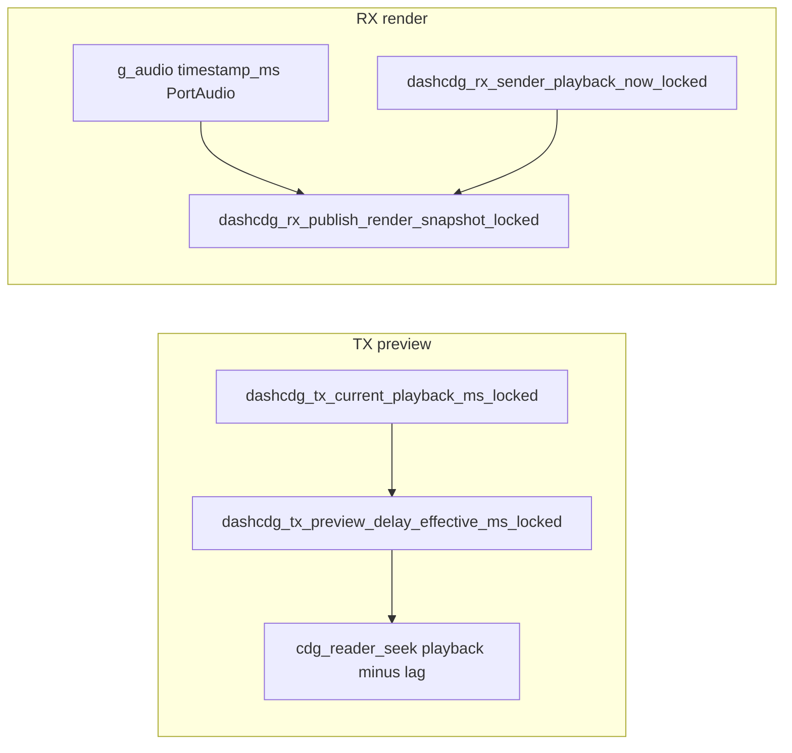

# Enterprise plan: rate conversion, Opus quality, and A/V sync

## Current baseline (fact-finding)

- **Resampling:** [`platform/desktop/src/pcm_rate_convert.c`](platform/desktop/src/pcm_rate_convert.c) — exact-ratio **48 kHz → 8/16 kHz** uses custom **FIR decimation**; other ratios use **Catmull–Rom cubic**; **8/16 → 48** applies cubic then an **LPF** using the same decimation tap sets (asymmetric vs true synthesis filter — should be verified against a reference). TX capture path [`dashcdg_tx_resample_pcm`](platform/desktop/src/app_tx.c) funnels through this for arbitrary device rates. Existing tests: [`tests/test_pcm_rate_convert.c`](tests/test_pcm_rate_convert.c) (DC preservation, alias-energy heuristic).
- **Opus:** Real builds use libopus in [`platform/desktop/src/opus_codec.c`](platform/desktop/src/opus_codec.c) (`OPUS_APPLICATION_AUDIO`, `OPUS_SIGNAL_MUSIC`, complexity 5, constrained VBR). The `-DDASHCDG_DESKTOP_NO_OPUS=1` object in the Makefile is an **intentional stub for builds without libopus** — not a runtime mock; document explicitly so “no mocks” means **release binaries always link real Opus** unless a documented CI/offline profile opts out.
- **A/V sync model ([already documented](docs/specs/v4-display-audio-sync.md)):** TX preview subtracts effective preview lag (~500 ms via [`dashcdg_tx_preview_delay_effective_ms_locked`](platform/desktop/src/app_tx.c)) so **on-screen CDG** matches what listeners hear after network + RX buffering. RX uses **DAC-aligned** [`g_audio->timestamp_ms`](platform/desktop/src/desktop_audio.c) for [`dashcdg_rx_playback_ms_for_graphics_locked`](platform/desktop/src/app_rx.c) when the stream is running, with drain-order guarantees (audio jitter before CDG). **[Conflict to resolve in docs](docs/specs/av-sync-network-clients.md):** older text describes encoder-primary display when the clock is ready; implementation prefers DAC when audio runs — pick **one** canonical policy (likely “DAC for single-host karaoke; sender-primary for multi-receiver comparability” or unify behind a flag) and update both specs.

---

## Phase 0 — Documentation only (commit: `docs: audio rate conversion and sync specs`)

**Goal:** 100% written spec + test plans **before** functional code changes. No placeholders: every document names concrete symbols, pass/fail numbers or procedures, and license/compliance gates.

| Deliverable | Purpose |
|-------------|---------|
| **`docs/specs/audio-rate-conversion-engine.md`** | Contract for all PCM rate changes: supported `(in_rate,out_rate)` pairs, **streaming vs frame-local** state (today adapters are per 20 ms frame), anti-alias requirement, **int16** quantization/dither policy (SoX “shape” vs none), and decision matrix: **A)** vendor [dmkrepo/libsox](https://github.com/dmkrepo/libsox) minimal static lib vs **B)** in-house polyphase/SRC matching SoX `rate` quality class without full SoX tree. |
| **`docs/specs/opus-desktop-encoding-policy.md`** | Map **bitrate →** `OPUS_APPLICATION_*`, `OPUS_SIGNAL_*`, `OPUS_SET_BANDWIDTH`, FEC/DTX defaults; speech vs music karaoke defaults; link to session `audio_codec_id` 1 in [`docs/specs/v4-audio-codecs.md`](docs/specs/v4-audio-codecs.md). |
| **`docs/test/audio-resampling-validation.md`** | Deterministic tests: multi-tone and Nyquist-near sweeps, impulse/transition responses, **SNR/alias energy bounds** vs golden vectors (checked into `tests/data/` as small binary or CSV). Procedure for regenerating goldens with an approved reference build (libsox CLI or `sox` if available in CI). |
| **`docs/specs/av-sync-rx-tx-instrumentation.md`** | First-tranche **measurement**: log fields for TX `raster_ms`, effective lag, RX `timestamp_ms`, queued audio ms, sender-derived playback — same timeline axes for side-by-side comparison. |
| **Reconcile** [`docs/specs/av-sync-network-clients.md`](docs/specs/av-sync-network-clients.md) vs [`v4-display-audio-sync.md`](docs/specs/v4-display-audio-sync.md) — one authoritative policy; deprecate or rewrite conflicting paragraphs. |
| **License appendix** | SoX/libsox are historically **GPL/LGPL** mixed — record linking mode (static vs dynamic), attribution, and whether product counsel allows vendoring; if GPL-incompatible, **Plan B** (soxr/libsamplerate-style LGPL engine or in-tree FIR) becomes mandatory in writing. |

---

## Phase 1 — A/V sync first tranche (commit after measurement + fix)

**Goal:** Explain and fix “TX preview matches heard audio on RX, but RX window looks wrong” by **evidence**, not guesswork.

1. **Instrumentation** (small, logging/HUD-guarded): expose TX preview `raster_ms` and RX `playback_ms` used for snapshot + `dashcdg_desktop_audio_buffered_ms` + `timestamp_ms` in one structured log line or debug HUD line (follow patterns in [`app_tx.c`](platform/desktop/src/app_tx.c) HUD).
2. **Root-cause classes** to validate in code review:
   - **Symmetric lag:** RX display may need the **same conceptual delay** TX preview subtracts (network path is “early” vs local DAC) — if metrics show RX CDG **leading** heard audio, apply a **single** configurable `rx_display_lag_ms` tied to announced `playout_delay_ms` / session preroll, or derive from **queued PCM + host latency**, not duplicated heuristics.
   - **`stream_played_frames` vs partial fill** in [`dashcdg_pa_callback`](platform/desktop/src/desktop_audio.c): verify full-block advance vs **consumed** frames during underrun; fix if timestamp runs ahead of sound.
   - **Clock choice:** if multi-receiver parity matters, add a **runtime/CLI flag** to prefer sender clock for graphics (spec already described) vs DAC (current default) — documented in reconciled spec.
3. **Tests:** extend [`docs/test/av-sync-cross-client-validation.md`](docs/test/av-sync-cross-client-validation.md) with a **TX+RX same-host** checklist: compare TX preview raster time to RX snapshot time at N,2N wall times, with allowed tolerance derived from measured buffer depth (e.g. ±1–2 CDG frames).
4. **Automated where feasible:** optional headless trace mode writing CSV for CI (if build already supports similar — follow [`docs/test/v4-network-observability-validation.md`](docs/test/v4-network-observability-validation.md) patterns); if not feasible without display, keep **manual** procedure but with exact numbers.

---

## Phase 2 — Rate conversion engine (commit after integration + tests)

**Path A — Vendored libsox (user option):**

- Add `vendor/libsox` (git submodule or `scripts/fetch_*` mirroring [`scripts/fetch_opus_portaudio_vendors.sh`](scripts/fetch_opus_portaudio_vendors.sh)).
- CMake or Makefile target building **only** what is needed for `rate` / resample (minimize formats, dependencies — may still pull `libsndfile`-class deps; spike in Phase 0 doc must confirm).
- Thin wrapper `platform/desktop/src/dashcdg_sox_rate.c` + [`pcm_rate_convert.h`](platform/desktop/include/dashcdg/pcm_rate_convert.h) — **real** implementation, no stubs; gate with `HAVE_DASHCDG_LIBSOX` if Windows MinGW struggles.

**Path B — SoX-quality in-tree (fallback if license/build weight fails):**

- Replace non-exact-ratio cubic segments with **polyphase resampler** (reference: SoX rate effect / soxr design): streaming state struct, fixed **Q** for desktop, SIMD optional later.
- Unify TX mic resample + NB codec adapters on the **same** engine.
- Expand [`tests/test_pcm_rate_convert.c`](tests/test_pcm_rate_convert.c) with goldens from **docs/test/audio-resampling-validation.md**.

**Bit depth:** today path is **int16 end-to-end**; “bit shaping” in the spec means **dither/truncation** policy when internal float is used — document whether SoX-style TPDF dither applies on final int16 write (only if measurable benefit; avoid complexity without AB proof).

---

## Phase 3 — Opus regression guard (commit)

- Implement **policy** from `opus-desktop-encoding-policy.md` in [`opus_codec.c`](platform/desktop/src/opus_codec.c) (e.g. `OPUS_AUTO` bandwidth, `OPUS_SIGNAL_VOICE` default for karaoke bitrates, music mode only above threshold).
- Add **round-trip** tests: encode/decode sine / sweeps at target bitrate; assert **thresholds** on spectral flatness or RMS change (not ear-tuned only). Reuse or extend [`docs/test/v4-audio-codec-validation.md`](docs/test/v4-audio-codec-validation.md).

---

## Phase 4 — Integration, CI, and release notes

- `make test` must include new resampling + Opus tests.
- Update [`AGENTS.md`](AGENTS.md) pointers (receiver debugging) only if behaviour/flags change.
- **Git discipline:** commit after Phase 0 (docs), Phase 1 (sync), Phase 2 (SRC), Phase 3 (Opus), Phase 4 (CI) — matches “commits after major work items.”

---

## Explicit non-goals (prevents scope creep)

- Replacing PortAudio/WASAPI or rewriting full jitter logic (unless Phase 1 proves timestamp bug there).
- Shipping GPL-incompatible linkage without counsel sign-off — Phase 0 license appendix decides vendor vs Plan B.
