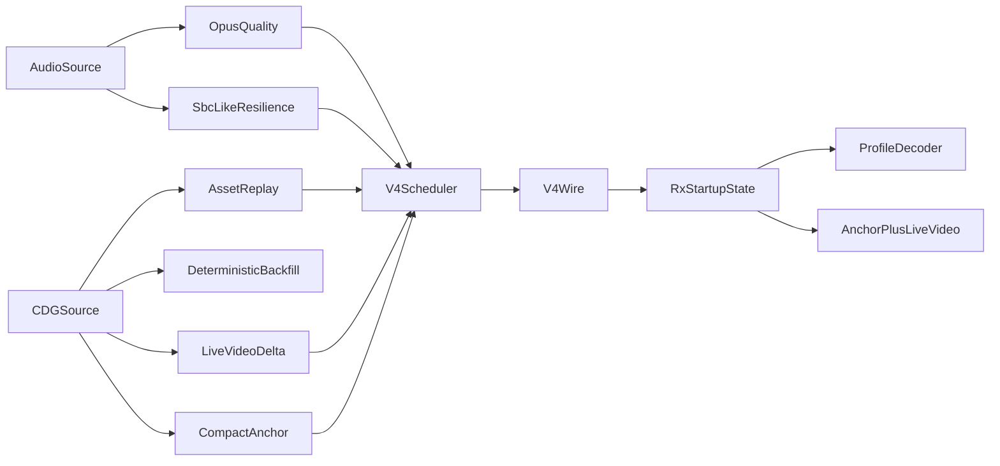

# Bad-Network Transport And TX Slimdown Plan

## Decision Summary
- Use a clean bad-network wire break rather than stretching current protocol v3.
- Implement two audio profiles in the first tranche:
  - `quality`: Opus-based
  - `resilience`: SBC-like framed mode
- Keep the work staged so TX CD+G storage changes are proven first, then transport-v4 behavior lands on cleaner runtime boundaries.

## Goals
- Remove duplicated TX CD+G batch payload storage while preserving current v3 behavior in the interim.
- Introduce a new bad-network transport with bounded startup pacing, explicit loading/anchor behavior, richer repair policy, and profile-aware late join.
- Add proof hooks so startup timing, bitrate, memory, and repair behavior can be measured instead of inferred.

## Implementation Stages

### 1. Reconcile docs and validation targets before code
- Update the existing transport/runtime docs so they match current code reality where needed before new behavior is added.
- Specifically align:
  - [docs/specs/transport-protocol.md](docs/specs/transport-protocol.md)
  - [docs/architecture/desktop-streaming.md](docs/architecture/desktop-streaming.md)
  - [docs/architecture/threaded-streaming-runtime.md](docs/architecture/threaded-streaming-runtime.md)
  - [docs/test/desktop-proof-plan.md](docs/test/desktop-proof-plan.md)
- Add a concrete v4 transport spec and validation supplement rather than overloading v3 wording:
  - extend [docs/specs/bad-network-transport.md](docs/specs/bad-network-transport.md)
  - extend [docs/specs/bad-network-audio-profiles.md](docs/specs/bad-network-audio-profiles.md)
  - extend [docs/test/bad-network-transport-validation.md](docs/test/bad-network-transport-validation.md)
- Document the chosen resilience direction explicitly: SBC-like framing, startup redundancy policy, and operator-visible profile reporting.

### 2. Land TX CD+G Stage A first on the current runtime
- Refactor [platform/desktop/src/app_tx.c](platform/desktop/src/app_tx.c) so `CDG_BATCH` scheduling keeps metadata only and reads packet bytes from the canonical CD+G source at send/FEC time.
- Preserve current v3 packet semantics for this stage:
  - `ASSET_CHUNK` remains byte-addressed
  - `CDG_BATCH` remains packet-index/timeline-driven
  - `CDG_SNAPSHOT` remains unchanged
- Keep [platform/desktop/src/app_rx.c](platform/desktop/src/app_rx.c) behavior unchanged except for any compatibility fallout from metrics or validation hooks.
- Add proof for memory/behavior in:
  - [tests/test_core.c](tests/test_core.c) where pure logic fits
  - [docs/test/portability-streaming-validation.md](docs/test/portability-streaming-validation.md)

### 3. Introduce a random-access CDG source layer
- Add a reusable CD+G source abstraction used by TX for:
  - asset replay
  - live batch reads
  - snapshot generation
  - optional preview access
- Likely touch:
  - [platform/desktop/src/app_tx.c](platform/desktop/src/app_tx.c)
  - [platform/desktop/src/file_io.c](platform/desktop/src/file_io.c)
  - new helper under `platform/desktop/src/` and matching headers under `platform/desktop/include/`
- Provide one in-memory implementation first, then a file-backed path if the runtime and proof remain stable.
- Keep a fallback path for preview/deterministic seek if a full in-memory reader is still needed temporarily.

### 4. Define and add protocol-v4 framing
- Add new protocol definitions in:
  - [proto/include/dashcdg/protocol.h](proto/include/dashcdg/protocol.h)
  - [proto/src/protocol.c](proto/src/protocol.c)
  - [tests/test_core.c](tests/test_core.c)
- Introduce v4 session metadata carrying at minimum:
  - `transport/profile version`
  - `audio_profile_id`
  - `video_profile_id`
  - `codec_id`
  - startup/bootstrap/repair descriptors
- Add new or revised packet families for:
  - loading screen / loading-state publication
  - compact visual anchor
  - profile-aware audio framing
  - bounded repair/redundancy signaling
- Keep v3 code paths intact until v4 TX/RX work is proven, then switch desktop bad-network mode onto v4 explicitly.

### 5. Implement TX v4 scheduler and startup path
- Restructure TX scheduling in [platform/desktop/src/app_tx.c](platform/desktop/src/app_tx.c) so one loop pass cannot dump unbounded bootstrap traffic.
- Add explicit per-family pacing/budgets:
  - live audio deadline traffic first
  - compact visual anchor / live visual delta second
  - bounded repair/redundancy next
  - opportunistic deeper asset/backfill last
- Add a TX-generated loading screen path and transition rules matching [docs/architecture/bad-network-startup-path.md](docs/architecture/bad-network-startup-path.md).
- Expose machine-readable counters/timestamps for:
  - first loading screen sent
  - first anchor sent
  - first audio groups sent
  - profile active
  - repair mode active
  - worst short-window bitrate

### 6. Implement dual audio-profile encode path
- Keep `quality` on the current Opus path, but make its metadata/profile explicit.
- Add a resilience encoder/packetizer using an SBC-like framed mode in:
  - [platform/desktop/src/opus_codec.c](platform/desktop/src/opus_codec.c) only if shared patterns remain useful
  - likely a new codec helper beside it, with matching header updates in `platform/desktop/include/dashcdg/`
  - [platform/desktop/src/app_tx.c](platform/desktop/src/app_tx.c) for profile selection and startup redundancy
- Add operator/runtime profile selection and visible status in TX.
- Ensure the wire format keeps room for future automatic profile switching without implementing it yet.

### 7. Implement RX v4 startup, profile decode, and observability
- Extend [platform/desktop/src/app_rx.c](platform/desktop/src/app_rx.c) to parse v4 metadata and expose why audio has not started:
  - waiting on config
  - waiting on initial groups
  - waiting on repair completion
  - waiting on preroll depth
- Add decoder selection by `codec_id` and profile-aware preroll behavior.
- Apply loading-screen and compact-anchor paths independently of full asset rebuild.
- Keep deterministic later-state recovery by continuing deeper backfill after live startup succeeds.
- Update [platform/desktop/src/desktop_audio.c](platform/desktop/src/desktop_audio.c) only where queueing/timestamps or buffering semantics must change.

### 8. Upgrade proof tooling and run the validation matrix
- Extend [scripts/desktop_impairment.py](scripts/desktop_impairment.py) or add a sibling constrained-relay script with:
  - bandwidth/throughput limiting
  - optional duplication
  - machine-readable periodic stats
- Add structured event logging in TX/RX for:
  - `loading_screen`
  - `first_anchor`
  - `first_audio`
  - `running`
  - profile/repair activation
- Run and document the bad-network matrix from [docs/test/bad-network-transport-validation.md](docs/test/bad-network-transport-validation.md), plus the portability/slimdown checks from [docs/test/portability-streaming-validation.md](docs/test/portability-streaming-validation.md).
- Keep `make test` green and add targeted protocol/unit tests for new serializers/parsers and any pure scheduling helpers.

## Commit Boundaries
- Commit 1: doc/spec reconciliation and finalized v4/profile validation docs.
- Commit 2: TX CD+G Stage A slimdown with proof updates.
- Commit 3: random-access CDG source layer.
- Commit 4: protocol-v4 framing and parser/serializer tests.
- Commit 5: TX v4 scheduler, loading screen, compact anchor, and metrics hooks.
- Commit 6: dual audio-profile encode path with SBC-like resilience mode.
- Commit 7: RX v4 decode/startup/observability path.
- Commit 8: impairment tooling upgrades and final validation/documentation pass.

## Proof Gates
- Stage A is not complete until TX memory no longer scales with duplicated `CDG_BATCH` payload copies and live `AUDIO_FRAME` + `CDG_BATCH` remain aligned.
- V4 startup is not complete until first loading screen, first useful anchor, and first audio can be measured against the bad-network targets.
- Resilience mode is not complete until it proves a materially lower link budget and successful late-join audio startup under the weak-Wi-Fi matrix.
- The full tranche is not complete until docs, tests, tooling, and runtime behavior all agree.

## Data Flow

