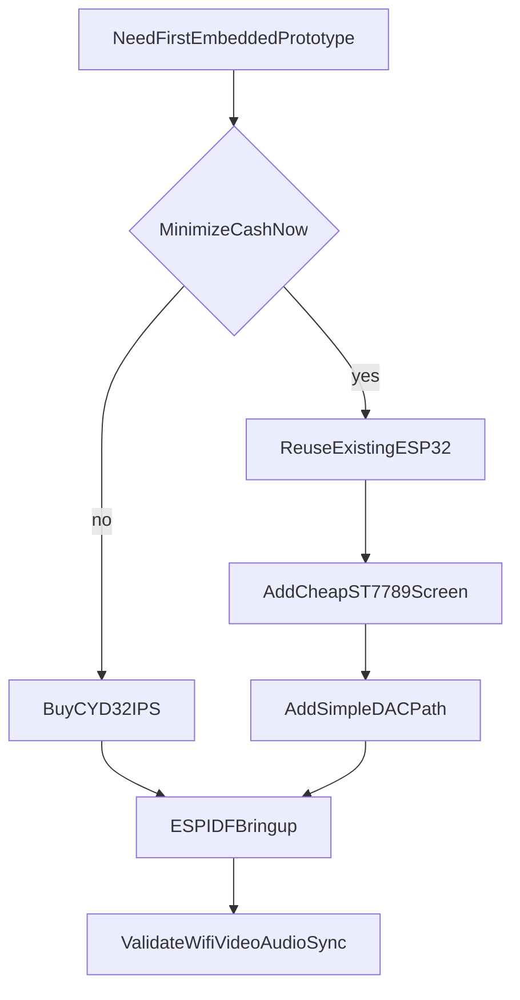

# Embedded Hardware Bring-Up Plan

## Recommendation

Primary recommendation: buy the `Freenove ESP32 CYD 3.2 inch` board as the best all-in-one first target, and order two so one can stay on bring-up firmware while the other is used for transport/audio experiments.

Why this is the best fit for the current repo direction:

- It is the strongest all-in-one option from the listed boards for a first prototype that wants `Wi-Fi + screen + onboard audio testing` without Linux.
- It keeps the practical `240x320` pixel workload that is friendlier to MCU SPI rendering than `320x480`, while giving a physically larger screen than the `2.8 inch` board.
- The `IPS` panel is a better fit than the `2.8 inch` TN display for handheld readability and off-angle viewing during karaoke/status use.
- It gives you a dual-core `240 MHz` ESP32-class MCU, mature ESP32 display/audio examples, and exposed ports for battery/speaker while staying in the `ESP-IDF + FreeRTOS` lane.
- It better matches the repo's stated near-term need to prove a display receiver first while also exploring local audio viability on MCU-class hardware in parallel.
- It keeps the firmware stack on `ESP-IDF + FreeRTOS`, which aligns better with the repo's existing ESP32 receiver docs than shifting to Pico SDK first.

Do not pick the `Pi Pico W + display` path for the first onboard-audio prototype.

- It is attractive on raw board price, but once a display is added it is no longer clearly cheaper.
- It adds more wiring and integration work for Wi-Fi, display, controls, and audio.
- It is a weaker first path for the repo's planned `Wi-Fi receiver + display + low-bitrate onboard audio` milestone.

Do not pick the `Waveshare ESP32-C6 1.47` board as the main prototype target.

- It is compact and cheap, but the single-core `160 MHz` class and tiny screen make it a worse first platform for simultaneous network receive, render, controls, and onboard codec experiments.
- The board listing and reviews suggest it is better for small dashboards than for the repo's first full end-to-end handheld receiver proof.

## Hardware ranking

### Option A: Best first prototype

`Freenove ESP32 CYD 3.2 inch`.

Pros:

- all-in-one board
- `240x320` display is much easier for readable karaoke/status UI
- physically larger screen without jumping to the much heavier `320x480` pixel class
- `IPS` panel is the best display type of the listed CYD options
- dual-core ESP32 class part is the safest bet from the listed options for `Wi-Fi + render + simple audio path`
- likely easiest path for `ESP-IDF` firmware bring-up
- avoids custom display wiring on day one

Cons:

- usually costs a bit more than the `2.8 inch` board
- touch quality still should not be treated as a milestone dependency
- not necessarily the absolute cheapest if you already own a usable ESP32 dev board

### Option B: Cheapest all-in-one fallback

`Freenove ESP32 CYD 2.8 inch`.

Pros:

- same practical `240x320` pixel workload as the `3.2 inch` board
- likely the cheapest self-contained option that still makes sense for this project
- still a valid first platform if the `3.2 inch IPS` stock or price changes

Cons:

- `TN` panel is a worse fit than `IPS` for viewing angle and perceived quality
- smaller physical screen for lyrics/status readability
- less attractive if you are already spending enough to buy two units

### Option C: Cheapest cash-outlay fallback

Reuse your existing plain ESP32 board and add a cheap SPI screen.

Best add-on screen from the listed options:

- `waveshare 1.14 inch ST7789 Pico LCD` if absolute cheapest and tiny is acceptable
- `1.3 inch ST7789 LCD HAT` only if you are okay adapting a Pi-oriented module and physical fit is convenient
- `2 inch capacitive touch` only if you decide touch matters enough to justify higher cost and more integration risk

Pros:

- lowest immediate spend if your existing ESP32 is usable
- lets you split the risk: prove receiver firmware first, nicer enclosure later

Cons:

- more wiring and bench mess
- more unknowns around your exact ESP32 board variant
- slower bring-up than a CYD-style integrated board
- battery integration is more DIY unless your board already has charging

### Option D: Not recommended first

`Pi Pico W` plus any of the listed displays.

Reason:

- okay as a display-only or controls-first board, but not the best first platform for `Wi-Fi receiver + handheld UI + onboard low-bitrate audio validation`
- total cost with screen is not compelling enough to offset the extra integration work

## Suggested phase order

### Phase 1: Hardware selection and first target

Primary target:

- `Freenove ESP32 CYD 3.2 inch`

Secondary target if price/availability shifts:

- `Freenove ESP32 CYD 2.8 inch`

Lowest-cash fallback target:

- your existing plain ESP32 board plus a cheap `ST7789` screen

Document these paths in:

- `[docs/hardware/amazon-board-recommendation.md](docs/hardware/amazon-board-recommendation.md)`
- `[docs/hardware/embedded-bringup-bom.md](docs/hardware/embedded-bringup-bom.md)`

### Phase 2: First firmware milestone

Define the first milestone as:

- join a session over Wi-Fi <- we should have AP/STA web interface configuration for the wifi even initially as it sets a good baseline of running a web app on freertos independent of other tasks
- parse transport metadata <- good start freertos app, also needs igmp as we have snooping on our network, also we support DSCP so WMM or whatever ideally as well, it is respected on the [G.hn](http://G.hn) adapters as well as core cisco switch, openwrt should be working with it as well.
- show loading/late-join status <- there is a microsd slot we can load animations on if needed as we have 4MB FLASH
- render live video or anchor state <- at minimum anchor/snapshots like a storyboard, then we can enable delta calculations and playout? which ever is easier, if just going full blast is then do it all
- play low-bitrate local audio through a simple DAC path for sync/human validation <- we should use AMR-WB if possible as we only have an 8-bit DAC on chip otherwise QCELP13k initially whichever is easier to use or works on esp32 don't worry about code complexity, it needs to work and make reasonable audio
- tolerate display-only fallback if audio path is not stable yet <- yes this is fine, we are using onboard DAC either way so we can figure something out

Document in:

- `[docs/hardware/esp32-handheld-bringup.md](docs/hardware/esp32-handheld-bringup.md)`
- `[docs/specs/embedded-rx-audio-profile.md](docs/specs/embedded-rx-audio-profile.md)`

### Phase 3: Hardware interfaces

For the CYD path, define:

- display driver choice <- 3.2" st7789
- touch as optional and non-blocking <- resistive working with sample on device and lvgl
- battery path expectations <- on board charging, and power, we have an ADC on pin IO34 with a resistive divider of 100k to +BAT and 100k to GND (per schematic) - current VBAT is 3.7V 18300 2.96wh connected per schematic on bat connector and is working 
- simple audio output path for the low-bitrate codec test mode <- we have an audio amp on pin IO26 built in 8-bit dac in pseudo i2s dma transfer mode, amp shutdown is IO4 with 10k pullup so prob send to GND to enable amp the datasheet is chinese so I have no idea really
- controls as buttons-first even if touch exists <- the pins we have access to rn are IO39 IO35

For the plain-ESP32 fallback, define: <- we don't need to bother rn we have qty 2 boards with 3.2" lcd

- recommended `ST7789` wiring
- simple external DAC/amplifier path
- battery/charger assumptions
- minimal enclosure assumptions

Document in:

- `[docs/hardware/esp32-board-interface-notes.md](docs/hardware/esp32-board-interface-notes.md)`

### Phase 4: Validation and exit gates

Create a focused embedded validation matrix that proves:

- first visible screen timing
- live video progression timing
- first audio timing
- sync sanity by human observation and logs
- packet-loss recovery behavior at prototype scale
- battery runtime and thermal observations

Document in:

- `[docs/test/embedded-hardware-bringup-validation.md](docs/test/embedded-hardware-bringup-validation.md)`

## Decision summary

If you want the easiest thing to buy and get working quickly:

- buy two `Freenove ESP32 CYD 3.2 inch` boards <- done

If you need the smallest immediate spend:

- reuse your existing ESP32 and buy the cheapest workable `ST7789` screen, then add the simplest audio hardware you can source quickly <-not bothering

If the `3.2 inch IPS` version becomes notably more expensive or hard to get:

- fall back to the `2.8 inch 240x320` CYD rather than jumping to `320x480` TN boards

If you want the cleanest long-term firmware starting point for this repo's embedded path:

- stay on `ESP-IDF / FreeRTOS` first, not `Pico SDK <- yes I agree`

## Implementation notes for the docs

The docs set should explicitly state:

- first embedded target is `ESP32 + FreeRTOS + ESP-IDF`
- `touch` is optional and must not block bring-up
- `buttons-first` is acceptable for the first handheld prototype
- `display plus low-bitrate audio proof` is the milestone, not polished industrial design
- local audio remains a feasibility gate until measured stable on target hardware

A simple decision diagram may help in the recommendation doc:

