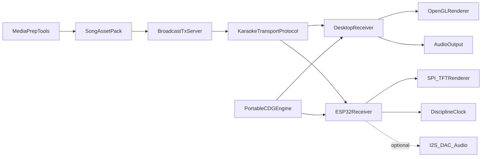

# Enterprise Karaoke Broadcast Roadmap
## Current Baseline
The repo today is a compact desktop `MP3+G` player with three critical seams worth preserving:
- CD+G timing/state in [C:\Users\andrew\OneDrive - Green O365\Documents\GitHub\dashcdg\inc\cdg.h](C:\Users\andrew\OneDrive - Green O365\Documents\GitHub\dashcdg\inc\cdg.h), including the `300` packets/sec timebase and `cdg_state` framebuffer.
- Audio clock generation in [C:\Users\andrew\OneDrive - Green O365\Documents\GitHub\dashcdg\src\audio.c](C:\Users\andrew\OneDrive - Green O365\Documents\GitHub\dashcdg\src\audio.c), where playback time is latency-adjusted and exposed as a shared timestamp.
- Desktop render loop in [C:\Users\andrew\OneDrive - Green O365\Documents\GitHub\dashcdg\src\player.c](C:\Users\andrew\OneDrive - Green O365\Documents\GitHub\dashcdg\src\player.c), where the renderer follows `audio_state.timestamp` and seeks CD+G state to the matching packet.

Concise seam worth preserving:
```c
ms = ATOMIC_INT_GET(g_AudioState->timestamp);
if (cdg_reader_seek(g_Reader, MS_TO_CDG_FRAME_COUNT(ms))) {
    glUniform1iv(g_Shader.colorTableLocation, 16, g_Reader->state.color_table);
}
```
That is the right architectural nucleus: one authoritative media clock, deterministic CD+G state evolution, and a pluggable renderer.

## Target Architecture
Build a transport-agnostic karaoke platform with Wi-Fi first, Bluetooth/RF later as adapters, and a portable core shared by desktop and ESP-IDF receivers.



## Idea 1: Broadcast/Multicast Software Platform
### Tranche 0: Architecture and repo hardening
Before new features, convert the current app into a product-shaped workspace:
- Split the monolithic build in [C:\Users\andrew\OneDrive - Green O365\Documents\GitHub\dashcdg\Makefile](C:\Users\andrew\OneDrive - Green O365\Documents\GitHub\dashcdg\Makefile) into a multi-target structure for `core`, `desktop-rx`, `desktop-tx`, `tools`, and `tests`.
- Define clean module boundaries: `core/cdg`, `core/clock`, `core/packet`, `platform/desktop`, `platform/espidf`, `proto`, `tools`, `docs`.
- Replace implicit behavior with written specifications: protocol spec, timing spec, renderer contract, portability contract, and song packaging spec.
- Add CI gates for format, compile, unit, golden-vector, fuzz, integration, and release artifact generation.

### Tranche 1: Portable core engine
Lift the logic from [C:\Users\andrew\OneDrive - Green O365\Documents\GitHub\dashcdg\inc\cdg.h](C:\Users\andrew\OneDrive - Green O365\Documents\GitHub\dashcdg\inc\cdg.h) and [C:\Users\andrew\OneDrive - Green O365\Documents\GitHub\dashcdg\src\audio.c](C:\Users\andrew\OneDrive - Green O365\Documents\GitHub\dashcdg\src\audio.c) into a deterministic core library.
- Finish CD+G opcode coverage, especially scroll and transparency, and define exact semantics with conformance vectors.
- Separate decoder state from file I/O, GPU upload, and platform audio APIs.
- Introduce a canonical fixed-point or integer timestamp model so desktop and MCU targets share the same sync math.
- Add golden-song replay tests: for a given packet stream and timestamp, framebuffer and palette must match expected snapshots.
- Add fuzzing/property tests for malformed packets, truncation, parity noise, and seeks.

### Tranche 2: Desktop transmitter and desktop receiver proof
Implement the first production-proof system on computers.
- Build a `desktop-tx` process that ingests song assets, packetizes timeline data, and emits Wi-Fi multicast/broadcast frames.
- Build a `desktop-rx` process that receives protocol frames, reconstructs media state, disciplines its local clock, and renders via the current OpenGL path.
- Keep desktop audio local in this tranche so the first system proves sync, late-join recovery, loss tolerance, and venue-scale fanout before MCU constraints are introduced.
- Add discovery/control channels only if needed; otherwise keep the first protocol narrow and deterministic.

Primary protocol design choices for this tranche:
- Transport abstraction now, but implement Wi-Fi UDP multicast/broadcast first.
- Separate `control`, `timeline`, and `asset` concerns so future Bluetooth/RF links can carry reduced or prepacked subsets.
- Support late join by periodic keyframes/snapshots plus timeline anchors.
- Budget protocol for lossy links: sequence numbers, clock beacons, keyframe cadence, and bounded retransmission for critical metadata only.

### Tranche 3: Production-level verification for Idea 1
Define enterprise quality gates before expanding transports.
- Protocol conformance suite with PCAP-style fixtures and replay validation.
- Network impairment matrix: jitter, loss, duplication, reorder, burst loss, varying RSSI, and late join.
- Cross-platform matrix: Linux, Windows, macOS.
- Performance budgets: CPU, memory, startup time, recovery time, sync drift, and maximum simultaneous receivers.
- Security baseline: signed firmware/assets later, but now at least authenticated control plane, versioned protocol, malformed packet hardening, and documented threat model.

## Idea 2: ESP32 Receiver Product
### Tranche 4: ESP-IDF reference receiver on small full-color SPI TFT
Use ESP-IDF, not Arduino, and target a small color TFT first.
- Create a strict platform port layer: timers, network sockets, framebuffer updates, persistent settings, buttons/encoder/touch abstraction, power state, and OTA hooks.
- Implement a receiver that consumes the same timeline/protocol as desktop, but with an MCU-friendly rendering path.
- Decide early whether the TFT path uses full framebuffer, banded updates, dirty rectangles, or tile-native rendering; the answer should be driven by measured SPI throughput and frame budget.
- Make the display receiver first-class even without onboard audio, so venue sync and lyric readability can be proven on battery hardware.

Hardware/software deliverables for this tranche:
- Reference schematic requirements: ESP32 variant, TFT controller, Li-ion charging, power-path behavior, USB-C, battery telemetry, and user input devices.
- BSP and board bring-up checklist.
- Manufacturing test hooks: display, buttons, battery, charging, flash, Wi-Fi, and audio pads even if audio is not yet enabled.
- Field-update plan: signed OTA, rollback, provisioning/reset workflow, and failure telemetry.

### Tranche 5: Optional ESP32 audio playout
Treat local audio as a stretch phase after the display receiver is proven.
- Run a feasibility spike for MP3 decode throughput, RAM headroom, buffer sizing, and audio/render coexistence under worst-case network jitter.
- If feasible, implement I2S/DAC output with drift control against the same network timeline.
- If not feasible on the chosen ESP32/TFT/battery envelope, preserve protocol compatibility and move audio to an external companion or higher-tier MCU/SBC profile.

### Tranche 6: Hardware productization
After the reference receiver works, harden it into an enterprise device program.
- EVT: bring-up, power integrity, thermals, RF coexistence, SPI signal integrity, battery safety, and enclosure constraints.
- DVT: endurance, charge/discharge behavior, ESD, suspend/resume, brownout, packet-loss soak, button abuse, and OTA interruption.
- PVT: manufacturing test software, fixture docs, serial provisioning, calibration, and traceability.

## Testing Strategy
Testing must be executable, not aspirational.
- Unit tests for CD+G decode, scroll semantics, transparency, packet framing, clock math, and protocol serialization.
- Golden visual tests: deterministic framebuffer snapshots from curated `.cdg` vectors.
- Integration tests: TX to RX over loopback and impaired virtual networks.
- Hardware-in-the-loop tests: ESP32 receive latency, frame cadence, battery and thermal telemetry, OTA rollback, and long-duration sync soak.
- Release criteria per tranche: no tranche exits without written acceptance tests, automated gates, and signed-off documentation.

## Documentation Set
Create documentation as a product artifact, not an afterthought.
- `docs/architecture/`: system context, module boundaries, timing model, transport model.
- `docs/specs/`: protocol spec, song package spec, receiver state machine, renderer contract, clock discipline spec.
- `docs/test/`: verification matrix, golden-vector catalog, hardware validation plans, failure taxonomy.
- `docs/hardware/`: requirements, schematics notes, BOM rationale, manufacturing tests, service/update procedures.
- `docs/ops/`: versioning, release train, incident/debug playbooks, fleet update procedures.

## Recommended order of execution
1. Refactor into a portable, fully tested `core` library while fixing current CD+G spec gaps.
2. Prove Wi-Fi UDP broadcast/multicast desktop TX and desktop RX with strong observability and impairment tests.
3. Port the same protocol/core to ESP-IDF on a small full-color SPI TFT receiver.
4. Run an explicit feasibility gate for local ESP32 audio before committing to it as a product requirement.
5. Only after those gates, expand to Bluetooth/RF adapters and production hardware tranches.

## Acceptance criteria for the first implementable phase
The first coding phase should be considered complete only when:
- The current player logic is split into portable core modules without changing observed desktop behavior.
- Missing CD+G behaviors are specified and covered by automated conformance tests.
- A desktop TX and desktop RX can maintain visible lyric sync under realistic Wi-Fi loss/jitter conditions.
- The repo contains architecture, protocol, and verification documents sufficient for another engineer to continue without reverse engineering the current code.