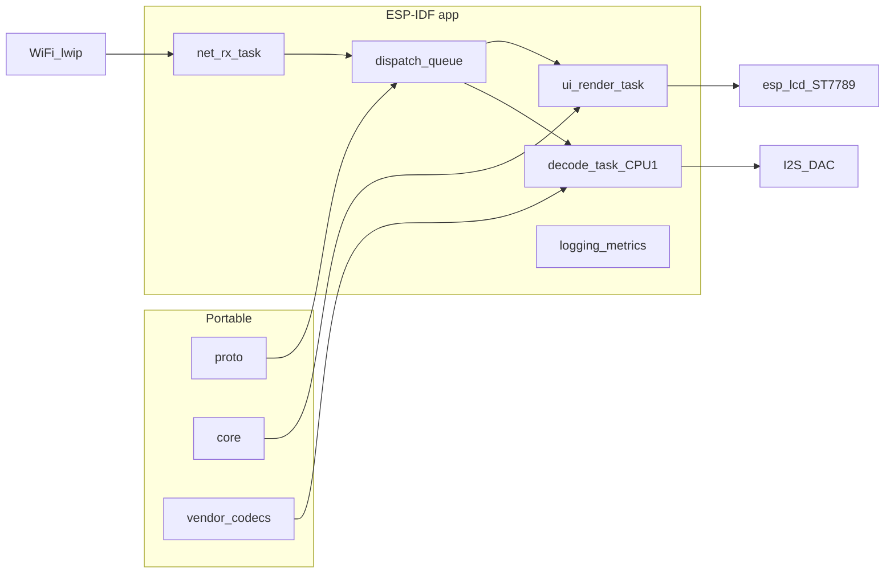

# ESP32 CYD embedded program (enterprise tranches)

## Baseline in this repo

- **Chosen hardware** is already documented: primary target **Freenove ESP32 CYD 3.2", 240×320 IPS, ST7789**, ESP-IDF + FreeRTOS ([`docs/hardware/amazon-board-recommendation.md`](docs/hardware/amazon-board-recommendation.md), [`docs/hardware/esp32-board-interface-notes.md`](docs/hardware/esp32-board-interface-notes.md)).
- **Portable assets** exist for firmware reuse: [`proto/`](proto/) (wire parse/serialize), [`core/`](core/) (CD+G, clock helpers). Desktop proof lives under [`platform/desktop/`](platform/desktop/) — embedded work should **not** duplicate protocol logic; link or submodule the portable libs into the ESP-IDF component graph.
- **Codec inventory (normative for wiring adapters):** [`docs/specs/audio-codec-modules.md`](docs/specs/audio-codec-modules.md) maps wire ids to **Bluetooth SBC** (`bluetooth_sbc_kernel`), **AMR NB/WB** (`amr_pschatzmann`), **EVRC**, **QCELP**, **Opus**, vs baseline **NB-IMA** in `core/`. The ESP32 program **explicitly prioritizes the higher-quality / standard codec paths** below and treats **NB-IMA as fallback-only**, not the primary MCU audio story (overrides the older “NB-IMA first” wording in [`docs/specs/embedded-rx-audio-profile.md`](docs/specs/embedded-rx-audio-profile.md) — that doc should be **updated in Tranche 0** to match this plan).
- **Firmware landing zone is still a stub**: [`platform/espidf/README.md`](platform/espidf/README.md) only lists intended modules; **no `idf.py` project yet** ([`README.md`](README.md) notes no buildable ESP-IDF receiver).
- **Important current reality:** the active desktop proof already contains the protocol and timing rules the ESP32 receiver will need, but the current `v4` runtime has regressions and in-flight fixes around **audio-device reconfigure churn**, **cold-start jitter skip**, and **first-live-video seed**. Embedded work must inherit the corrected contract, not the broken one.

This plan assumes: **prefer Espressif-managed components** (`esp_wifi`, `lwip`, `esp_lcd` ST7789 panel driver, `esp_lvgl_port` / LVGL) for reliability; **greenfield only** for dashcdg-specific pipelines (RX dispatch, jitter/playout glue, SPI bandwidth strategy) where no upstream equivalent exists.

---

## Phase 0 prerequisite: restore protocol v4 on desktop before cloning it into firmware

The repo now documents a good `v4` timing model in:

- [`docs/specs/v4-display-audio-sync.md`](docs/specs/v4-display-audio-sync.md)
- [`docs/specs/av-sync-network-clients.md`](docs/specs/av-sync-network-clients.md)
- [`docs/specs/receiver-progress-invariants.md`](docs/specs/receiver-progress-invariants.md)
- [`docs/specs/audio-jitter-playout-boundary.md`](docs/specs/audio-jitter-playout-boundary.md)

But the runtime implementation in [`platform/desktop/src/app_rx.c`](platform/desktop/src/app_rx.c), [`core/src/audio_jitter.c`](core/src/audio_jitter.c), and [`core/src/cdg_batch_jitter.c`](core/src/cdg_batch_jitter.c) has been drifting while the docs evolved.

Before any ESP-IDF tranche uses `v4` as a stable transport, complete this **desktop stabilization gate**:

### v4 remediation work items

1. **Stop periodic `session_info` from tearing down audio mid-playback.**
   Current risk: receiver repeatedly re-opens the audio device / clears the PCM ring on unchanged sessions, which dumps preroll and causes `wait-preroll` regressions.
   Files: [`platform/desktop/src/app_rx.c`](platform/desktop/src/app_rx.c)
   Acceptance: unchanged `v4_session_info` packets during steady-state do **not** reset device, jitter queues, or start gates.

2. **Prevent cold-join jitter from ghost-skipping the stream before the first valid decode/apply.**
   Current risk: late clock establishment plus empty-buffer skip logic can advance `next_media_sequence` or `next_packet_index` before the first real media frame lands.
   Files: [`core/src/audio_jitter.c`](core/src/audio_jitter.c), [`core/src/cdg_batch_jitter.c`](core/src/cdg_batch_jitter.c), [`tests/test_core.c`](tests/test_core.c)
   Acceptance: empty-buffer skip and stall-loss skip are blocked until the stream is decode-primed.

3. **Seed live video state before the first wire delta.**
   Current risk: first `v4_video_delta` applies onto an uninitialized live canvas, so the render path switches to black or partial garbage until a later snapshot / anchor arrives.
   Files: [`platform/desktop/src/app_rx.c`](platform/desktop/src/app_rx.c)
   Acceptance: RX started before TX still shows correct graphics once the first deltas arrive, even if a fresh anchor has not yet landed.

4. **Keep one explicit graphics-time function.**
   Current risk: render publication mixes sender playback, local DAC timestamp, reader state, snapshot state, and v4 bridge state through scattered branches.
   Files: [`platform/desktop/src/app_rx.c`](platform/desktop/src/app_rx.c)
   Acceptance: one helper decides graphics playback time; all render publication and first-delta seed logic call it.

5. **Keep steady-state v4 rendering live-owned even after `asset-ready`.**
   Current risk: a broken live cursor can be masked by switching render ownership to the fully rebuilt asset reader, which makes the UI appear fixed while violating the live-stream protocol contract.
   Files: [`platform/desktop/src/app_rx.c`](platform/desktop/src/app_rx.c), [`docs/specs/v4-live-video-playout.md`](docs/specs/v4-live-video-playout.md)
   Acceptance: `asset-ready` never becomes the primary renderer during active v4 playback; anchors/snapshots remain bootstrap/recovery only.

6. **Reconcile `clock_sync` ownership with audio chunk tags.**
   Current risk: receiver behaviour silently degrades if `playback_base_*` is missing or stale during startup / codec switch.
   Files: [`platform/desktop/src/app_rx.c`](platform/desktop/src/app_rx.c), [`platform/desktop/src/app_tx.c`](platform/desktop/src/app_tx.c)
   Acceptance: `v4_clock_sync` owns the sender-derived playback base; first audio chunk may bootstrap only until the next valid clock sync.

7. **Make CDG loss recovery converge to actual sender batch starts.**
   Current risk: `core/src/cdg_batch_jitter.c` can recover by advancing `next_packet_index` with a fixed nominal stride even when the oldest pending future batch proves the sender is on a different boundary, causing long-play video stalls while audio continues.
   Files: [`core/src/cdg_batch_jitter.c`](core/src/cdg_batch_jitter.c), [`tests/test_core.c`](tests/test_core.c), [`docs/specs/cdg-batch-jitter-playout-boundary.md`](docs/specs/cdg-batch-jitter-playout-boundary.md)
   Acceptance: late recovery jumps to the oldest pending real batch start whenever present; unit tests cover variable `packet_count` batches.

8. **Codify codec-switch reset rules.**
   Current risk: TX can change codec/profile while RX keeps stale decoder/jitter/FEC state, producing decode failures or silent wedged playback.
   Files: [`platform/desktop/src/app_tx.c`](platform/desktop/src/app_tx.c), [`platform/desktop/src/app_rx.c`](platform/desktop/src/app_rx.c)
   Acceptance: codec/profile switch resets exactly the necessary decoder + jitter + parity state, and no more.

9. **Capture proof-grade validation for the repaired path.**
   Files: add/update docs under [`docs/test/`](docs/test/)
   Acceptance: at minimum a repeatable matrix for steady-state, track restart, late join, codec cycle, impairment, and cross-client A/V sync.

### Why this is part of the ESP32 plan

The embedded receiver will reuse:

- `proto/` packet parsing
- `core/` jitter and CDG state machines
- the same `session_info` / `clock_sync` / `audio_chunk` / `video_delta` state model

If desktop `v4` is unstable, the firmware project inherits unstable semantics and becomes much harder to debug because Wi-Fi, SPI, DAC, and RTOS complexity mask protocol faults.

---

## Program order of execution

### Phase A: stabilize and lock the desktop v4 contract

- Update spec docs where implementation assumptions are still implicit.
- Land core jitter tests for the exact cold-start and empty-skip regressions.
- Fix desktop RX/TX runtime until:
  - audio starts once and stays started
  - video does not go black on cold join
  - sender-derived playback time stays the common A/V reference
  - codec changes do not wedge the receiver
- Build and verify sneakernet artifacts after every meaningful runtime fix.

### Phase B: author ESP32 specs from the repaired contract

- Produce ESP32 requirement and architecture docs with explicit references to the repaired desktop `v4` rules.
- Trim the initial embedded feature subset to what the repaired desktop proof actually validates.

### Phase C onward: implement firmware tranches

- Scaffold `platform/espidf/`
- Headless network / logs
- UI / display
- visual pipeline
- audio pipeline
- power / hardening

This ordering is mandatory. No firmware tranche should invent a new timing contract while desktop `v4` is still being debugged.

---

## Audio codec strategy (ESP32, dual-core)

**Policy:** Build the embedded receiver around **recognized speech/music codecs** and wire-compatible modules already indexed in-repo. **Do not** anchor product quality or validation on **NB-IMA** (`dashcdg_nb_ima_*`) except as a **last-resort narrowband fallback** when a build profile explicitly enables it for interoperability or extreme memory constraints.

**Preferred decode targets (in roughly this bring-up order):**

| Priority | Codec | Role | Repo / notes |
|----------|--------|------|----------------|
| 1 | **Opus** | `quality` profile, best perceptual quality if CPU/RAM allow | [`audio_modules/opus/`](audio_modules/opus/) — **pin decode work to APP CPU 1** (`xTaskCreatePinnedToCore` or equivalent ESP-IDF pattern) so Wi‑Fi/stack stays on CPU 0 where possible; measure **worst-case frame decode** before declaring realtime. |
| 2 | **Bluetooth SBC** | Standard low-latency narrowband-ish resilience option | [`audio_modules/bluetooth_sbc_kernel/`](audio_modules/bluetooth_sbc_kernel/) — kernel **LGPL-2.1+**: schedule a **license compliance gate** before shipping static MCU images (rewrite vs linkage policy per product counsel). |
| 3 | **AMR-NB / AMR-WB** | Cellular-era narrow/wide speech; strong fit for karaoke bitrate | [`audio_modules/amr_pschatzmann/`](audio_modules/amr_pschatzmann/) — **3GPP / upstream license** review gate ([docs/specs/audio-codec-modules.md](docs/specs/audio-codec-modules.md)). |
| 4 | **EVRC** + **QCELP** | **Two CDMA-era codecs** as requested — meets “at least one or two” | [`audio_modules/evrc_*`](audio_modules/evrc_arulk77/), [`audio_modules/qcelp_rupw/`](audio_modules/qcelp_rupw/) — pick **one** EVRC vendor tree for production after comparison; wire ids per [`docs/specs/v4-audio-codecs.md`](docs/specs/v4-audio-codecs.md). |

**NB-IMA:** Supported only as **optional fallback** (`CONFIG_DASHCDG_AUDIO_NB_IMA_FALLBACK`) for lab builds or if a given firmware image cannot yet link vendor codecs; never the default acceptance path for demos or enterprise sign-off.

**Specs to add in Tranche 0:** `docs/specs/esp32-audio-codecs.md` — decode order, RAM ceilings per codec, **dual-core pinning**, failure behavior (“decode too slow” → drop frame / signal UI / fall back), and pointers to [`docs/test/v4-audio-codec-validation.md`](docs/test/v4-audio-codec-validation.md) for cross-platform parity where applicable.

---

## Power management (battery + soft “off”)

**Goal:** With an attached battery, support a user-facing **soft power off** that maps to **ESP32 deep sleep** (microamp domain), not merely blanking the LCD.

**Design points:**

- **Sleep entry:** User gesture (long-press power **or** UI “Power off”) → stop decode → disconnect Wi‑Fi cleanly → turn off **backlight** → optional **display controller sleep** → flush critical NVS → `esp_deep_sleep_start()` with configured wake mask.
- **Wake sources:** At minimum **GPIO** (dedicated wake button or multipurpose button if schematic allows **EXT0/EXT1**); document debounce + boot reason logging (`esp_sleep_get_wakeup_cause()`).
- **Sleep depth:** Prefer **deep sleep** for true “off” battery retention; optionally document **light sleep** for faster resume experiments (trade higher idle µA).
- **Battery voltage:** **Schematic-gated**. Add REQ **`ESP-RX-PWR-xxx`**: if the purchased CYD revision exposes **VBAT divider to an ADC-capable GPIO**, implement periodic or on-demand sampling, **calibration** notes, and low-battery UI + optional forced sleep policy. If **no** routed sense pin, document **manual** bench measurement only and UI “battery unknown.”

**Specs to add:** `docs/specs/esp32-power-management.md` — state machine (`RUNNING` → `SHUTDOWN` → `DEEPSLEEP` → `WAKE_BOOT`), wake pin table, ADC channel assumptions, charging IC detection **if** status pin is broken out.

**Tests:** Extend [`docs/test/embedded-hardware-bringup-validation.md`](docs/test/embedded-hardware-bringup-validation.md) with rows for **sleep current** (USB vs battery), **wake reliability**, and **battery warning** behavior when ADC exists.

---

## Simulation strategy (Wokwi vs desktop)

| Layer | Role | Fit for CYD / ST7789 |
|-------|------|----------------------|
| **LVGL + SDL on PC** | Fast UI/layout iteration, fonts, theme, touch mapping | **Strong** for UX; **does not** validate SPI timing or ESP32 load ([LVGL docs](https://docs.lvgl.io/) pattern: PC simulator build). |
| **[Wokwi](https://docs.wokwi.com/)** | Browser (or CI) integration smoke: Wi‑Fi stubs, UART, **some** displays | **Moderate**: good for early boot flows and UART proof; **verify** your exact panel/part and GPIO map against Wokwi’s supported parts list — CYD-specific routing may require a **custom diagram** or accepting “close enough” pinout for UI-only milestones. Treat Wokwi as **smoke**, not performance sign-off. |
| **QEMU / Renode** | ISA-level emulation | **Weak** for ESP32 + ST7789 + LVGL stack realism; use sparingly for **headless** or **logic-only** builds, not panel fidelity. |
| **Bare ESP32 (no screen)** | Real silicon, Wi‑Fi stack, timers, heap, tasks | **Strong** for protocol, Wi‑Fi join, UDP RX, **codec decode load**, FreeRTOS stability, and **deep sleep wake** tests **before** CYD boards arrive — matches your constraint. |

**Recommendation:** adopt a **three-layer validation ladder**: (1) host/`make test` for `proto`/`core`, (2) **ESP-IDF `HEADLESS` build** on real ESP32 + serial traces, (3) **LVGL SDL** for UI polish, (4) **Wokwi** for shareable demos/smoke, (5) **CYD hardware** for SPI throughput and final UX.

---

## Enterprise governance (lightweight but traceable)

Introduce under `docs/specs/` / `docs/test/`:

- **Requirement IDs** (`ESP-RX-xxx`) in a master sheet: networking, protocol subset, startup UX, memory ceilings, watchdog, OTA placeholder, security assumptions (Wi‑Fi credentials storage), **audio codec class**, **power states**, **battery ADC if available**.
- **Traceability matrix** (spreadsheet or markdown table): REQ → design doc section → test case → implementation module.
- **Definition of Done** per tranche: listed tests green on CI, manual checklist for hardware where CI cannot cover, **one git commit** (or tagged merge) after each tranche exit — matching your **“commits after major work items”** rule.

Non-functional targets to state explicitly in specs: worst-case heap, task stack sizes, watchdog supervision, UDP RX rate bounds, frame drop policy under SPI back-pressure, **codec realtime budget per core**, **deep sleep current target** (ballpark µA range on battery).

---

## Target software architecture (FreeRTOS)

Align with [`docs/hardware/esp32-receiver-architecture.md`](docs/hardware/esp32-receiver-architecture.md):



- **Standard stack:** ESP-IDF Wi‑Fi + UDP sockets, FreeRTOS queues/mutexes, `esp_timer` for periodic work, **NVS** for settings, **ESP-IDF log + `idf.py monitor`** for flight-recorder style traces.
- **Display path:** `esp_lcd` panel API for ST7789; LVGL optional but **recommended** once you want touch and non-trivial UI — use **`esp_lvgl_port`** pattern to pin flush callback to SPI and run LVGL tick from a timer.
- **Audio path:** unified **decoder dispatcher** by v4 codec id → Opus / SBC / AMR / EVRC / QCELP / NB-IMA fallback; **decode task** pinned away from Wi‑Fi where beneficial.
- **Headless profile:** same tasks but `display_hal` renders to **no-op** / **serial state machine**; optional **LED GPIO** heartbeat and **structured log** lines for automated parse in CI scripts.

---

## Repository layout (proposed)

| Path | Purpose |
|------|---------|
| [`platform/espidf/dashcdg_rx/`](platform/espidf/) (or similar) | Top-level ESP-IDF project: `CMakeLists.txt`, `sdkconfig.defaults`, `main/`, `components/` |
| `components/dashcdg_proto`, `components/dashcdg_core` | Thin wrappers pulling in [`proto/`](proto/), [`core/`](core/) with ESP-IDF-safe compile flags |
| `components/dashcdg_audio` | Codec dispatcher + links into [`audio_modules/*`](audio_modules/) per Kconfig |
| `components/board_cyd32` | Pin map, backlight, reset, SPI host, **wake GPIO**, **ADC battery** if routed — **revision-gated** comments |
| `docs/specs/esp32-*` | System spec, RTOS map, HAL, LVGL UX, **audio**, **power**, headless profile |
| `docs/test/esp32-*` | Test strategy, CI matrix, Wokwi procedure, HW validation updates to [`docs/test/embedded-hardware-bringup-validation.md`](docs/test/embedded-hardware-bringup-validation.md) |
| [`scripts/`](scripts/) | Optional: `esp_log_check.py`, Wokwi CI wrapper, flash/monitor helpers |

**Git discipline:** after each tranche below — **merge commit or conventional commit** with scope `espidf:` (e.g. `feat(espidf): tranche 1 headless Wi-Fi stub`).

---

## Testing pyramid (must be written, not only planned)

1. **Host (existing):** keep [`make test`](README.md) green; add tests wherever new portable helpers are extracted for ESP (same as desktop parity goal in [`docs/architecture/portable-core.md`](docs/architecture/portable-core.md)).
2. **Firmware unit / component tests:** ESP-IDF **Unity** on-target tests for pure C modules (packet parsing smoke, **codec golden vectors** where feasible without full I2S); run locally and optionally in CI with **ESP32 runner** job if you attach hardware later.
3. **Headless integration (pre-CYD):** ESP32 **without display** — scripted checks: boot, Wi‑Fi connect (test SSID), receive crafted UDP fixtures (recorded pcap replay or tiny Python sender on LAN), assert counters/log lines; **decode soak** per enabled codec.
4. **LVGL SDL (optional CI job):** build PC LVGL demo that shares **screens/widgets code** with firmware via shared `ui/` folder — catches layout regressions without silicon.
5. **Wokwi:** `diagram.json` project in repo (e.g. `platform/espidf/wokwi/`) + documented “Run in Wokwi” steps; CI only if GitLab runner can run headless browser or Wokwi CLI (optional later; do not block Tranche 1).

**GitLab CI:** extend [`.gitlab-ci.yml`](.gitlab-ci.yml) with a **dockerized ESP-IDF build** stage (`espressif/idf` image) compiling the app with **Kconfig matrix** for codec subsets (at minimum **Opus+SBC** build job); artifact: `build/` or `compile_commands.json` for debugging. Native `make test` stays the fast gate.

### Immediate desktop validation loop for Phase A

Run these after each `v4` runtime change:

```sh
make test
make debug
scripts/build_windows_sneakernet_dist.sh
```

Then run targeted proof checks:

```sh
build/bin/desktop-player tx --headless --badnet-v4 <endpoint> <port> <song-id> <file-or-folder>
build/bin/desktop-player rx --headless <endpoint> <port>
python scripts/desktop_impairment.py --listen-group ... --emit-group ... [impairment args]
```

On Windows builds, also validate:

```sh
build/amd64/bin/desktop-gdi-rx.exe
build/x86/bin/desktop-gdi-rx.exe
```

When the render path is under active repair, take desktop screenshots and archive them under `build/validation/` or a similar temp workspace so visual regressions are visible.

### Sneakernet artifact policy

- Every tranche that changes desktop runtime behaviour must end with a fresh `make dist-windows-sneakernet` or `scripts/build_windows_sneakernet_dist.sh` run.
- Artifact verification must include:
  - expected EXEs present for x64 / x86 / retro layouts
  - required codec DLLs present
  - at least one smoke launch of the affected RX binary
- Do not wait until the end of the whole project to discover packaging regressions.

---

## Tranches and phases of work

### Tranche 0A — Desktop v4 stabilization gate

**Deliverables:** updated `v4` sync / jitter / receiver-progress docs, core tests proving the cold-start skip guard, desktop runtime fixes in `app_rx.c` and related core jitter helpers, and a short validation note for the repaired behaviour.

**Exit:**

- steady-state v4 playback no longer falls back into repeated `wait-preroll`
- first-live-video path shows correct graphics without waiting for a later full keyframe
- audio and video remain aligned through at least one late join and one codec switch
- sneakernet build completes after the fixes

**Git:** focused commits such as `fix(v4): hold empty jitter skips until first decode` and `fix(v4): seed live state before first delta`.

---

### Tranche 0B — Program charter and REQ freeze (documentation only)

**Deliverables:** `docs/specs/esp32-rx-requirements.md` (REQ IDs), `docs/specs/esp32-rx-freertos-architecture.md`, `docs/specs/esp32-audio-codecs.md`, `docs/specs/esp32-power-management.md`, `docs/test/esp32-test-strategy.md`, traceability stub table; **revise** [`docs/specs/embedded-rx-audio-profile.md`](docs/specs/embedded-rx-audio-profile.md) so MCU policy matches **codec-first / NB-IMA fallback**; update [`platform/espidf/README.md`](platform/espidf/README.md) with pointers.

**Exit:** stakeholders sign off REQ subset for **Milestone A** (join + parse + status UI headless), the repaired `v4` inheritance boundary, and the audio policy above.

**Git:** docs-only commit(s).

---

### Tranche 1 — Scaffold + headless “flight recorder”

**Implementation:** Create ESP-IDF project under `platform/espidf/`, `sdkconfig.defaults` for Wi‑Fi + logs; **no display**. Implement **minimal** UDP RX loop + log structured lines (packet type counts). Optional: connect **`proto`** parse-only path** for one fixed test vector checked into `tests/fixtures/`.

**Tests:** Unity test or boot-time self-test parsing golden vectors; CI: `idf.py build`.

**Exit:** Flash any ESP32; serial log proves RX path and stable reboot.

**Git:** `feat(espidf): scaffold project and headless rx stub`.

---

### Tranche 2 — Wi‑Fi provisioning + session discovery slice

**Implementation:** NVS-stored SSID/password (document threat model: **lab use**); connect to AP; join multicast/UDP as per [`docs/specs/transport-udp-boundary.md`](docs/specs/transport-udp-boundary.md) mapping; implement **subset** of v4 path needed for loading/status (reuse `proto` views, not re-encode).

**Tests:** Scripted headless test with LAN sender; document in `docs/test/esp32-network-fixture.md`.

**Exit:** Receiver logs transition states matching desktop session join (no graphics yet).

**Git:** merge after network + parse milestone.

---

### Tranche 3 — Display HAL + LVGL hello (CYD path, can wait for hardware)

**Implementation:** `board_cyd32` pins from **purchased** schematic; `esp_lcd` ST7789 init; full-screen color test; then LVGL label + status page. Touch: **optional** (`XPT2046` vs `GT911` — confirm for your SKU) behind `input_abstraction`.

**Tests:** On-target screenshot optional; primary = **manual checklist** extension in [`docs/test/embedded-hardware-bringup-validation.md`](docs/test/embedded-hardware-bringup-validation.md). Parallel: LVGL SDL shares widget code.

**Exit:** First pixel + loading screen matching REQ UX.

**Git:** display milestone commit.

---

### Tranche 4 — CD+G visual path + preferred audio codecs (measurement-driven)

Split into two deliverable halves (can be one branch with two merge commits):

**4A — Video path:** Integrate **`core`** CDG state updates from batches/snapshots per architecture doc; choose SPI strategy (full vs dirty) **after** measuring Mbps on hardware ([`docs/hardware/esp32-receiver-architecture.md`](docs/hardware/esp32-receiver-architecture.md)).

Video acceptance inherits the desktop `v4` stabilization rules:

- anchor or snapshot can seed live state
- first delta cannot apply onto a black / uninitialized canvas
- live video progression remains independent from full asset backfill once a valid live state exists

**4B — Audio path:** Bring up **I2S** (or onboard codec path per board), **decoder dispatcher**, and codecs in priority order: **Opus** (dual-core pinned decode), **SBC**, **AMR-WB/NB**, then **EVRC** + **QCELP**. Run **CPU/RAM profiling** after each codec; document **NB-IMA** only under explicit `CONFIG_*` fallback. Cross-check wire compliance with [`docs/specs/v4-audio-codecs.md`](docs/specs/v4-audio-codecs.md) and license rows in [`docs/specs/audio-codec-modules.md`](docs/specs/audio-codec-modules.md).

Audio acceptance inherits the desktop `v4` stabilization rules:

- no periodic session metadata may reset the audio device unless format actually changed
- empty-buffer skip policy must be decode-primed
- sender-derived playback time remains the render master once clock sync exists

**Tests:** Expand host tests for extracted scheduling helpers; on-target decode soaks; hardware validation matrix rows for **each enabled codec**.

**Exit:** Matches **first firmware milestone** in [`docs/hardware/esp32-handheld-bringup.md`](docs/hardware/esp32-handheld-bringup.md) with **preferred** audio classes; display-first fallback still allowed for bring-up **but** NB-IMA is not the success definition.

**Git:** `feat(espidf): cdg render` + `feat(espidf): codec stack` (or equivalent).

---

### Tranche 5 — Power management (deep sleep + battery)

**Implementation:** Soft-off UI → **deep sleep** path; wake GPIO configuration; boot reason logging; backlight policy; **ADC battery** sampling behind Kconfig **`BOARD_HAS_BATTERY_SENSE`** tied to schematic. Charging behavior: document only (no assumptions without knowing charge IC hookup).

**Tests:** Bench measurement protocol for sleep current; wake reliability **N≥30** presses; low-battery UI if ADC present.

**Exit:** Repeatable **off/on** cycle on battery without bricking Flash/NVS.

**Git:** `feat(espidf): power management`.

---

### Tranche 6 — Hardening + OTA stub + release readiness

**Implementation:** OTA partition table sketch, rollback story, panic reporting, NVS factory reset.

**Tests:** Stress tests (packet loss simulation on LAN), long-run soak checklist.

**Exit:** production-readiness gate doc cross-linking [`docs/ops/quality-gates.md`](docs/ops/quality-gates.md).

**Git:** release tagging policy documented.

---

## Risks and mitigations

- **Pinout variance across CYD revisions:** freeze pin map only after board photo/schematic; ship **Kconfig board profile** (`CYD_32_REV_x`); **battery sense** may be absent on some revs — keep ADC path optional.
- **Wokwi vs reality gap:** never block releases on Wokwi; use it for demos and UART-level checks.
- **Desktop `v4` contract drift:** if docs and runtime diverge again, firmware debugging will become ambiguous. Mitigation: keep core jitter tests and desktop proof validation as the source of truth before lifting behaviour into ESP-IDF.
- **SPI bandwidth vs Wi‑Fi:** defer “pretty” animations until measured; spec should cap UI refresh rate under load.
- **Codec licensing:** AMR / EVRC / QCELP / SBC — **legal review** before product distribution; LGPL SBC may drive **dynamic link** or **rewrite** strategy on MCU ([`docs/specs/audio-codec-modules.md`](docs/specs/audio-codec-modules.md)).
- **Opus CPU:** If Opus misses realtime on ESP32 @ desired bitrate, spec allows **graceful degrade** (drop to AMR/SBC on wire or receiver-side profile negotiation — document in transport/session policy if sender supports it).

---

## Concrete working notes for implementation

When implementing against this plan, prefer this cadence:

1. patch one bounded failure mode
2. run `make test`
3. build desktop binaries
4. run a focused TX/RX proof scenario
5. capture a screenshot if visual output changed
6. rebuild sneakernet artifacts
7. only then move to the next tranche item

This is slower than speculative coding for an hour straight, but it is materially faster than debugging cross-cutting regressions after the fact.

---

## What “100% specced” means in practice

Specs and tests are **delivered incrementally per tranche** so each merge stays reviewable: **no big-bang waterfall** — instead **REQ freeze + design + automated tests + implementation + exit review** per tranche, which is the usual enterprise compromise between rigor and velocity.
