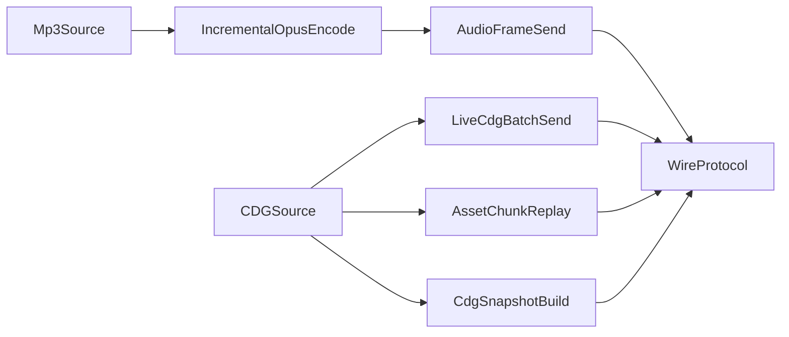

# Portability And Streaming Slimdown

## Current Facts
- The desktop TX already sends live audio and live CDG in parallel over the wire: [platform/desktop/src/app_tx.c](platform/desktop/src/app_tx.c) schedules `AUDIO_FRAME` packets in `dashcdg_tx_thread_main()` and separately schedules `CDG_BATCH` packets from the same live playout timeline.
- TX still holds too much CDG state in memory: [platform/desktop/src/app_tx.c](platform/desktop/src/app_tx.c) loads the full asset into `g_tx_state.asset_bytes` and `dashcdg_tx_build_cdg_batches_locked()` copies all packets again into `g_tx_state.cdg_batches`.
- The current desktop stack is already closest to modern Windows/Linux and not yet truly wired for macOS or legacy Windows: [Makefile](Makefile), [platform/desktop/src/gl_renderer.c](platform/desktop/src/gl_renderer.c), [platform/desktop/src/net_compat.c](platform/desktop/src/net_compat.c), and [docs/architecture/portable-core.md](docs/architecture/portable-core.md).

## Goals
- Preserve live `Opus + CDG_BATCH` streaming while redesigning TX CDG bootstrap so it no longer requires full-CDG preload as the default steady-state path.
- Define a realistic modern desktop target first: current Windows, Linux, and macOS.
- Treat legacy Windows full-GUI support as a separate feasibility/program plan driven primarily by renderer baseline and dependency support.

## Proposed Workstreams
### 1. Write the spec and constraints first
- Add a transport/runtime spec describing the target TX memory model: random-access source abstraction, sliding bootstrap window, no duplicated batch buffers, and explicit guarantees for late join, replay, and snapshots.
- Update docs to separate three modes clearly:
  1. `current desktop proof`
  2. `target modern cross-platform desktop runtime`
  3. `legacy Windows full-GUI feasibility tranche`
- Primary files to extend: [README.md](README.md), [docs/specs/transport-protocol.md](docs/specs/transport-protocol.md), [docs/test/desktop-proof-plan.md](docs/test/desktop-proof-plan.md), and a new portability/runtime note under [docs/architecture](docs/architecture).

### 2. Refactor TX CDG memory usage in stages
- Stage A: remove duplicated prebuilt CDG batch storage from [platform/desktop/src/app_tx.c](platform/desktop/src/app_tx.c) while keeping current asset replay semantics.
- Stage B: introduce a random-access CDG source layer so `ASSET_CHUNK`, `CDG_BATCH`, and snapshot generation can read from file-backed storage or a small window instead of requiring one full in-memory blob.
- Stage C: only after Stage B is stable, evaluate a true streaming bootstrap mode that minimizes or eliminates full preload while preserving acceptable late-join behavior.
- Keep a fallback path if deterministic seek/snapshot generation still needs full-file access during transition.

### 3. Define the modern desktop portability baseline
- Modernize the build matrix around three supported targets:
  1. Windows with MinGW-w64
  2. Linux with GL/PortAudio/Opus packages
  3. macOS with an explicit build path and dependency story
- Audit desktop dependencies by layer:
  - renderer: [platform/desktop/src/gl_renderer.c](platform/desktop/src/gl_renderer.c)
  - audio: [platform/desktop/src/desktop_audio.c](platform/desktop/src/desktop_audio.c)
  - sockets/interface selection: [platform/desktop/src/net_compat.c](platform/desktop/src/net_compat.c)
- Define one explicit OpenGL baseline for the modern desktop renderer and treat that as the primary GUI support gate.

### 4. Split legacy Windows into a feasibility tranche
- Plan legacy full-GUI Windows as a research track, not as an immediate coding target.
- Decide feasibility by answering these in docs before implementation:
  - minimum renderer path required for full GUI
  - whether the current OpenGL/GLEW/FreeGLUT stack can realistically meet that baseline
  - whether a future alternate renderer tranche is required (for example older OpenGL, DirectDraw, or DirectX)
  - which OS floor is even plausible for full GUI: likely XP/2000 at best, with 95/98/NT analyzed as non-committed research unless the renderer stack changes drastically
- Keep the legacy tranche separate from the modern cross-platform milestone so it cannot stall practical shipping work.

## Validation Plan
- Add focused checks for TX memory and live-wire behavior:
  - prove `AUDIO_FRAME` and `CDG_BATCH` continue to advance together during steady playout
  - prove TX memory does not scale with duplicated CDG batch copies after Stage A
  - prove late join, snapshots, and pause/restart still work with the new CDG source model
- Add platform validation targets:
  - Windows package build remains green
  - Linux build/test path remains green
  - macOS gets a first-class build recipe and smoke checklist
- Add a separate legacy feasibility report rather than pretending support exists before it is proven.

## Risks And Decisions To Front-Load
- True no-full-preload TX is not just an optimization; it changes bootstrap, late join, and deterministic recovery assumptions.
- macOS support is likely much easier than legacy full-GUI Windows and should be planned as part of the modern tranche.
- Legacy full-GUI Windows support is primarily a renderer/dependency problem, not just a compiler flag problem.
- If renderer baseline cannot be met on old Windows, the legacy tranche should explicitly branch into a future alternate-renderer plan instead of contorting the current OpenGL path.
