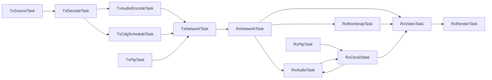

# Threaded Desktop Streaming Refactor

## Goals

- Eliminate the long-play receiver stall where status oscillates through `wait-preroll`, `wait-start`, `wait-bootstrap`, and `asset-ready` while packets still arrive.
- Replace the current coarse-lock desktop runtime with explicit task/thread boundaries for network, PTP, audio, media scheduling, video state, and rendering.
- Remove whole-track synchronous TX pre-decode/pre-encode from the hot path and move to real-time incremental decode/resample/Opus encode.
- Produce the documentation/spec/test set first so the refactor is constrained by a written contract.

## Current Findings

- RX stall risk is concentrated in [`platform/desktop/src/app_rx.c`](platform/desktop/src/app_rx.c): `dashcdg_rx_drain_media_locked()`, `dashcdg_rx_apply_snapshot_locked()`, `dashcdg_rx_format_audio_gate_locked()`, and render/audio gate coupling in `display()`. The current design can stop advancing live playout even while datagrams continue arriving.
- TX startup/track-switch latency is concentrated in [`platform/desktop/src/app_tx.c`](platform/desktop/src/app_tx.c): `dashcdg_tx_load_track_locked()`, `dashcdg_tx_build_audio_frames_locked()`, and `dashcdg_tx_build_cdg_batches_locked()`. The first track is prepared before worker threads start, and MP3 decode plus Opus encode currently happen for the whole track up front.
- The current runtime uses one large shared-state mutex on both TX and RX, which is the opposite of an RTOS/task-portable architecture.

## Design Direction

### Runtime model

Use explicit task-style modules with bounded queues between them.

### TX side

- Replace whole-track `mp3dec_load` usage with streaming decode and streaming resample.
- Keep one continuous Opus encoder state per active session and encode frames just ahead of send deadlines.
- Convert playlist changes into control messages handled by media/source tasks rather than doing heavy work under the scheduler lock.
- Keep FEC grouping deterministic, but derive it from rolling frame indices rather than a prebuilt full-track array.

### RX side

- Separate packet ingest from media application.
- Decouple audio progress, video progress, bootstrap completion, and snapshot recovery into separate state machines so `asset-ready` can no longer incorrectly stall live playout.
- Rework startup gates so they are derived from explicit queue/deadline state, not incidental coupling between audio timestamp, bootstrap status, and live packet cursors.
- Make snapshot handling a recovery aid rather than a gate that can block first live-batch progression.

### Renderer boundary

- Replace the current GLUT-style main-loop assumption with an explicit renderer module that consumes published video state from a render queue or double-buffered snapshot.
- Keep OpenGL context ownership isolated to the render thread/module boundary so the rest of the runtime is portable to RTOS-style task decomposition.

## Specs and Docs First

Update before code changes begin:

- [`docs/specs/transport-protocol.md`](docs/specs/transport-protocol.md)
  - clarify incremental TX encode semantics, rolling media sequence guarantees, queue/backpressure assumptions, and snapshot/bootstrap/live precedence rules
- New architecture doc such as [`docs/architecture/threaded-streaming-runtime.md`](docs/architecture/threaded-streaming-runtime.md)
  - task model, queues, ownership, clock domains, and shutdown behavior
- [`docs/test/desktop-proof-plan.md`](docs/test/desktop-proof-plan.md)
  - add long-play soak, track-switch-under-load, queue starvation, and snapshot-recovery proof cases
- New focused design note for the long-play stall root-cause and invariants
  - define what must keep moving even when bootstrap is incomplete or a packet is missing

## Implementation Workstreams

### 1. Define task-safe shared contracts

Files to introduce or reshape:

- [`platform/desktop/include/dashcdg/`](platform/desktop/include/dashcdg/)
- [`platform/desktop/src/app_tx.c`](platform/desktop/src/app_tx.c)
- [`platform/desktop/src/app_rx.c`](platform/desktop/src/app_rx.c)
- [`platform/desktop/src/desktop_audio.c`](platform/desktop/src/desktop_audio.c)
- [`core/src/media_clock.c`](core/src/media_clock.c)

Plan:

- define queue item structs for audio frames, CDG batches, control commands, PTP observations, and render snapshots
- replace the giant shared mutex model with single-owner task state plus message passing
- make queue depth, deadlines, and overflow explicit telemetry

### 2. Fix RX long-play progression logic during the refactor

Hot spots:

- [`platform/desktop/src/app_rx.c`](platform/desktop/src/app_rx.c)

Plan:

- split packet receive, bootstrap rebuild, live audio playout, live CDG progression, and render publishing into independent loops/tasks
- redesign `wait-preroll` and `wait-start` so they reflect actual start eligibility only
- remove the current condition where snapshot/live bootstrap interplay can prevent the first missing live batch from being skipped or recovered
- ensure audio starvation, bootstrap lag, and render lag each have their own counters and cannot silently freeze the others

### 3. Replace TX prebuild with real-time incremental media production

Hot spots:

- [`platform/desktop/src/app_tx.c`](platform/desktop/src/app_tx.c)
- [`platform/desktop/src/desktop_audio.c`](platform/desktop/src/desktop_audio.c)
- [`platform/desktop/src/opus_codec.c`](platform/desktop/src/opus_codec.c)

Plan:

- add streaming MP3 decode instead of whole-file PCM load
- add streaming resampler state instead of full-buffer conversion
- feed a rolling Opus encoder from decoded PCM in real time
- schedule CDG batches from track time in parallel with audio production
- switch tracks by swapping active producer pipelines instead of blocking the network scheduler

### 4. Replace UI/render loop boundary

Hot spots:

- [`platform/desktop/src/gl_renderer.c`](platform/desktop/src/gl_renderer.c)
- desktop app entrypoints and display wiring in [`platform/desktop/src/app_rx.c`](platform/desktop/src/app_rx.c) and [`platform/desktop/src/app_tx.c`](platform/desktop/src/app_tx.c)

Plan:

- isolate render-thread ownership of GL state
- publish immutable frame/render snapshots from the video task
- keep HUD generation based on published metrics rather than direct locking into core runtime state

### 5. Rework observability and validation

Plan:

- add counters for queue occupancy, dequeue lag, audio underrun windows, live-video deadline skips, bootstrap lag, snapshot recovery, and thread heartbeat
- add soak-friendly status lines that make it obvious which task stopped making progress
- extend tests around protocol/frame sequencing, jitter/FEC behavior, and clock updates
- add long-play scripted validation and regression docs

## Validation Strategy

### Automated

- core/protocol tests continue to pass
- add targeted tests for rolling media sequence/FEC grouping and queue-driven progression invariants
- add regression coverage for snapshot/live-cursor interactions if feasible at the unit level

### Manual and scripted

- direct TX/RX long-play soak over default multicast
- impairment-relay soak over reorder plus burst loss
- repeated track-change soak during live playback
- pause/resume soak during late join and during active bootstrap
- renderer stress run proving render thread independence from network/media tasks

## Commit Plan

Use major commits for:

1. specs/docs/tests scaffolding
2. queue/task contracts and runtime skeleton
3. RX stall and gate refactor
4. TX incremental decode/encode refactor
5. renderer-thread boundary replacement
6. validation and telemetry cleanup

## Risks To Control

- replacing the renderer boundary may require app-entry and event-loop surgery, not just a helper extraction
- incremental Opus encode must preserve frame continuity and FEC grouping semantics
- streaming MP3 decode/resample must not reintroduce drift against CDG timing
- a big-bang refactor needs feature flags or staged integration checkpoints inside the branch to keep validation possible