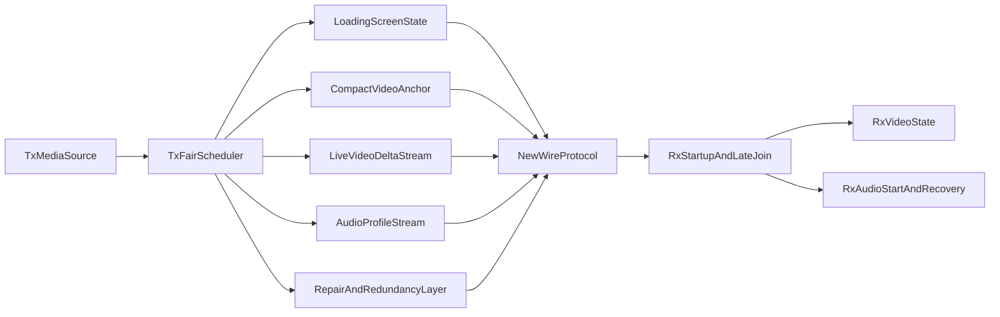

# Bad Wi-Fi Recovery And Transport Redesign

## Current Facts
- Yes, the desktop proof already streams live audio and live CDG in parallel over the wire. In [platform/desktop/src/app_tx.c](platform/desktop/src/app_tx.c), `dashcdg_tx_thread_main()` independently schedules `AUDIO_FRAME` and `CDG_BATCH` traffic from the same live playback timeline.
- The transport is still too expensive and bursty for weak Wi-Fi. The biggest current cost is not just audio: [docs/specs/transport-protocol.md](docs/specs/transport-protocol.md) and [platform/desktop/src/app_tx.c](platform/desktop/src/app_tx.c) show continuous `ASSET_CHUNK` replay, periodic large `CDG_SNAPSHOT` bursts, timed `CDG_BATCH` traffic, FEC overhead, and PTP/control traffic all sharing the same loop.
- Late-join video is structurally stronger than late-join audio today. RX can recover video from `CDG_SNAPSHOT`, but audio still depends on buffered `AUDIO_FRAME` playout reaching the start gate in [platform/desktop/src/app_rx.c](platform/desktop/src/app_rx.c).

## Goal
Create a separate protocol/runtime tranche optimized for bad Wi-Fi and poor networks that:
- sharply reduces steady-state bitrate and burstiness
- improves audio late join and startup reliability
- gets a first visual on screen quickly with a TX-driven loading screen
- keeps a higher-quality mode available while adding a very low bitrate test mode
- can freely bump the wire protocol and redesign packet families if that is the best solution

## Proposed Workstreams
### 1. Write the new transport spec first
- Create a separate protocol/tranche spec that clearly distinguishes:
  1. `current v3 desktop proof`
  2. `new bad-network transport mode`
  3. `retained higher-quality mode`
- Define explicit targets for:
  - average and peak bitrate on weak Wi-Fi
  - startup time to first picture
  - startup time to first audio
  - late-join behavior for audio and video
  - burst-loss and reorder tolerance
- Primary docs to update or add: [docs/specs/transport-protocol.md](docs/specs/transport-protocol.md), [docs/test/desktop-proof-plan.md](docs/test/desktop-proof-plan.md), [docs/test/desktop-impairment-validation.md](docs/test/desktop-impairment-validation.md), plus a new architecture/spec note for the redesigned transport.

### 2. Redesign the bandwidth profile end to end
- Replace the current always-on heavy bootstrap/background pattern with a staged transport model:
  - fast loading screen first
  - compact recovery keyframe/state object next
  - then live deltas/media
  - then opportunistic deeper backfill only when bandwidth allows
- Revisit packet families individually:
  - `ASSET_CHUNK`: likely no longer always replayed at the current constant rate
  - `CDG_SNAPSHOT`: make it faster to first useful picture and less bursty
  - `CDG_BATCH`: evaluate compact encoding for repeated or low-entropy CDG content, including RLE-style packing where it materially reduces bytes
  - FEC/redundancy: move from current bounded XOR-only assumptions toward a profile better suited to bursty Wi-Fi
- Add pacing/fairness rules so no one packet family can monopolize a TX loop tick.

### 3. Add explicit audio profiles
- Keep a normal quality mode.
- Add at least one low-bitrate resilience/testing mode for bad networks and MCU experimentation.
- Evaluate codec/profile choices in the spec before implementation:
  - existing Opus quality mode retained
  - low-bitrate mode could be low-rate Opus, u-law, SBC-like behavior, or another fixed/floating-point-friendly profile
- Define profile signaling on the wire so RX can late join and immediately know the decoding mode.

### 4. Fix late join and startup asymmetry
- Add a real audio late-join strategy instead of relying only on buffered future frames and current start gates.
- Define how video startup should work:
  - immediate TX-generated loading screen
  - rapid first state anchor
  - then live CDG deltas/keyframes
- Define how audio startup should work:
  - a fast-start low-bitrate or redundant join burst
  - adaptive preroll instead of one rigid threshold where appropriate
  - explicit recovery from missing first audio groups

### 5. Build a bad-network validation matrix before coding
- Extend [docs/test/desktop-impairment-validation.md](docs/test/desktop-impairment-validation.md) with targets that match the user-reported failure mode:
  - Wi-Fi-like throughput pressure
  - mixed burst loss plus reorder
  - late join mid-track with delayed snapshot arrival
  - audio startup under partial packet loss
  - video-first loading screen behavior
- Record objective pass criteria for both modes:
  - low-bitrate resilience mode
  - higher-quality normal mode

## Proposed Architecture Direction

## Design Priorities
- First priority: make weak Wi-Fi actually playable.
- Second priority: make late join obvious and fast, with a pleasant loading/connecting visual instead of a blank screen.
- Third priority: reduce TX and RX memory/bandwidth pressure rather than preserving current packet families for their own sake.
- Fourth priority: keep a high-quality path, but never let it block the existence of a robust low-bitrate test/recovery mode.

## Risks To Front-Load
- A truly robust Wi-Fi transport likely means protocol v4 or a similarly explicit wire break from the current proof protocol.
- CDG compression must be chosen carefully so encode/decode CPU cost does not exceed the network savings on MCU-class targets.
- More FEC or redundancy alone may not solve the issue if TX pacing and bootstrap bursts remain unmanaged.
- Audio late join needs a deliberate state/recovery design; video-only snapshot success will not automatically fix audio startup.
