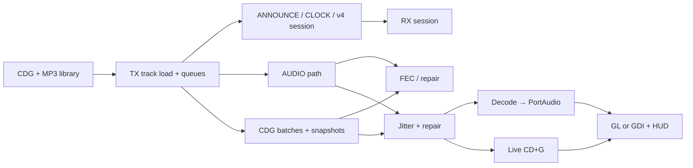

# dashcdg

> **Multicast karaoke that dares to leave the house** — CD+G over UDP, real codecs,
> late join, and enough Windows zips to fill a **USB stick of doom** (lovingly).

**Fork:** [andrew867/dashcdg](https://github.com/andrew867/dashcdg) · upstream history:
[AppleDash/dashcdg](https://github.com/AppleDash/dashcdg).

This line of work was never about stopping to ask *why*—it was about finding out
**whether it was possible**: MP3+G-style transport with repair, multiple desktop
front-ends (OpenGL, Win32 GDI, headless), and packaging that still runs on the
**weird old laptop** in the back of the closet. If you want enterprise polish
and a 24/7 NOC, buy a box; if you want to **see the packets fly**, you are
probably in the right place.

- **Attitude, on purpose:** [docs/fork-manifesto.md](docs/fork-manifesto.md)  
- **Contribute / build / tests:** [docs/CONTRIBUTING.md](docs/CONTRIBUTING.md)  
- **Long-form doc index:** [docs/README.md](docs/README.md)  
- **Receiver + debugging handoff:** [AGENTS.md](AGENTS.md)

---

## What is this repository?

`dashcdg` is a **karaoke transport and desktop reference** implementation:

- Deterministic **CD+G** decode, replay, and seek
- A **versioned** UDP protocol (**v4** on the wire by default; **`--v3`** for legacy)
- **Desktop TX/RX** for IPv4 **multicast** and **broadcast**
- **Live** audio over the wire: Opus, AMR wide/narrow, EVRC, QCELP, NB-IMA,
  SBC-style low-rate modes — plus timed **CD+G** batches, **snapshots**, and
  **bounded FEC** so bursty Wi-Fi does not end the party

The **transmitter** pushes audio and graphics on parallel timelines; the
**receiver** can **cold-join**, **repair** losses, and **re-anchor** from v4
snapshots without downloading a full `.cdg` file over the air first.

**Windows** builds are first-class: headless `desktop-tx`, GL `desktop-rx` with
GDI fallback, dedicated **`desktop-gdi-rx.exe` / `desktop-gdi-tx.exe`**, and a
**retro** bundle without OpenGL (still Opus + PortAudio, with PIII-friendly DLLs
on i386). The full matrix, exe names, and zip layouts live in
[`docs/specs/desktop-platform-support.md`](docs/specs/desktop-platform-support.md).

---

## Quick start (developers)

```sh
git clone <this-repo>
cd dashcdg
make
make test
```

On **MSYS2 / MinGW** you also need **vendored libsoxr** before linking the full
desktop stack:

```sh
make vendor-soxr
make desktop-apps
```

Run a build output from `build/amd64/bin/` or `build/x86/bin/` (paths vary by
arch — see the platform spec above). The repo includes a **large** optional
`cdg/` sample library; see
[`docs/test/sample-media.md`](docs/test/sample-media.md).

**Network defaults:** multicast `239.255.77.77`, UDP **24684**; point TX and RX
at the same group/port and press play.

---

## Protocol snapshot (v4)

| Area | Packets / ideas (short) |
| --- | --- |
| Bootstrap | `ANNOUNCE`, `ASSET_CHUNK`, `CLOCK_BEACON` |
| Media | v4 **session info**, **clock sync**, **audio** chunks, **CDG** batches, **snapshots** |
| Resilience | **FEC** / repair windows, **v4** anchors — bounded, not a full-file torrent |
| Time | **Software** PTP-style delay request/response for clock work — not IEEE1588 hardware |

Deeper: [`docs/specs/transport-protocol.md`](docs/specs/transport-protocol.md),
[`docs/specs/bad-network-transport.md`](docs/specs/bad-network-transport.md),
[`docs/architecture/desktop-streaming.md`](docs/architecture/desktop-streaming.md).

**TX audio isolation (2026):** the send path can **release audio** without
getting stuck behind PTP or RX **stats** work — see
[`docs/architecture/tx-audio-isolation.md`](docs/architecture/tx-audio-isolation.md).
**Lip-sync on RX** uses a realistic **host output latency** on PortAudio/WASAPI;
see [`docs/specs/v4-display-audio-sync.md`](docs/specs/v4-display-audio-sync.md).

---

## Repository map

| Path | Role |
| --- | --- |
| `core/` | CD+G, clocks, jitter, narrowband math |
| `proto/` | Framing, serializers, parsers |
| `platform/desktop/` | Renderer, PortAudio, resampling (e.g. **libsoxr** on MinGW), `app_tx.c` / `app_rx.c` |
| `apps/desktop-player/` | `desktop-player` with `tx` / `rx` shims |
| `platform/espidf/` | ESP-IDF **badge** firmware (growing) — desktop remains the v4 **contract** |
| `docs/` | **Everything** worth reading a second time |
| `scripts/` | Packaging, vendors, impairments, sneakernet |
| `tests/` | Core + protocol + helpers |
| `.github/workflows/` | CI; see **Releases** below |

---

## Build matrices (condensed)

**POSIX / generic:** `make`, `make debug`, `make test`.

**Windows:** vendor **soxr** (see [docs/specs/pcm-libsoxr-desktop-src.md](docs/specs/pcm-libsoxr-desktop-src.md)),
and for **i686 sneakernet** also vendor **Opus/PortAudio** sources
(`make vendor-audio-sources` or
[`docs/specs/windows-legacy-mingw-build.md`](docs/specs/windows-legacy-mingw-build.md)).

**Portable zips:**

```sh
scripts/build_release.sh x64    # or x86, all
# or: make dist-windows
```

**Sneakernet USB tree** (x64 + x86 + legacy P3 + retro):

```sh
make dist-windows-sneakernet
# → build/dist/dashcdg-windows-sneakernet/ + .zip; README inside the folder
```

Toggles: see header of `scripts/build_windows_sneakernet_dist.sh`. Desktop apps
print a **git-stamped** build id at startup so soak logs point at the right
commit.

---

## CI & releases

On tags matching `v*`, [`.github/workflows/release-sneakernet.yml`](.github/workflows/release-sneakernet.yml)
attaches **dashcdg-windows-sneakernet.zip** and a **sample track zip** from `cdg/`.
Manual **workflow_dispatch** runs can target a `release_tag` too.

---

## Desktop app cheat sheet

| App | Notes |
| --- | --- |
| `desktop-player` | Local play + can run **tx** / **rx** sub-modes — `--help` is truth |
| `desktop-tx` / `desktop-rx` | Standalone; **`desktop-gdi-tx.exe`** when you want a **GDI** preview with no GL |
| v4 audio | Non-retro TX default is often **resilience + AMR-WB**; `c` in a TTY cycles codecs; see [`docs/specs/v4-audio-codecs.md`](docs/specs/v4-audio-codecs.md) |

**Dependencies (high level):** OpenGL + GLEW + FreeGLUT for GL builds; GDI path
avoids GL; PortAudio + Opus everywhere for desktop; **AVRT** / **winmm** for
timing (see `platform/desktop/src/win32_timing_boost.c`).

**UI:** Arrow keys seek in the player; TX uses space/pause, next/prev, quit, etc. —
**`--help` on the binary** wins over this README when they disagree.

---

## Architecture diagram (simplified)



Impaired-network relay: [`docs/test/desktop-impairment-validation.md`](docs/test/desktop-impairment-validation.md) and `scripts/desktop_impairment.py`.

---

## Status (honest, no sugar coating)

| Done (in tree) | Still adventure territory |
| --- | --- |
| v3 + v4 families, MT TX/RX, live A/V + repair, pause, multicast/broadcast, GL+GDI, Windows zips, PIII-safe i686 DLL path, build IDs in logs, libsoxr on MinGW | “Venue PTP” is **not** grandmaster clock hardware; long impaired soaks and edge cases keep teaching us things; FEC is **bounded**; ESP32 is **not** a drop-in desktop clone yet |

Track the wish list: [`docs/specs/remaining-tranches-roadmap.md`](docs/specs/remaining-tranches-roadmap.md).

---

## License

MIT — see [LICENSE](LICENSE) (root). AppleDash is credited in the file header;
this fork’s changes follow the same license.

---

## More links (pick your rabbit hole)

- [docs/ops/quality-gates.md](docs/ops/quality-gates.md)  
- [docs/test/desktop-proof-plan.md](docs/test/desktop-proof-plan.md)  
- [docs/specs/receiver-progress-invariants.md](docs/specs/receiver-progress-invariants.md)  
- [docs/architecture/threaded-streaming-runtime.md](docs/architecture/threaded-streaming-runtime.md)  

**You made it to the end.** Go break something, run `make test`, and if the
lyrics and the snare line up, that counts as a good afternoon.
