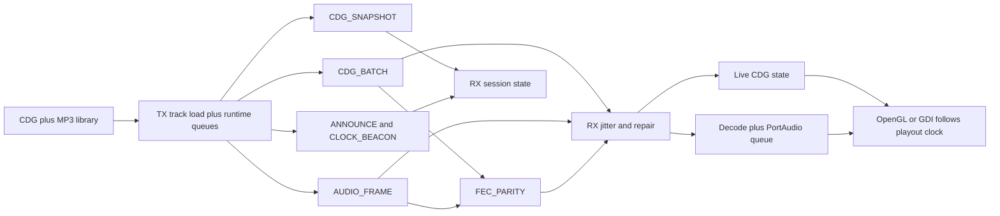

# dashcdg

**Fork:** [andrew867/dashcdg](https://github.com/andrew867/dashcdg) (from [AppleDash/dashcdg](https://github.com/AppleDash/dashcdg)).

This line of work was never about stopping to ask *why*—it was about finding out **whether it was possible**: multicast MP3+G-style karaoke transport with late join, bounded repair, multiple desktop surfaces (OpenGL and Win32 GDI), and enough Windows packaging to actually run it on real machines (including deliberately awkward targets). If you are here for polish over possibility, you may be in the wrong queue; if you are here to see what sticks, welcome.

Longer version of the same idea: [`docs/fork-manifesto.md`](docs/fork-manifesto.md).

`dashcdg` is a **karaoke transport and desktop proof** codebase centered on:

- deterministic CD+G decode, replay, and seek
- a versioned UDP-friendly wire protocol (v4 on the wire by default; `--v3` for legacy)
- desktop TX/RX apps for multicast and IPv4 broadcast
- live on-wire audio (Opus, AMR-WB/NB, QCELP-13k, low-rate QCELP, NB-IMA, Bluetooth SBC) plus timed CD+G, snapshots, and bounded FEC

The desktop TX path sends audio and CD+G in parallel; RX can cold-join, repair, and re-anchor from v4 snapshots/anchors without rebuilding a full `.cdg` asset on the wire. **Windows** builds include headless `desktop-tx`, GL-first `desktop-rx` with GDI fallback, dedicated **`desktop-gdi-rx.exe` / `desktop-gdi-tx.exe`**, and a **retro** Win32 bundle without OpenGL (still **Opus + PortAudio** with PIII-safe vendored DLLs on i686). Canonical matrix: [`docs/specs/desktop-platform-support.md`](docs/specs/desktop-platform-support.md).

## What exists today

Hybrid transport (high level):

- `ANNOUNCE`, `ASSET_CHUNK`, `CLOCK_BEACON` — late join / bootstrap
- `AUDIO_FRAME` — live audio frames (codec per v4 session)
- `CDG_BATCH` — live timed CD+G
- `CDG_SNAPSHOT` — bounded framebuffer/palette keyframes
- `PTP_*` — software round-trip clock estimate
- `FEC_PARITY` — bounded single-loss XOR recovery for short audio and CD+G groups

Receiver behavior (summary):

- v4 session info, clock sync, timed CD+G deltas, and periodic anchors cooperate for late join and recovery
- explicit HUD / headless observability for playout, clock, and repair state
- jitter and session logic tuned for cold join and handoff (see [`docs/architecture/desktop-streaming.md`](docs/architecture/desktop-streaming.md))

## Repository map

- `core/` — portable CD+G, clocks, jitter, narrowband codecs
- `proto/` — protocol framing, serializers, parsers
- `platform/desktop/` — renderer, PortAudio, resampling (including **libsoxr** on MinGW), TX/RX app logic
- `apps/desktop-player/` — local player plus `tx` / `rx` entry shims
- `docs/` — architecture, specs, tests, hardware, ops ([`docs/README.md`](docs/README.md))
- `tests/` — portable core, protocol, and helper tests
- `.github/workflows/` — CI/CD (see **Releases** below)

## Build

**POSIX / generic:**

```sh
make
make debug
make test
```

**Windows (MSYS2)** — desktop objects link **static libsoxr** for high-quality PCM rate conversion. The Makefile requires vendored **`libsoxr.a`** per arch before linking the desktop library:

```sh
make vendor-soxr
# or: bash scripts/build_soxr_vendor.sh mingw64 && bash scripts/build_soxr_vendor.sh mingw32
```

Fetch Opus/PortAudio **sources** (needed for the PIII-safe i686 shared DLL build used in sneakernet / mingw32 zips):

```sh
make vendor-audio-sources
# or: bash scripts/fetch_opus_portaudio_vendors.sh
```

Then `make debug` as usual with `MINGW_ARCH=mingw64` or `mingw32` (see [`docs/specs/windows-legacy-mingw-build.md`](docs/specs/windows-legacy-mingw-build.md)).

### Windows portable zips (per-arch)

```sh
scripts/build_release.sh x64
scripts/build_release.sh x86
scripts/build_release.sh all
```

Produces `build/amd64/release/dashcdg-windows-x64-portable.zip`, `build/x86/release/dashcdg-windows-x86-portable.zip`, and copies into `build/dist/` when using `all`.

Or from the Makefile:

```sh
make dist-windows
```

For an **XP-oriented PE** on the package build, set `DASHCDG_WINDOWS_LEGACY=1` for the script or `WINDOWS_LEGACY_TARGET=1` for `make` (details in [`docs/specs/windows-legacy-mingw-build.md`](docs/specs/windows-legacy-mingw-build.md)).

### Sneakernet USB bundle (x64 + x86 + legacy P3 + retro)

One folder plus a zip of that folder — same layout as local development when you run:

```sh
make dist-windows-sneakernet
# runs: bash scripts/build_windows_sneakernet_dist.sh
```

Outputs:

- `build/dist/dashcdg-windows-sneakernet/` (with `README.txt` inside)
- `build/dist/dashcdg-windows-sneakernet.zip`

The script builds vendored PIII **libopus-0.dll** + **libportaudio.dll**, both **libsoxr** static libs, then four `make debug` variants (incremental by default; set `DASHCDG_SNEAKENET_CLEAN=1` for CI-style clean builds). See the script header in `scripts/build_windows_sneakernet_dist.sh` for env toggles (`RUN_P3_DISASM`, `SKIP_*`, etc.).

Each sneakernet packaging run now pins a git-derived build string such as **`dev-master-g0b67b5a`** and the desktop apps print it at startup:

- `[tx] build: dev-master-g0b67b5a`
- `[rx] build: dev-master-g0b67b5a`

That line is emitted to the console and to the sidecar soak logs, so field tests can be tied back to the exact source revision.

## Releases and CI

- **Workflow:** [`.github/workflows/release-sneakernet.yml`](.github/workflows/release-sneakernet.yml)  
  On push of tags matching `v*` (e.g. `v0.1.0`), GitHub Actions builds the sneakernet bundle in MSYS2 and attaches **two** assets to the GitHub Release:
  - **`dashcdg-windows-sneakernet.zip`** — the four-folder Windows USB layout (`windows-x64`, `windows-x86`, `windows-x86-legacy-p3`, `windows-x86-retro`)
  - **`dashcdg-sample-tracks-mp3g.zip`** — the in-repo **`cdg/`** MP3+G library (same pairs the TX/player scan by default)

  Manual runs are also supported via **Actions → Build and Release Sneakernet Bundle → Run workflow** (supply a `release_tag` such as `v0.1.0`).

## Sample tracks (`cdg/`)

The repo carries a **large** `cdg/` tree of working **`.cdg` + `.mp3`** pairs so you can exercise TX/RX without hunting for media. See [`docs/test/sample-media.md`](docs/test/sample-media.md) for size expectations, redistribution notes, and how that maps to release zips.

## Desktop dependencies

**Full GL stack** (`desktop-rx`, `desktop-player`, non-headless TX objects that link GL): OpenGL, GLEW, FreeGLUT, PortAudio, Opus, pthread, Winsock helpers as linked today.

**GDI-only receiver** (`desktop-gdi-rx.exe`): PortAudio, Opus, Win32 GDI — no FreeGLUT/GLEW in that link ([`docs/specs/win32-gdi-view-backend.md`](docs/specs/win32-gdi-view-backend.md)).

**Retro bundle** (`WINDOWS_RETRO_BUNDLE=1`): **no OpenGL**; **Opus + PortAudio** with the same PIII-safe `libopus-0.dll` / `libportaudio.dll` as other mingw32 folders; narrowband codecs still available per v4 session. See [`docs/specs/vendored-opus-portaudio-windows.md`](docs/specs/vendored-opus-portaudio-windows.md).

**Windows timing:** builds link **`WINMM.dll`** for `timeBeginPeriod`; **`AVRT.dll`** (MMCSS) is loaded at runtime on Vista+ only — see `platform/desktop/src/win32_timing_boost.c`.

**Typical MSYS2 packages:** `mingw-w64-{x86_64,i686}-gcc`, Opus/PortAudio/freeglut/glew from the prefix for **mingw64**; **mingw32** product builds expect the **vendored** PIII DLLs under `build/mingw32-p3-vendor/` from `scripts/build_mingw32_p3_opus_portaudio_shared.sh` (not stock MSYS2 i686 Opus for sneakernet layouts).

## Desktop app usage

Local player (paths depend on platform; Windows MSYS2: `build/amd64/bin/...` or `build/x86/bin/...`):

```sh
build/bin/desktop-player [--shuffle] [<folder> | <file.cdg>|<file.mp3>|<file-stem> [file.mp3]]
```

Network modes via player:

```sh
build/bin/desktop-player tx [--help] [--headless] [--v3] [--audio-profile=quality|resilience] [--v4-audio-codec=<name>] [--badnet-v4|--badnet-v4-sbc|--badnet-v4-qcelp8k] [endpoint-address] [port] [song-id] [file|folder] [warmup-ms]
build/bin/desktop-player rx [--help] [--headless] [--gdi] [endpoint-address] [port]
```

Standalone TX/RX (Windows: use **`desktop-tx.exe`** for headless; **`desktop-gdi-tx.exe`** for GDI preview without GL):

```sh
build/bin/desktop-tx [--help] [--v3] ...
build/bin/desktop-rx [--help] [--headless] [--gdi|--win-gdi] ...
```

**V4 audio:** defaults and codec IDs are documented in [`docs/specs/v4-audio-codecs.md`](docs/specs/v4-audio-codecs.md). Current non-retro TX default is **resilience profile + AMR-WB**; `--audio-profile=quality` switches to Opus. Use **`--help`** on `tx` / `rx` for the full flag list; with a TTY, **`c`** cycles codecs on TX.

Network defaults:

- multicast `239.255.77.77`, UDP port `24684`
- default TX library folder: `cdg/` when no source path is given
- IPv4 broadcast destinations (e.g. `192.168.0.255`) are accepted where supported

## Media resolution behavior

- No path: `desktop-player` scans `cdg/` sequentially; `--shuffle` randomizes.
- No TX path: `desktop-tx` / `desktop-player tx` scan `cdg/` (TX shuffles on startup and again each playlist wrap).
- Folder: scan `.cdg` and pair same-stem `.mp3` (MP3+G).
- Single file / stem resolution as before; see [`docs/specs/desktop-platform-support.md`](docs/specs/desktop-platform-support.md) for packaging notes.

## UI controls

Authoritative behaviour is whatever **`--help`** prints on the binary you are running; the docs describe architecture and proof plans, not every hotkey variant.

- Player: arrow keys seek ±1000 ms.
- TX: `Space`/`p` play/pause, `n`/`]` next, `b`/`[` back, `r` restart, `f` force rebroadcast, `c` cycle v4 codec, `q` quit, etc.
- RX: `--headless` status lines; `S` in window prints status.

## Desktop streaming architecture



## Impairment validation relay

```sh
python scripts/desktop_impairment.py \
  --listen-group 239.255.77.91 \
  --listen-port 24684 \
  --emit-group 239.255.77.92 \
  --emit-port 24685 \
  --drop-every 11
```

See [`docs/test/desktop-impairment-validation.md`](docs/test/desktop-impairment-validation.md).

## Current status (honest)

**Implemented and exercised in-tree:** v3/v4 packet families, threaded TX/RX, live audio + CDG + snapshots + FEC, pause screen, multicast and broadcast, GDI and GL paths, Windows packaging including sneakernet, PIII-safe i686 codec DLL build path, git-stamped build IDs in soak logs, and libsoxr-backed desktop resampling on MinGW.

**Still research / proof grade:** clocking is software-timestamped, not venue PTP hardware; long impaired soaks and numeric caps are still being expanded; FEC repairs one loss per group; some edge cases around startup and handoff may still need tuning—see [`docs/specs/remaining-tranches-roadmap.md`](docs/specs/remaining-tranches-roadmap.md).

## Important limitations

- Not a finished commercial venue stack.
- Embedded ESP-IDF receiver remains documentation-first under [`docs/hardware/`](docs/hardware/) until a buildable target lands.

## Related documentation

- [`docs/fork-manifesto.md`](docs/fork-manifesto.md) — why this fork exists (short)
- [`docs/README.md`](docs/README.md) — full index
- [`docs/test/sample-media.md`](docs/test/sample-media.md) — **`cdg/`** sample library and release zip
- [`docs/specs/desktop-platform-support.md`](docs/specs/desktop-platform-support.md) — **master** Windows/Linux matrix, artifacts, sneakernet
- [`docs/specs/transport-protocol.md`](docs/specs/transport-protocol.md) — protocol fields
- [`docs/architecture/desktop-streaming.md`](docs/architecture/desktop-streaming.md) — end-to-end desktop architecture
- [`docs/architecture/threaded-streaming-runtime.md`](docs/architecture/threaded-streaming-runtime.md) — threads and queues
- [`docs/specs/receiver-progress-invariants.md`](docs/specs/receiver-progress-invariants.md) — RX progress rules
- [`docs/test/desktop-proof-plan.md`](docs/test/desktop-proof-plan.md) — proof claims
- [`docs/ops/quality-gates.md`](docs/ops/quality-gates.md) — release / quality expectations
