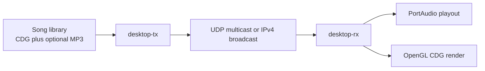
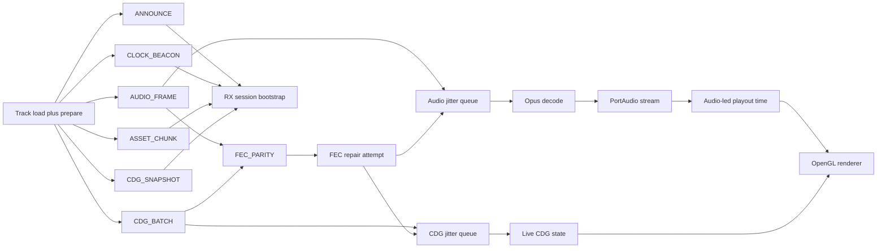

# Desktop Streaming Architecture

## Purpose

This document is the developer handoff for the active desktop TX/RX proof. Read this first if you need to understand how the repo's networked karaoke path actually works today, what is portable, and what is still proof-grade.

## High-Level Topology

The sender and receiver share one protocol and one timeline:

- TX publishes session metadata, live media, repair packets, and timing traffic.
- RX rebuilds enough session state to start quickly, then continues toward deterministic late-join completeness in the background.
- Audio becomes the playout master once steady-state playback starts.

## Repository Roles

- `core/src/cdg.c`: deterministic CD+G packet application, snapshotting, and seek primitives
- `core/src/media_clock.c`: bounded remote/local time discipline helpers
- `proto/src/protocol.c`: packet serialization and parsing for protocol v3
- `platform/desktop/src/app_tx.c`: TX state machine, scheduler, playlist logic, pause screen, PTP master behavior, and FEC generation
- `platform/desktop/src/app_rx.c`: RX session state, jitter queues, FEC recovery, snapshot apply, PTP slave behavior, and render/audio startup gates
- `platform/desktop/src/desktop_audio.c`: queue-driven PortAudio backend used by RX network playback
- `platform/desktop/src/opus_codec.c`: Opus encode/decode wrapper for the desktop proof
- `platform/desktop/src/gl_renderer.c`: desktop CDG rendering path and HUD drawing

## End-to-End Packet Flow

## TX Runtime

### Startup and Track Load

When TX starts or changes tracks, it:

1. resolves a song or directory entry
2. loads the `.cdg` asset for bootstrap replay
3. pairs an `.mp3` if present
4. prepares a bounded audio-production queue for live send
5. opens a new session with a default `1000 ms` warmup
6. lets the dedicated TX audio thread stream MP3 decode, resample to `48 kHz`,
   downmix to mono, and encode rolling `20 ms` Opus frames just ahead of send

Important current behavior:

- TX still performs CD+G asset load and batch preparation synchronously on the
  track-change hot path.
- TX audio production is no longer whole-track pre-encode; a dedicated producer
  thread fills a bounded `audio_ready_queue` during live send.
- Console output now prints a preparation line immediately, but some media
  preparation cost is still on the hot path.
- Directory playback defaults to the local `cdg/` folder when no TX source path is provided.
- TX shuffles on initial directory load and reshuffles when the playlist wraps.

### Scheduler Responsibilities

`app_tx.c` is responsible for:

- periodic `ANNOUNCE` and `CLOCK_BEACON`
- live `AUDIO_FRAME` send
- live `CDG_BATCH` send
- bounded `FEC_PARITY` generation
- periodic `CDG_SNAPSHOT` generation
- pause-screen snapshot generation
- preview HUD and terminal stats
- operator commands for pause, next, back, restart, rebroadcast, and visibility

Current threading split inside the desktop proof:

- TX audio production happens on `dashcdg_tx_audio_thread_main()`
- TX packet pacing and control traffic still run in the main TX scheduler loop
- CD+G batch creation is still done up front and currently duplicates payload
  storage, which is the next slimdown target

### Pause Mode

Pause is not just a local UI stop:

- TX sets the paused flag in packet headers
- normal audio/CDG advancement is suppressed
- TX repeatedly sends a generated pause-screen snapshot
- RX treats that snapshot as healthy session state and keeps the window/headless status alive
- resume returns to live scheduling from the paused media position

## RX Runtime

### Session Bring-Up

RX combines bootstrap and live playout:

1. `ANNOUNCE` prepares or resets session state
2. RX anchors the sender clock immediately from a fresh announce on new sessions or track changes
3. `ASSET_CHUNK` rebuilds the full CDG asset in the background
4. `CDG_SNAPSHOT` can immediately seed the live framebuffer before asset completion
5. `AUDIO_FRAME` and `CDG_BATCH` enter bounded jitter queues
6. `FEC_PARITY` is used to recover a single missing payload per protected group when possible
7. PortAudio startup happens asynchronously so GUI/headless status does not stall

### Clocking

The desktop proof uses software-timestamped PTP-style exchanges:

- `PTP_SYNC`
- `PTP_FOLLOW_UP`
- `PTP_DELAY_REQ`
- `PTP_DELAY_RESP`

Current RX behavior:

- fresh announces re-anchor after track changes
- stale PTP exchanges are discarded after a bounded age window
- clock telemetry tracks offset, path delay, step size, peak correction, and holdover age
- once audio is flowing steadily, audio playout time becomes the render master

This is good enough for desktop proof work, but it is not hardware-timestamped PTP.

### Jitter and Recovery

RX keeps bounded pending queues for both live streams:

- audio frames can arrive slightly out of order and still be recovered/applied
- CDG batches can arrive slightly out of order and still be recovered/applied
- overdue gaps are skipped instead of wedging the session forever
- per-pass media drain is bounded so render/status threads remain responsive

Current FEC behavior:

- XOR parity is generated across short groups
- one missing media payload in a fully covered group can be reconstructed
- burst loss beyond one member per group is expected to exceed the current repair model

## Late Join and Recovery Model

Late join now combines three layers:

1. repeated `ANNOUNCE` for session discovery and config
2. repeated `ASSET_CHUNK` for deterministic full-asset rebuild
3. periodic `CDG_SNAPSHOT` for fast visual bootstrap and mid-session repair anchor

That means:

- a newly started RX can show live video quickly from snapshot state
- the full asset continues to rebuild behind the scenes
- once the asset is complete, RX regains deterministic seek/backfill behavior

Audio does not yet have an equivalent standalone keyframe concept; audio recovery is currently based on playout delay, jitter queues, and bounded FEC repair rather than a separate audio-state snapshot.

## Observability

Both TX and RX expose proof telemetry in the HUD and/or stdout:

- asset/bootstrap progress
- playout gates such as `wait-ptp`, `wait-preroll`, and running state
- audio and live CDG packet counters
- reorder and skip counts
- FEC group, parity, repair, and failure counters
- snapshot receive/apply counters
- PTP offset, path delay, step, peak, and holdover values

Use `docs/test/desktop-impairment-validation.md` for the repeatable impaired-network matrix and `docs/test/desktop-proof-plan.md` for the intended proof claims.

## What Is Portable vs Desktop-Specific

Portable/reusable today:

- CDG decode semantics
- media clock math
- wire protocol framing

Desktop-specific today:

- socket setup and network threads
- PortAudio stream management
- OpenGL renderer and preview HUD
- track preparation, playlist controls, and current TX scheduler policy
- pause-screen generator art

## Current Gaps

- TX track preparation is still synchronous for CD+G asset and batch setup even
  though audio encode is now incremental.
- TX still preloads the full `.cdg` asset and duplicates live CD+G payload
  storage in prebuilt batches.
- The clock loop is software timestamped and millisecond scale, not venue-grade hardware timestamping.
- FEC is intentionally bounded and only repairs one missing payload per group.
- Long impaired-network soak validation is still incomplete.
- There is no embedded receiver implementation yet; only the reusable seams and planning docs exist.

## Suggested Reading Order

1. `README.md`
2. `docs/architecture/desktop-streaming.md`
3. `docs/specs/transport-protocol.md`
4. `docs/test/desktop-proof-plan.md`
5. `docs/test/desktop-impairment-validation.md`
6. `docs/architecture/portable-core.md`
