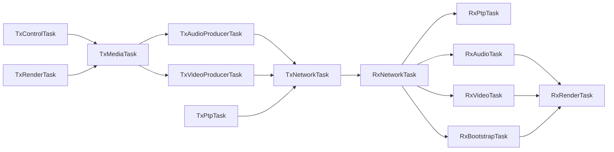

# Threaded Streaming Runtime

## Purpose

This document defines the target desktop runtime that replaces the earlier coarse-lock TX/RX proof loops. It is a design and implementation contract for the threaded refactor; it does not claim that every item here is already fully implemented in the current shipping binaries.

## Goals

- keep network ingress progressing even when media decode, bootstrap rebuild, or rendering is slow
- remove whole-track TX audio pre-encode from the session-start hot path
- separate clock, network, audio, video, and render responsibilities into task-like modules
- make ownership and queue boundaries explicit so the design can later map onto RTOS tasks

## Current Implemented Subset

Parts of this target runtime already exist in the desktop proof:

- TX incremental audio production on a dedicated audio thread
- a bounded `tx_audio_ready` queue between audio production and packet pacing
- RX audio queue-driven PortAudio playout

Still not fully split today:

- TX video production and network pacing are still largely coupled in one main
  scheduler loop
- RX packet receive, live media progression, and render publication are not yet
  fully separated into the ideal task boundaries below

## Runtime Topology

## Ownership Rules

### TX

- `TxControlTask` owns operator commands and track-change requests.
- `TxMediaTask` owns the active track/session description and decides when a producer swap is valid.
- `TxAudioProducerTask` owns MP3 decode, resample state, Opus encoder state, and rolling audio-frame sequence/FEC grouping.
- `TxVideoProducerTask` owns timed CDG batch production and snapshot cadence.
- `TxNetworkTask` owns packet pacing, socket send, session announce/beacon cadence, and asset rebroadcast cadence.
- `TxPtpTask` owns `PTP_DELAY_REQ` receive and `PTP_DELAY_RESP` send.
- `TxRenderTask` owns the OpenGL preview context and only consumes immutable preview snapshots.

### RX

- `RxNetworkTask` owns socket receive and packet parse, then dispatches typed events into bounded queues.
- `RxPtpTask` owns sender-clock discipline and path-delay estimation.
- `RxBootstrapTask` owns `ASSET_CHUNK` replay, asset completion, and deterministic-reader readiness.
- `RxAudioTask` owns audio-frame reorder handling, Opus decode, and PortAudio queue feed.
- `RxVideoTask` owns live CDG batch reorder handling, snapshot apply, and the current live `dashcdg_cdg_state`.
- `RxRenderTask` owns the OpenGL context and only consumes immutable published render snapshots plus HUD metrics.

## Queue Contracts

Bounded queues are intentional. Overflow is observable and never silent.

- `tx_audio_ready`: encoded `AUDIO_FRAME` items ready for pacing/send
- `tx_cdg_ready`: timed `CDG_BATCH` items ready for pacing/send
- `tx_control`: next/back/restart/pause/load requests
- `rx_packet_events`: parsed network packets handed off from socket receive
- `rx_ptp_events`: `PTP_SYNC`, `PTP_FOLLOW_UP`, and `PTP_DELAY_RESP` observations
- `rx_audio_events`: live audio frames already validated at the protocol layer
- `rx_video_events`: live CDG batches and snapshots already validated at the protocol layer
- `rx_render_frames`: immutable render snapshots published by RX video/bootstrap

Each queue must expose:

- current depth
- high-water mark
- overflow/drop count
- last publish time
- last consume time

## Progress Invariants

These invariants define the runtime behavior the refactor must preserve:

1. Network receive must continue even when decode or rendering stalls.
2. Audio playout progress must not depend on bootstrap completion.
3. Live CDG progression must not depend on asset-ready once enough live state exists to continue.
4. Snapshot apply is a recovery aid and visual fast-start anchor, not a gate that can permanently block live progression.
5. Renderer state must be publish/consume based. The render thread never mutates transport or decode state directly.
6. Track changes must not require whole-track audio pre-encode before a new session can be announced.

## TX Producer Model

TX audio production becomes incremental:

- streaming MP3 decode
- streaming resample into the transport sample rate
- rolling Opus encode at `20 ms`
- rolling sequence and FEC group assignment
- lookahead bounded by queue depth rather than full-track precompute

TX video production becomes timeline-driven:

- derive the next batch from packet index and playback time
- generate periodic snapshots from the current live state
- keep asset rebroadcast independent from live video cadence

## RX Gate Model

The RX HUD/status gates should map to independent subsystems:

- audio gate: clock lock, audio queue fill, audio device start, underrun state
- video gate: live snapshot availability, live CDG backlog, video deadline skips
- bootstrap gate: asset replay completeness and deterministic-reader readiness
- render gate: renderer heartbeat and most-recent published frame age

No single gate string should hide a stall in a different subsystem.

## Render Boundary

The renderer must be an explicit module boundary:

- OpenGL objects are created, owned, and destroyed on the render thread
- render inputs are immutable snapshots
- HUD data is copied into a render-facing snapshot structure
- transport/media threads never call GL directly

## Portability Mapping

This design intentionally maps onto RTOS concepts:

- task -> FreeRTOS task
- queue -> FreeRTOS queue or stream buffer
- published snapshot -> double buffer plus event flag
- thread heartbeat -> watchdog/feed point

## Validation Targets

- long-play soak with no transport-progress freezes
- repeated track changes without multi-second silent pre-encode stalls
- impairment relay runs where network ingress still progresses during repair/skip conditions
- render thread remains responsive even during bootstrap replay or packet bursts
