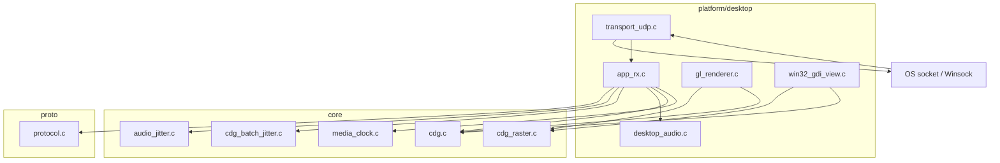

# Transport and playout modules (architecture)

## Overview

This note ties together:

- [`../specs/transport-udp-boundary.md`](../specs/transport-udp-boundary.md)
- [`../specs/audio-jitter-playout-boundary.md`](../specs/audio-jitter-playout-boundary.md)
- [`../specs/cdg-batch-jitter-playout-boundary.md`](../specs/cdg-batch-jitter-playout-boundary.md)
- [`../specs/cpu-rgba-raster-contract.md`](../specs/cpu-rgba-raster-contract.md)
- [`portable-core.md`](portable-core.md)
- [`threaded-streaming-runtime.md`](threaded-streaming-runtime.md)

## Layer diagram

## Data flow (RX)

1. **`transport_udp`** returns raw UDP payload bytes + sender sockaddr (metadata preserved in `app_rx` if needed later).
2. **`dashcdg_protocol_parse_packet`** produces `dashcdg_packet_view`.
3. **`handle_*`** routines update `receiver_state`, including **`dashcdg_audio_jitter_insert`** for live audio frames and FEC recoveries, and **`dashcdg_cdg_batch_jitter_insert`** for live CDG batches (including FEC recovery and V4 deltas).
4. **`dashcdg_rx_drain_media_locked`** calls **`dashcdg_audio_jitter_drain_step`** and **`dashcdg_cdg_batch_jitter_drain_step`** in bounded loops; on **APPLY**, audio decodes to **`dashcdg_desktop_audio_queue_frames`**; CDG applies **`dashcdg_cdg_state_process_packet`** per sub-packet then **`dashcdg_cdg_batch_jitter_note_applied`**.
5. **Render** path copies `dashcdg_cdg_state` snapshot; **GL:** **`dashcdg_gl_renderer_render`** uses **`dashcdg_cdg_state_to_rgba8`** + `GL_RGBA` upload. **Windows GDI:** **`dashcdg_win32_gdi_view_present_rgba`** uses the same RGBA buffer and blits with GDI (`--win-gdi`).

## Thread ownership (unchanged)

- Network thread: transport recv + parse + mutex-protected state updates.
- Media thread / GLUT timer: drain + publish render snapshot.
- Main thread: GLUT display (OpenGL) **or** Win32 GDI message pump + present (`--win-gdi`).

## RTOS mapping (ESP32)

| Desktop module | FreeRTOS task |
| --- | --- |
| `transport_udp` + parse | Wi-Fi receive task |
| `audio_jitter` + decode | Audio task |
| `cdg_batch_jitter` + CDG apply | Graphics / media task |
| `cdg_raster` + SPI flush | Render task |

## Build coupling

- `libdashcdg_core.a` gains `audio_jitter.o`, `cdg_batch_jitter.o`, and `cdg_raster.o`.
- `libdashcdg_desktop.a` gains `desktop_transport_udp.o` and `desktop_win32_gdi_view.o` via `DESKTOP_APP_OBJECTS` in the Makefile (GDI links `-lgdi32 -luser32` on Windows targets).

## File list (normative after implementation)

| Path | Role |
| --- | --- |
| `core/include/dashcdg/audio_jitter.h` | Jitter API |
| `core/src/audio_jitter.c` | Jitter implementation |
| `core/include/dashcdg/cdg_raster.h` | Raster API |
| `core/src/cdg_raster.c` | Raster implementation |
| `platform/desktop/include/dashcdg/transport_udp.h` | UDP helpers |
| `platform/desktop/src/transport_udp.c` | UDP implementation |
| `platform/desktop/include/dashcdg/win32_gdi_view.h` | Win32 GDI view (optional RX path) |
| `platform/desktop/src/win32_gdi_view.c` | Win32 GDI implementation / non-Win stubs |
