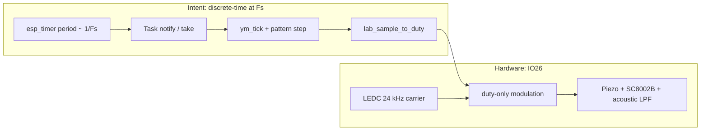

# Audio lab “Mary” demo — root-cause analysis, specs, tests, and fix plan

This document treats the **“sounds like a steady tone, not a melody”** failure as a **system** problem: intent (DSP) vs **timebase** (when samples hit hardware) vs **electroacoustic** (how IO26 is heard). It is written to support **evidence-based** fixes, not guesswork.

## 1. System under analysis

### 1.1 Intended architecture (as implemented in tree)

| Stage | Location | Role |
| --- | --- | --- |
| A. Note / waveform generator | `badge_lab_ym.c` | Three **32-bit phase accumulators** (`s_phase[]`), increments `hz_to_inc(hz)` with **`hz = f / LAB_FS_HZ * 2^32`**, **`LAB_FS_HZ = DASHCDG_LAB_PCM_FS_HZ`** (default **24 kHz** on ESP32). Square from MSB; mix + drums → **`ym_tick()`** → `int32_t` sample. |
| B. Note / phrase clock | `badge_lab_ym.c` | **`TICKS_PER_STEP = Fs/8`** → **125 ms** per pattern index step. **`pattern_advance_if_needed`** increments **`s_step_counter`** once **per `ym_tick()` call**, not per wall-clock second independently. |
| C. Sample clock | `esp_timer` → `vTaskNotifyGiveFromISR` / `xTaskNotifyGive` → **`ulTaskNotifyTake(pdTRUE, …)`** | **One timer tick ⇒ one notification ⇒ ideally one `ym_tick` + one push** after batch accounting. |
| D. Amplitude / duty mapping | `lab_sample_to_duty()` | `powf` volume curve, clamps, maps to **8-bit duty** ~**128 ± swing** (small swing by design). |
| E. Fixed-carrier PWM “DAC” | `platform_hw.c` | **`lab_pcm_stream_begin`**: `ledc_set_freq(..., 24000)` on **`LEDC_TIMER_BEEP`**, **`LEDC_CH_AUDIO`**. **`lab_pcm_push_u8`**: `ledc_set_duty` + `ledc_update_duty` **only** (no per-sample freq change while streaming). **`beep_apply_freq_duty_locked`** **returns early** while **`s_lab_pcm_streaming`**. |

**Critical invariant (must hold for “melody”):**

> **Exactly one call to `ym_tick()` (and thus one pattern step increment) per nominal sample period `1/LAB_FS_HZ` of wall time**, modulo acceptable **jitter**; and **duty updates** must represent that sample stream without **effective downsampling** to a single slowly varying bias.

If wall-time sample rate collapses, **phrase clock** (still tied to **sample count**) drags: notes hang → **ear hears one pitch for a long time** (“a tone”). If **phrase clock** runs too fast vs wall (catch-up bursts), notes **blur** or sound like **noise / warble**.

### 1.2 Mermaid — data and time

---

## 2. Physics / DSP expectations (spec)

### 2.1 PWM-as-audio

With carrier **`F_c = 24 kHz`** and duty **`d[n]`** updated at **`F_s`**, after low-pass the **useful band** is roughly **0 … min(F_s/2, F_acoustic_passband)`**. Melody fundamentals are **~65–400 Hz**; harmonics of **square** extend much higher.

**Spec S1:** **`F_s` effective** (rate at which **`d[n]`** meaningfully changes **in wall time**) shall be **≥ 8 kHz** preferred, **≥ 4 kHz** minimum, with **jitter** small enough that **inter-note** intervals stay near **125 ms** (±20 ms perceptual).

### 2.2 Phrase clock vs sample clock

**`s_step_counter`** advances **once per `ym_tick()`**. Therefore:

**Spec S2:** **`ym_tick()` executions per wall second** shall equal **`LAB_FS_HZ` ± tolerance** (e.g. **±2%**) while demo plays.

If **`ym_tick()`/s` << `LAB_FS_HZ`**, **notes change slowly** → **tone-like**.  
If **`ym_tick()`/s >> `LAB_FS_HZ`**, **notes change too fast** → **garbled / chirp**.

### 2.3 `LAB_SAMPLE_US` integer quantization

`LAB_SAMPLE_US = 1000000u / LAB_FS_HZ` (e.g. **41 µs** at **24 kHz**, truncated). Small rate error vs nominal **Fs** slightly **detunes** all generators together; it does **not** alone explain a **single** long tone.

**Spec S3:** Document **actual** timer period (µs) from **`esp_timer_get_period`** or logic analyzer; either accept **62** or use **`esp_timer`** API that allows **fractional** configuration if available on target.

---

## 3. Failure mode analysis (FMEA-style)

| ID | Failure | Mechanism | Ear / scope signature | Detection |
| --- | --- | --- | --- | --- |
| F1 | **Sample clock starvation** | Lab task **prio** below or equal to **LVGL** / other work; **`ulTaskNotifyTake`** returns **rarely**; **few `ym_tick`/s** wall-time. | **One pitch for seconds**; melody **crawls**. | Count **`ym_tick`** per second (GPIO, `esp_timer` on second pin, or `esp_log` throttled). |
| F2 | **Burst “catch-up” without wall-time pacing** | Timer keeps **notifying** while task runs long **CPU** bursts; **`ym_tick`** count advances **faster than wall** in short windows, then **stalls**. | **Warble**, **ringing**, **wrong tempo**, sometimes **mask-like tone**. | Same rate counter + **distribution** of inter-`push` gaps (scope on test GPIO toggled each `push`). |
| F3 | **`powf` in `lab_sample_to_duty` every sample** | **~16k `powf`/s** can **stretch** CPU time per burst → F2/F1 hybrid. | **Low pitch / muddy** or **irregular**; CPU load high. | **CPU profiler** or toggle GPIO around **`powf`**. |
| F4 | **`CONFIG_ESP_TIMER_SUPPORTS_ISR_DISPATCH_METHOD` off** | Timer runs **`ESP_TIMER_TASK`**; **jitter** and **coalescing** of callbacks. | **Detuned** melody, **rough** timbre; can contribute to **tone-like** if updates **clump**. | Read **`sdkconfig`**, confirm **ISR dispatch**; scope **notify→push** jitter. |
| F5 | **Pattern / `hz` logic bug** | Wrong **`TICKS_PER_STEP`**, **`s_inc` stuck**, **`s_pat_pos` not advancing**. | **Stuck** on one note of score. | Log **`s_pat_pos`** every **2000** ticks; assert **monotonic** mod length. |
| F6 | **Hardware dominates** | **Piezo** resonance, **SC8002B** band-limiting, **carrier bleed** at **24 kHz** or **subharmonics**. | **Whine** or **single prominent partial** even when **`d[n]`** is correct. | **AC-coupled** sense at speaker with **spectrum**; compare **open duty** vs **mic**. |
| F7 | **`ledc_update_duty` rate / coherency** | Driver or clock tree limits **effective** duty stream; **glitches** on update. | **Buzz**, **missing harmonics**. | Scope **IO26**; verify **duty** steps correlate with **expected** square at **F_note**. |
| F8 | **Mutex / streaming race** | **`lab_pcm_stream_begin`** under **`s_mtx`**; **`push`** lockless — generally OK; regression if **streaming** toggles mid-burst. | **Dropouts**, **stuck** at idle duty. | Assert **`s_lab_pcm_streaming`** stable while playing; trace **`stream_end`**. |

**Primary hypothesis for “still a tone” after prior fixes:** **F1 + F2 + F3** interacting: **real-time sample clock** is **not** one stable **`LAB_FS_HZ`** at the **transducer**, even though **notification count** sometimes matches over long averages.

---

## 4. Test plan (before changing DSP again)

### 4.1 Tier A — software observables (no scope)

| Test | Procedure | Pass criteria |
| --- | --- | --- |
| **T-A1** | Log **`s_pat_pos`** (or a **1 Hz** heartbeat of **`s_pat_pos`**) while playing **30 s**. | **~8** full pattern cycles in **32×125 ms ≈ 4 s** per cycle… adjust: **PATTERN_LEN** steps × **125 ms** = **4 s** per full pattern? **32 × 0.125 = 4 s** per lap. **30 s** → **~7–8** laps. |
| **T-A2** | Count **`ym_tick`** calls in a **1 s** window (`esp_timer` on CPU or `esp_log` sum with **spinlock**). | **≈ `DASHCDG_LAB_PCM_FS_HZ`** within **~±2%**. |
| **T-A3** | Measure **worst-case** `lab_sample_to_duty` time (cycle counter or **GPIO** bracket). | **<< 62 µs** mean; **p99** small vs period. |
| **T-A4** | Confirm **`CONFIG_ESP_TIMER_SUPPORTS_ISR_DISPATCH_METHOD=y`** in **built** `sdkconfig`. | ISR path compiled in **`badge_lab_ym.c`**. |

### 4.2 Tier B — scope / LA (gold standard)

| Test | Procedure | Pass criteria |
| --- | --- | --- |
| **T-B1** | GPIO **toggle each `dashcdg_platform_hw_lab_pcm_push_u8`** (or every **N** pushes). | Toggle rate **≈ Fs** stable; **no multi-ms flat** regions during play. |
| **T-B2** | **AC** probe + FFT on transducer or amp out. | **Fundamental** of current score note **moves** every **~125 ms**; not **single peak** fixed for **> 500 ms** unless score holds that note. |
| **T-B3** | Compare **GPIO toggle** to **LEDC** output edges. | Duty **modulation** sidebands present; not **pure 24 kHz** tone only. |

### 4.3 Tier C — stress / regression

| Test | Procedure | Pass criteria |
| --- | --- | --- |
| **T-C1** | Open **Karaoke** / heavy UI, return to **Audio lab**, play Mary. | Still **T-A2** in range (degraded but **melody**). |
| **T-C2** | **Pause** / **resume** rapidly. | No **stuck streaming**; **T-B1** recovers. |

---

## 5. Fix strategy space (options, not committed)

Ranked by **engineering cost** vs **risk reduction**.

| Option | Description | Pros | Cons |
| --- | --- | --- | --- |
| **P0** | **Instrument first** (T-A/T-B); fix only what data shows. | Avoids wrong abstraction. | Needs one **scope** or **GPIO** session. |
| **P1** | **Remove `powf` from per-sample path** (precompute **peak** in **integer** when volume changes). | Big CPU win; attacks **F3**. | Small timbre change. |
| **P2** | **Wall-clock pacing**: do **not** drain **all** pending notifications in one burst; **cap** work per wake to **≤ 1–2 ms** and **leave** backlog for fairness, **or** use **dedicated timer ISR** that pushes **one** sample only (no task). | Directly attacks **F2**. | **Design change**; careful with **WDT** / **IRAM**. |
| **P3** | **Lower `LAB_FS_HZ`** (e.g. **8k**) to match **real** sustainable update rate. | Easier real-time margin. | **Retune** `TICKS_PER_STEP` for same **125 ms** steps. |
| **P4** | **Change actuator path**: **I2S** / **Sigma-Delta** / **RMT** for PCM. | Best audio fidelity. | **HW/SW scope** increase. |

**Recommendation:** Execute **P0** (minimum **T-A2 + T-B1**). Then pick **P1** and/or **P2** based on whether the bottleneck is **CPU** (`powf`) or **scheduling** (burst vs wall).

---

## 6. Implementation phases (after tests)

1. **Phase 0 — Instrumentation (temporary)**  
   - Add **Kconfig** `DASHCDG_AUDIO_LAB_DIAG_GPIO` (optional): toggle on each **push** or each **`ym_tick`**.  
   - Optional **throttled** `ESP_LOGI` of **`s_pat_pos`** once per pattern wrap.  
   - **Remove** or **default-off** before release.

2. **Phase 1 — CPU hot path**  
   - Replace per-sample **`powf`** with **integer** gain updated only when **speaker %** changes.

3. **Phase 2 — Real-time contract**  
   - If scope shows **F2**: redesign pacing (**one sample per ISR** OR **bounded** batch + **rate** correction).  
   - If scope shows **F1**: raise **prio** only with **WDT** analysis, or **isolate** LEDC update to **high-prio** worker.

4. **Phase 3 — Hardware validation**  
   - If software meets **S1/S2** but ear still wrong → **F6/F7**: acoustic / carrier frequency study.

---

## 7. Acceptance criteria (release)

- **AC1:** Blind listen: **≥ 3** distinct pitches in **first 2 s** of demo (Mary opening).  
- **AC2:** **T-A2** on device: **`ym_tick`/s** in **[0.98×Fs, 1.02×Fs]** vs **`DASHCDG_LAB_PCM_FS_HZ`** over **10 s**.  
- **AC3:** **Pause** silences **within 100 ms**; **resume** restores **AC1**.  
- **AC4:** No **regression** on **UI beeps** when leaving Audio lab.

---

## 8. References in repo

- `platform/espidf/projects/dashcdg_badge/main/badge_lab_ym.c` — generator + timer/task loop.  
- `platform/espidf/projects/dashcdg_badge/main/platform_hw.c` — **`dashcdg_platform_hw_lab_pcm_*`**, **`beep_apply_freq_duty_locked`**, LEDC audio path.  
- `sdkconfig` / `sdkconfig.defaults` — **`CONFIG_ESP_TIMER_SUPPORTS_ISR_DISPATCH_METHOD`** for **ISR** timer dispatch.

---

## 9. Summary

On ESP32 the lab path now uses **DAC continuous (I2S0 DMA)** at **`DASHCDG_LAB_PCM_FS_HZ`** (default **24 kHz**); older analysis referred to **LEDC duty** at **~16 kHz**. A **persistent “tone”** perception is still **consistent** with **too few `ym_tick()` per second in wall time**, **burst timing**, **heavy per-sample math**, or **hardware** emphasis. **Measure `ym_tick`/s and GPIO around `push` first**, then apply **targeted** fixes (**P1/P2**) per data.
