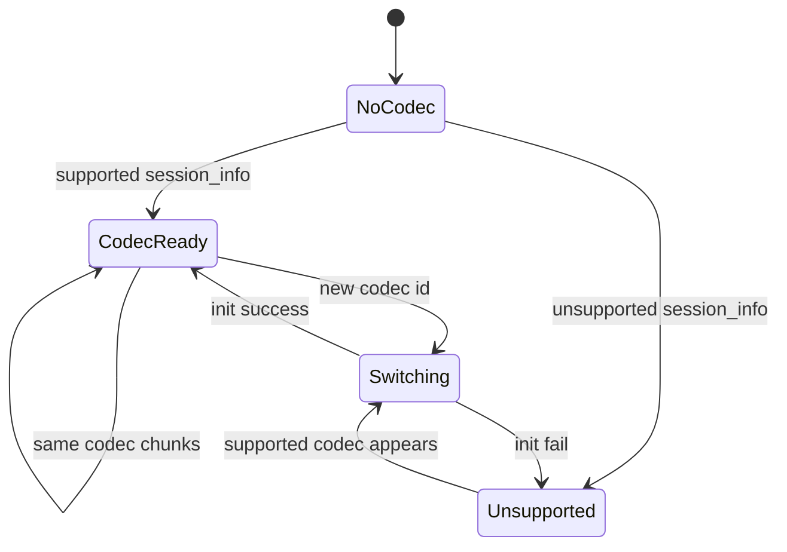
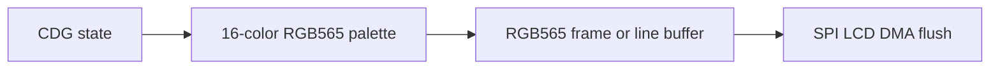
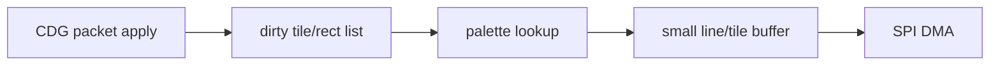

# Codec and rendering portability matrix

This document summarizes which desktop codec/rendering pieces should be reused, ported, deferred, or replaced for embedded systems.

## Codec matrix

| Wire ID | Name | Desktop implementation | Embedded recommendation | Rationale |
| --- | --- | --- | --- | --- |
| 1 | `opus` | `platform/desktop/src/opus_codec.c` with libopus | Defer unless target proves CPU headroom | Excellent quality, but expensive on small MCUs. |
| 2 | `sbc-like` / NB-IMA | `core/src/nb_ima_codec.c` | First audio target | Integer-only, first-party, easiest to make deterministic. |
| 3 | `celp13k` | `platform/desktop/src/nb_qcelp_codec.c` plus QCELP vendor code | Defer | Vendor tree needs fixed-point/stack audit and profiling. |
| 4 | `qcelp8k` | QCELP lower-rate mode, legacy EVRC alias | Defer | Useful weird codec, but not first bringup. |
| 5 | `amr-nb` | `platform/desktop/src/amr_nb_codec.c` plus AMR vendor code | Possible Phase 5 | Speech-focused, smaller than Opus, licensing/build audit required. |
| 6 | `amr-wb` | `platform/desktop/src/amr_wb_codec.c` plus AMR vendor code | Possible Phase 5, preferred speech codec after NB-IMA | Current desktop resilience default, decent quality. |
| 7 | `bluetooth-sbc` | `platform/desktop/src/nb_sbc_codec.c` plus SBC vendor code | Possible Phase 5 | May be practical but needs CPU/memory profile. |

## Codec switching contract

Desktop behavior:

- TX sends `v4_session_info` quickly after codec changes.
- RX reconciles per-frame codec IDs if session info was dropped.
- RX tears down stale decoder state and re-primes audio.
- Video must continue even if audio codec setup fails.

Embedded behavior:

- Maintain an `active_codec_id`.
- If unsupported codec arrives, set audio state to `unsupported` and keep video running.
- On codec change, flush audio jitter and decoder state but do not clear CDG canvas.
- Do not allocate large codec state from a high-priority packet handler.

## Desktop DSP notes

Desktop TX currently applies speech-codec conditioning:

- Narrowband/speech paths use high-pass filtering around 80 Hz.
- Speech codec paths use fixed digital headroom before encode.
- Opus bypasses the speech-codec headroom pad.
- Desktop SRC and soft limiting live in platform code, not the wire format.

Embedded guidance:

- Keep conditioning deterministic and integer-friendly.
- Do not require libsoxr on firmware.
- Prefer codec-native sample rates internally, then resample only at I2S/display boundaries if unavoidable.

## Rendering matrix

| Path | Current desktop function | Embedded status |
| --- | --- | --- |
| RGBA raster | `dashcdg_cdg_state_to_rgba8()` | Useful for tests, not ideal for SPI displays. |
| BGRA raster | `dashcdg_cdg_state_to_bgra8()` | Windows GDI optimization, model for direct native output. |
| OpenGL | `dashcdg_gl_renderer_render()` | Desktop only. |
| Win32 GDI | `dashcdg_win32_gdi_view_present_bgra()` | Desktop only, useful low-end CPU lessons. |
| RGB565 full frame | Not yet implemented | Best ESP32 first display path. |
| Dirty tiles | Not yet implemented | Best long-term ESP32 path. |

## Recommended embedded raster path

First bringup:

Optimized path:

Implementation notes:

- CD+G visible area is small, but full-frame conversion at 50 fps still matters on old CPUs and MCUs.
- Palette is only 16 colors. Build the display-native palette once per frame or once per palette update.
- Avoid alpha on embedded displays unless the panel pipeline needs it.
- If the panel is RGB565, write RGB565 directly.

## Observability levels

| Level | Cost | Embedded use |
| --- | --- | --- |
| Off | Lowest | Default for legacy/production constrained builds. |
| Counters only | Low | Keep integer counters, emit rarely. |
| Periodic stats packet | Medium | Lab sync/adaptation work. |
| HUD text | High | Debug only, especially on small CPUs. |
| Per-event logs | Highest | Short lab repro only. |

## Minimum codec/rendering acceptance

Video-only firmware:

- Handles v4 session, anchors, deltas, clock sync.
- Renders stable lyrics/video.
- Ignores audio chunks safely.
- Survives track changes and late join.

Audio firmware:

- Adds one supported codec at a time.
- Keeps unsupported codecs from affecting video.
- Maintains bounded jitter and PCM queues.
- Recovers from underrun without clearing video.
