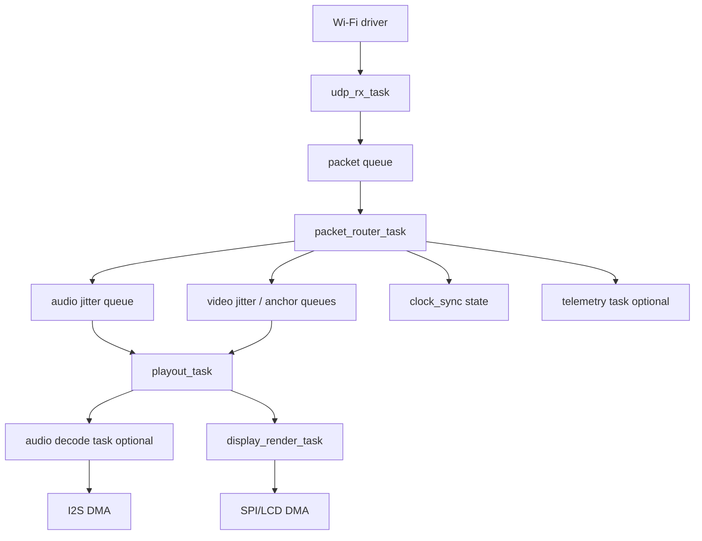
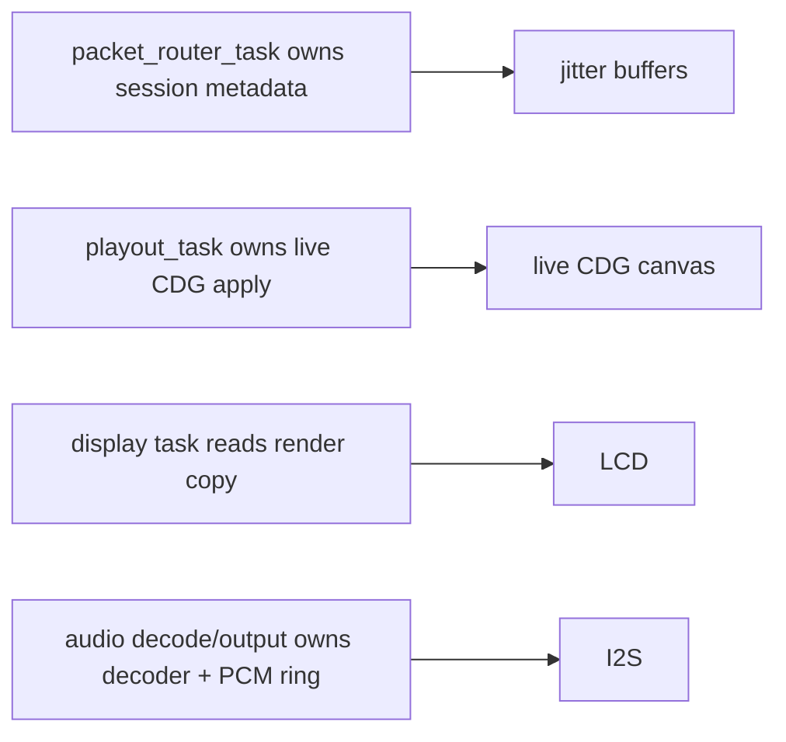

# FreeRTOS / ESP32 implementation plan

This plan turns the current Windows desktop v4 receiver into an embedded implementation. It assumes ESP-IDF, Wi-Fi UDP multicast/broadcast, a small TFT display, optional I2S audio output, and constrained CPU/RAM.

## Design goals

- Keep the v4 wire protocol compatible with Windows TX.
- Use fixed-size buffers wherever possible.
- Avoid dynamic allocation after session start.
- Keep audio, network, display, and logging isolated.
- Make video-only operation a first-class debug and bringup mode.
- Preserve late join and track-switch behavior before adding every codec.

## Recommended task graph

## Task table

| Task | Priority | Period/blocking | Owns | Notes |
| --- | --- | --- | --- | --- |
| `udp_rx_task` | High | Blocks on UDP socket | Datagram buffers | Keep parsing minimal if Wi-Fi callback pressure is high. |
| `packet_router_task` | High | Queue driven | Session state, jitter inserts, anchor assembly | Equivalent to desktop `network_thread()` after recv. |
| `playout_task` | High | 5 to 10 ms tick or timer | Jitter drain, CDG apply, audio enqueue | Equivalent to `dashcdg_rx_media_thread_main()`. |
| `audio_decode_task` | High if enabled | Queue driven | Codec decoder state | Optional in video-only mode. |
| `i2s_output_task` | Very high / DMA | DMA callbacks | PCM ring | Never log or allocate here. |
| `display_render_task` | Medium | 20 ms max for 50 fps | Framebuffer or dirty rects | Start with direct full-frame flush, optimize later. |
| `telemetry_task` | Low | 1 to 10 s | Logs/stats | Drops messages under load. |
| `ui_task` | Low | Button events | Operator controls | Toggle HUD, mute, audio-drop. |

## Queue and buffer model

Recommended initial static buffers:

| Buffer | Suggested count/size | Purpose |
| --- | --- | --- |
| UDP datagram pool | 8 to 16 x 1400 bytes | Absorb Wi-Fi bursts. |
| Audio jitter slots | 32 to 64 frames | Match desktop `DASHCDG_AUDIO_JITTER_SLOT_COUNT` unless RAM constrained. |
| CDG jitter slots | Enough for several 20 ms batches | Use existing core limit as reference. |
| Anchor assembly | Max encoded anchor bytes | Required for late join video. |
| Render canvas | One `dashcdg_cdg_state` plus optional display buffer | Avoid duplicate full frames if using dirty rects. |
| PCM ring | Codec/frame dependent | Only allocate if audio enabled. |
| Telemetry ring | Small text/event records | Never block high-priority tasks. |

## Suggested FreeRTOS ownership

Rules:

- One writer per mutable structure.
- Prefer queues over mutexes between high-priority tasks.
- If a mutex is unavoidable, never hold it while doing SPI, I2S, filesystem, or logging.
- Use small snapshots for render state handoff.

## Milestones

### Phase 0: protocol skeleton

Deliverables:

- ESP-IDF app boots, joins Wi-Fi, opens UDP socket.
- Validates v4 header and packet type.
- Counts session info, clock sync, anchors, video deltas, audio chunks.
- UART telemetry every 2 seconds.

Exit criteria:

- Can run next to Windows TX for 30 minutes without heap growth.
- Malformed packets are dropped without crash.

### Phase 1: video-only late join

Deliverables:

- Parse `v4_session_info`.
- Assemble and decode `v4_video_anchor`.
- Parse and apply `v4_video_delta`.
- Render CDG canvas to display.
- Implement `--rx-drop-audio` equivalent as default.

Exit criteria:

- Late join shows correct lyrics/video within one anchor cycle.
- Track forward/back recovers without device reboot.
- CPU and heap metrics remain bounded.

### Phase 2: clocked video playout

Deliverables:

- Implement `v4_clock_sync`.
- Implement PTP-style offset/path-delay estimate.
- Use sender timeline for CDG playout.
- Add jitter priming and skip policy from desktop CDG jitter.

Exit criteria:

- Video does not rush or stall under normal Wi-Fi jitter.
- Multiple receivers display within the target visual tolerance.

### Phase 3: fixed-point audio baseline

Deliverables:

- Implement NB-IMA (`audio_codec_id = 2`) decode path from `core/src/nb_ima_codec.c`.
- Add I2S PCM ring.
- Add audio jitter drain and startup preroll.
- Add video/audio sync selection.

Exit criteria:

- Audio starts after preroll and recovers from transient loss.
- Video-only mode still disables all audio decode/output cost.

### Phase 4: resilience and repair

Deliverables:

- Track FEC groups.
- Recover single missing audio or video group member with XOR repair.
- Add counters for continuity skip, reorder, gaps, underruns.

Exit criteria:

- Controlled packet-loss tests show fewer audible/visible drops than no-FEC mode.

### Phase 5: codec expansion

Deliverables, in recommended order:

1. AMR-WB decode if CPU/license/build constraints are acceptable.
2. AMR-NB decode.
3. QCELP8K/QCELP13K decode only if vendor code is ported and profiled.
4. Opus only on hardware that can prove stable headroom.

Exit criteria:

- Codec switch does not wedge audio.
- Unsupported codecs fail gracefully and keep video running.

## CPU reduction rules from Windows/P3 testing

These rules are mandatory for ESP32-class work:

- Do not format HUD/log strings in hot paths.
- Do not compute rolling diagnostics per packet unless telemetry is enabled.
- Do not convert pixel formats twice.
- Precompute 16-color CDG palettes.
- Prefer dirty rectangles or tile updates over full-screen SPI flush if measured full-frame flush is too slow.
- Keep audio decode disable/drop mode available at runtime.
- Keep render frame rate capped at 50 fps or lower.

## ESP32 renderer options

| Renderer | CPU | RAM | SPI bandwidth | Complexity | Notes |
| --- | --- | --- | --- | --- | --- |
| Full frame RGB565 | Low/medium | One frame buffer | High | Low | Best first bringup. |
| Banded scanline RGB565 | Medium | Small line buffer | High | Medium | Good RAM saver. |
| Dirty tiles | Low after changes | Tile metadata | Low/medium | High | Best final path for low CPU/SPI. |
| CDG tile-native renderer | Lowest | CDG state only | Low | High | Uses CDG tile semantics directly. |

## Failure handling policy

| Failure | Required behavior |
| --- | --- |
| TX disappears | Enter reconnecting state, stop logging repeated underruns, keep last canvas or reconnect overlay. |
| Bad session info | Drop packet, keep prior session until timeout. |
| Unsupported codec | Keep video running, report unsupported codec, do not allocate decoder. |
| Anchor incomplete | Continue waiting for next anchor or deltas; do not clear live canvas. |
| Audio underrun | Re-prime audio path without clearing video. |
| Queue overflow | Drop oldest not-yet-needed packet and increment counter. |

## Test plan for firmware parity

Use Windows TX as the reference sender.

1. Cold RX before TX.
2. Late join after TX already running.
3. Track forward/back rapidly.
4. Natural track rollover.
5. Pause/resume.
6. Video-only mode with audio chunks dropped.
7. Bad Wi-Fi or packet-loss emulator.
8. Long soak with TX and at least one Windows RX running beside the ESP32.
