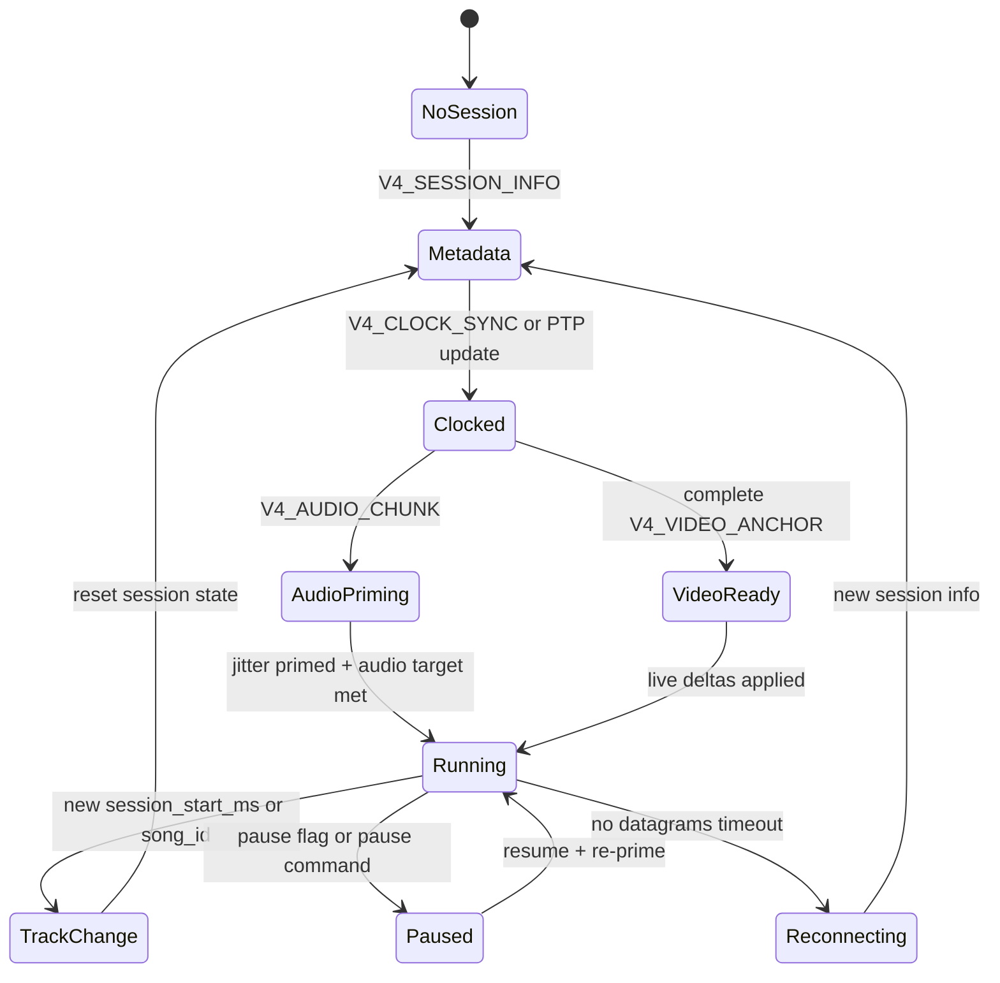
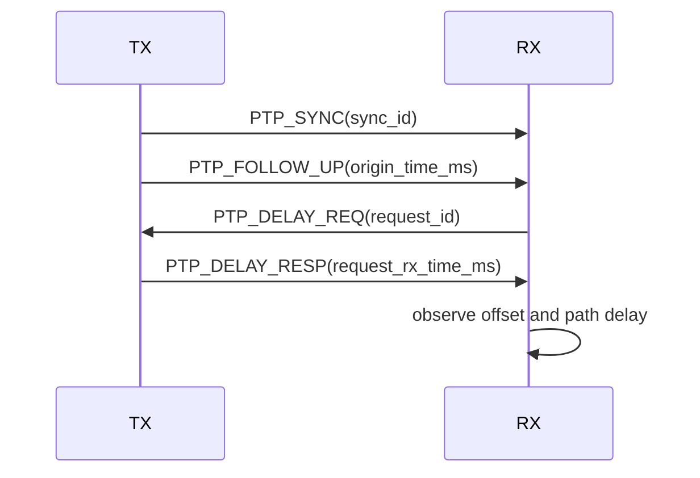
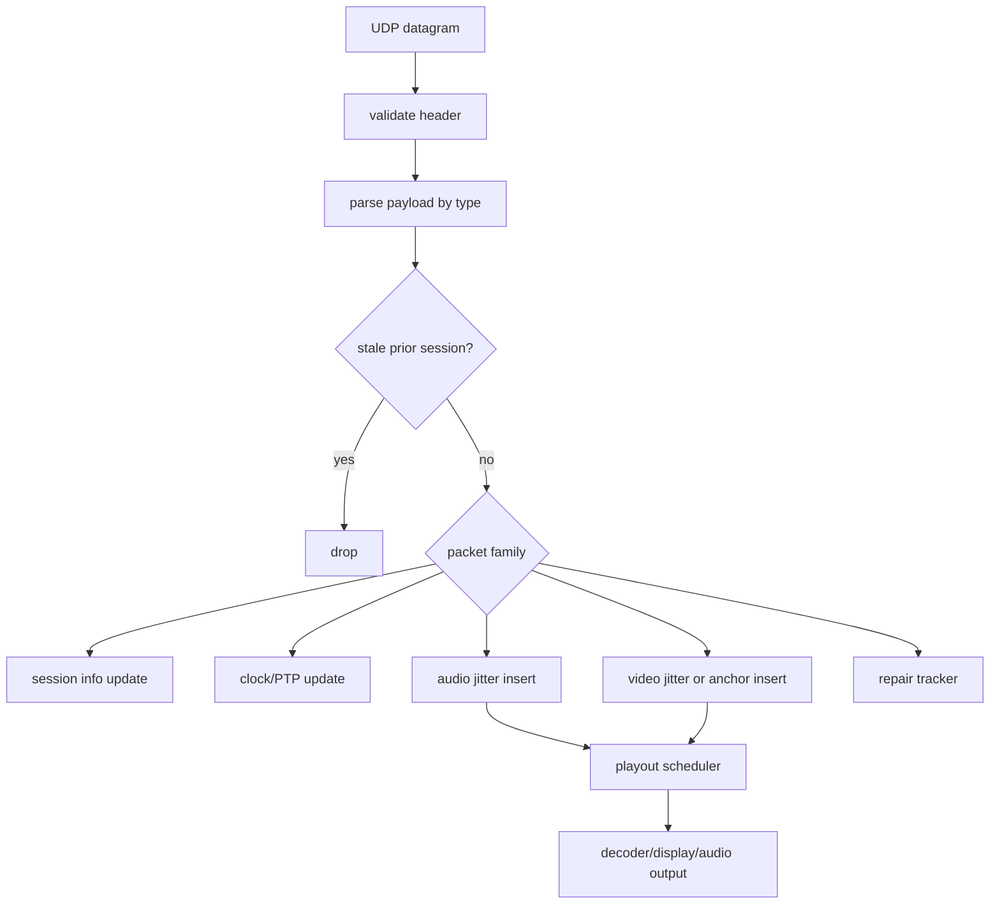

# Protocol v4 porting guide

This guide is the embedded receiver view of protocol v4. The canonical C definitions are in `proto/include/dashcdg/protocol.h`; this document explains the runtime contract a FreeRTOS/ESP32 implementation must preserve.

## Packet header

Every packet starts with `struct dashcdg_packet_header`:

| Field | Meaning |
| --- | --- |
| `magic` | `DKG1`. Drop packets with the wrong magic. |
| `version` | `4` for v4 packets. Desktop also accepts v3 for legacy. |
| `type` | Packet discriminator. |
| `flags` | Shared packet flags, including pause state on relevant packets. |
| `sequence` | Sender-wide datagram sequence. Useful for diagnostics, not playout identity. |
| `sender_time_ms` | Sender monotonic timestamp. Used by clock sync and startup anchoring. |
| `payload_length` | Payload bytes after header. |

Porting requirements:

- Reject payloads larger than the configured datagram buffer.
- Never trust offsets or lengths until checked against `payload_length`.
- Keep wire parsing endian-stable. Use explicit little-endian helpers like the desktop parser.

## V4 packet families

| Packet | Desktop handler | Embedded responsibility |
| --- | --- | --- |
| `V4_SESSION_INFO` | `handle_v4_session_info()` | Create/update session, codec, playout, repair, and video modes. |
| `V4_LOADING_SCREEN` | `dashcdg_rx_apply_loading_screen_locked()` | Optional UX while waiting for first usable anchor/delta. |
| `V4_CLOCK_SYNC` | `handle_v4_clock_sync()` | Update sender playback anchor. |
| `PTP_SYNC` / `PTP_FOLLOW_UP` / `PTP_DELAY_REQ` / `PTP_DELAY_RESP` | PTP branches in `network_thread()` | Improve sender offset/path-delay estimate. |
| `V4_VIDEO_ANCHOR` | `dashcdg_rx_handle_v4_anchor_locked()` | Assemble chunked RLE canvas and seed bridge/live state. |
| `V4_VIDEO_DELTA` | `handle_v4_video_delta()` | Insert live CD+G packet batches into CDG jitter. |
| `V4_AUDIO_CHUNK` | `handle_v4_audio_chunk()` | Insert encoded audio frames into audio jitter. |
| `V4_REPAIR_WINDOW` | `handle_v4_repair_window()` | Optional XOR repair for audio/video groups. |
| `V4_RX_STATS` | TX-side aggregation | Optional receiver telemetry. |

## Session lifecycle

Important edge cases:

- RX may start before TX. Do not advance jitter sequence numbers before first successful apply/decode.
- RX may late-join after audio/video are already flowing. Use anchors and jitter priming, not asset files, as the primary v4 startup path.
- Track changes can happen faster than one millisecond on desktop. The current RX also compares `song_id`, not only `session_start_ms`.
- Codec switches are legal at runtime. Per-frame audio chunk codec IDs are reconciled against latest session info.

## Audio chunk contract

`struct dashcdg_v4_audio_chunk_payload` includes:

| Field | Use |
| --- | --- |
| `media_sequence` | Audio jitter sequence. |
| `group_id`, `group_index` | Repair/FEC grouping. |
| `frame_ms` | Duration of this encoded frame. |
| `audio_profile_id` | Quality or resilience profile. |
| `codec_id` | Codec used for this packet. |
| `playback_ms` | Sender media timeline tag. |
| `encoded_length`, `encoded_bytes` | Encoded frame payload. |

Embedded policy:

- Insert by `media_sequence`, not by arrival order.
- Use `playback_ms` to align with sender time after clock sync.
- Treat missing early frames differently from steady-state loss. Cold-start skips must be gated until first successful decode/apply.
- If audio decode is disabled for diagnostics, drop chunks before FEC/decode work.

## Video anchor contract

`V4_VIDEO_ANCHOR` carries chunked RLE-encoded CDG canvas bytes:

- `anchor_id`
- `anchor_format`
- `packet_index`
- `total_bytes`
- `anchor_offset`
- `chunk_length`
- `anchor_bytes`

Desktop-specific constants:

- TX currently chunks anchors at 512 bytes.
- RX tracks that same stride to avoid aliasing adjacent chunks.
- Decoded canvas seeds `v4_bridge_cdg` and may seed `live_state` before first live delta.

Embedded policy:

- Allocate a bounded anchor assembly buffer sized to the maximum encoded anchor, or stream-decode if a future format allows it.
- Track duplicate chunks with a bitset.
- Do not apply a periodic anchor that would move the live canvas backward relative to already-applied deltas.
- On first anchor, render it even before deltas arrive.

## Video delta contract

`V4_VIDEO_DELTA` carries live CD+G subcode packet batches:

- `media_sequence`
- `group_id`, `group_index`
- `delta_format`
- `packet_count`
- `packet_start_index`
- `encoded_length`
- `delta_bytes`

Embedded policy:

- Jitter by `packet_start_index`.
- Apply only when the sender/render timeline says it is due.
- Missing deltas after priming may be skipped; missing deltas before priming must not cause permanent startup loss.
- CD+G state mutation must happen in a single owner context or behind a small critical section.

## Clock and sync

The desktop model has two levels:

1. `V4_CLOCK_SYNC` gives sender media timing.
2. PTP-style exchange estimates path delay and offset:
   - `PTP_SYNC`
   - `PTP_FOLLOW_UP`
   - `PTP_DELAY_REQ`
   - `PTP_DELAY_RESP`

Embedded policy:

- Use a monotonic millisecond clock for protocol state.
- Use hardware timers for audio/display scheduling if available.
- Clamp offset/path-delay corrections. The desktop uses bounded steps to avoid jumps.
- Keep a separation between sender timeline and local output timeline.

## Repair windows

Current v4 repair is XOR-based and group-oriented. It is useful for single-loss recovery but is not required for a first video-only embedded milestone.

Implementation order:

1. Parse and ignore repair packets safely.
2. Track group metadata without recovery.
3. Add audio repair.
4. Add video repair.
5. Add observability counters.

## Packet processing flow

## Embedded acceptance criteria

- Late join shows video without requiring TX restart.
- Track forward/back does not wedge video or audio.
- Pausing/resuming preserves current canvas and re-primes audio without clearing video.
- Video-only mode runs with audio decode disabled.
- Packet parser rejects malformed lengths and offsets.
- All queues have fixed maximum memory use.
