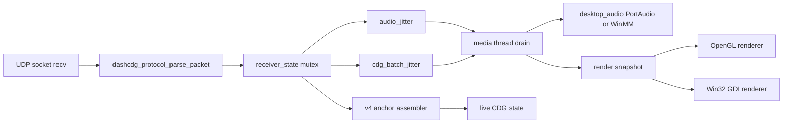
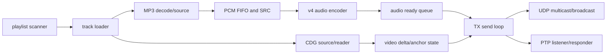
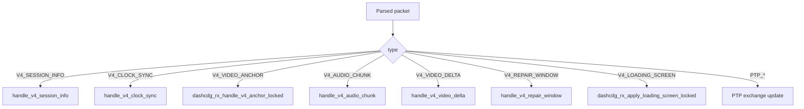

# Windows desktop implementation reference

For **2026 TX** behavior (separate **audio** mutex, **batched** v4 RX stats
ingest, unified wire sequence, deadline logs), also read
[`../architecture/tx-audio-isolation.md`](../architecture/tx-audio-isolation.md).

This document describes the current Windows desktop implementation as the behavioral reference for an embedded v4 receiver. It intentionally maps runtime behavior to source functions so firmware work can preserve semantics without copying desktop-specific PortAudio, GLUT, Win32, or pthread details.

## Executables and build flavors

| Build artifact | Role | Notes |
| --- | --- | --- |
| `desktop-tx.exe` | Headless transmitter | Sends v4 by default, supports codec hotkeys and sidecar logs. |
| `desktop-rx.exe` | OpenGL receiver when GL is available | Uses GLUT render timer and desktop audio output. |
| `desktop-gdi-rx.exe` | Win32 GDI receiver | Used for low-end and XP-class systems. |
| `desktop-legacy-rx.exe` | Alias/copy of GDI RX in sneakernet bundle | Used for operator muscle memory on legacy/P3 systems. |
| `desktop-gdi-tx.exe` | TX with Win32 GDI preview | Same v4 sender path plus preview window. |

Canonical build/package script:

```bash
bash scripts/build_windows_sneakernet_dist.sh
```

The Windows implementation uses three libraries conceptually:

| Layer | Files | Embedded relevance |
| --- | --- | --- |
| Core | `core/src/*.c`, `core/include/dashcdg/*.h` | Reusable CD+G state, raster, jitter, media clock, NB-IMA. |
| Protocol | `proto/src/protocol.c`, `proto/include/dashcdg/protocol.h` | Reusable wire parser/serializer if memory policy is acceptable. |
| Desktop platform | `platform/desktop/src/*.c` | Reference behavior only. Replace with FreeRTOS, Wi-Fi, I2S, display, and logging adapters. |

## Desktop RX architecture



### RX threads

| Thread | Desktop function | Responsibility | Embedded equivalent |
| --- | --- | --- | --- |
| Network RX | `network_thread()` in `app_rx.c` | Blocking UDP receive, parse, update receiver state, insert jitter frames. | Wi-Fi UDP receive task, preferably pinned away from audio ISR/core if dual-core. |
| Media drain | `dashcdg_rx_media_thread_main()` | Drain jitter buffers, queue PCM, publish render snapshots, send RX stats. | Playout scheduler task. |
| Audio backend | `desktop_audio.c` callback/output thread | Consume PCM ring and drive host audio API. | I2S DMA callback/task. |
| UI/render | `display()` or `dashcdg_rx_run_win32_gdi_main()` | Draw current render snapshot and optional HUD. | LCD flush task, dirty-rect or scanline mode. |
| Async logging | `desktop_async_log.c` | Keep console/file I/O off hot paths. | Ring-buffered telemetry task, optional. |

### RX state ownership

`struct receiver_state` in `app_rx.c` is the desktop owning object for:

- Session metadata from `v4_session_info`.
- Sender clock and PTP exchange state.
- Audio jitter and FEC groups.
- CDG batch jitter and FEC groups.
- Live CDG canvas, bridge canvas, active v4 anchor assembly.
- Audio output timing, buffer targets, underrun recovery counters.
- Observability counters for HUD, logs, and RX stats.

Embedded guidance:

- Split this into smaller structs by task ownership.
- Avoid holding a global mutex while doing display, file I/O, decoder work, or I2S queue operations.
- Preserve the state-machine edges, not the exact desktop locking.

## Desktop TX architecture



Important TX functions:

| Function | Purpose | Porting note |
| --- | --- | --- |
| `dashcdg_tx_load_track_locked()` | Reset session state, load MP3+G, send bootstrap. | Firmware TX is not first target, but this defines track-change semantics. |
| `dashcdg_tx_send_v4_track_bootstrap_locked()` | Immediate session info, clock sync, loading screen. | RX must tolerate this burst arriving before audio/video. |
| `dashcdg_tx_send_v4_session_info_locked()` | Publish session, codec, repair, anchor modes. | Firmware must treat this as authoritative. |
| `dashcdg_tx_send_v4_clock_sync_locked()` | Publish sender playback timing. | Firmware sync loop consumes this. |
| `dashcdg_tx_prepare_v4_video_anchor()` | Encode RLE CDG canvas anchor. | Firmware RX needs bounded anchor assembly memory. |
| `dashcdg_tx_send_v4_video_anchor_chunk_locked()` | Send chunked anchor bytes. | RX must accept chunk offsets and duplicate chunks. |
| `dashcdg_tx_send_v4_audio_chunk_locked()` | Send encoded audio with media sequence and playback tag. | RX audio jitter key. |
| `dashcdg_tx_send_v4_video_delta_locked()` | Send live CDG packets with packet index. | RX CDG jitter key. |
| `dashcdg_tx_send_v4_repair_parity_locked()` | Send XOR repair windows. | Embedded may defer repair initially. |
| `dashcdg_tx_audio_thread_main()` | Decode/source PCM and encode audio packets. | Demonstrates codec switching and silence fill policy. |

## Current RX packet dispatch

The desktop RX dispatches packets inside `network_thread()`:



## Audio decode/drop debug mode

The current RX includes a CPU isolation mode:

- CLI: `--rx-drop-audio` or `--no-audio-decode`
- Hotkey: `D` (toggles decode on/off each time)
- Behavior: stop/flush audio output, clear audio jitter/FEC/decoder/SRC state, drop incoming audio chunks, keep video/sync alive.

**Win32 GDI note:** `D` is a *toggle*. If decode-drop is left **on**, the HUD audio field shows `DROP(decode-off)` while datagram/audio counters can still advance (video and network stack stay live). A common trap was Windows **key-repeat**: the GDI preview used to forward every `WM_KEYDOWN`, so a slightly long press could fire **three** toggles from one physical tap and land on **decode disabled** — silence after a second or two while “everything else looked fine.” The Win32 GDI path now ignores autorepeat (first transition per physical key-down only).

Embedded use:

- Keep the same concept as a build flag or runtime debug setting.
- It is useful to benchmark Wi-Fi, parser, jitter, and LCD performance independent of codec/I2S cost.

## GDI and low-end lessons

Recent low-end work matters for embedded:

- Avoid extra pixel format conversion. GDI now uses direct CDG-to-BGRA raster output through `dashcdg_cdg_state_to_bgra8()`.
- Precompute the 16-entry CDG palette once per frame. Do not divide or shift color values per pixel when the palette is only 16 colors.
- Disable nonessential RX stats on legacy/GDI-only builds by default.
- Do not do console, file logging, HUD formatting, or string-heavy diagnostics on hot paths.
- Limit rendering to the actual CD+G useful cadence, currently 50 fps maximum.

## Function map for firmware engineers

| Desktop function | Kind | Embedded replacement |
| --- | --- | --- |
| `dashcdg_protocol_parse_packet()` | Wire parser | Reuse or generate a bounded parser from `protocol.h`. |
| `dashcdg_audio_jitter_insert()` | Audio jitter insert | Reuse with static allocation or port to fixed ring. |
| `dashcdg_audio_jitter_drain_step()` | Audio playout decision | Reuse policy; adapt time source. |
| `dashcdg_cdg_batch_jitter_insert()` | Video jitter insert | Reuse or port to fixed slots. |
| `dashcdg_cdg_batch_jitter_drain_step()` | Video playout decision | Reuse policy; adapt render scheduler. |
| `dashcdg_media_clock_observe_ptp_exchange()` | Clock sync | Reuse integer math. |
| `dashcdg_cdg_state_to_bgra8()` | Desktop GDI raster | Replace with LCD-native palette, RGB565, or dirty rectangle renderer. |
| `dashcdg_desktop_audio_*()` | Host audio | Replace with I2S DMA ring. |
| `dashcdg_win32_gdi_view_*()` | Host display | Replace with TFT/e-paper/display driver. |
| `dashcdg_async_logger_*()` | Host logging | Replace with UART/ring-buffer telemetry. |
