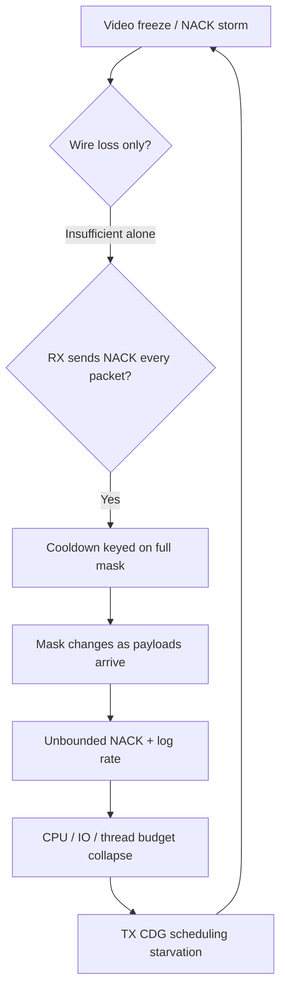

# Root cause analysis: long-track video lockup and repair-NACK storm (soak23)

**Date:** 2026-04-30  
**Severity:** P1 (playout failure under sustained load)  
**Artifacts:** `tx-metrics-soak23.jsonl`, `rx-metrics-soak23.jsonl`, `desktop-tx-20260430-164648-*.log`, `desktop-rx-20260430-150002-*.log` (~9.2M lines)

## 1. Problem statement

During long MP3+G / v4 sessions, video can freeze while the receiver appears stuck in a **repair-NACK loop**. TX metrics show **large negative CDG lead** (`cdg_worst_negative_lead_ms` on the order of tens of seconds) and elevated **starved bypass** counters. RX metrics show sustained **phase_warn / phase_fail**, huge **sender_minus_heard_ms**, and **recover_silent_stall**.

## 2. Observed evidence (symptoms)

| Signal | Interpretation |
|--------|------------------|
| RX log ~9.2M lines | Per-datagram stdout on every successful repair-NACK send |
| Repeating `repair-nack: group=… mask=0x01ff` then walk `0x01fe`, `0x01fc`, … | Mask changes on **every** FEC recovery attempt as members trickle in |
| `nack_cooldown=120ms` in RX config | Cooldown existed but did not limit the storm |
| TX `cdg_worst_negative_lead_ms` −20s…−80s | CDG emission starved vs audio timeline on the transmitter |
| `cdg_starved_bypass_taken` climbing | TX intentionally bypassing normal pacing to catch up—lag already catastrophic |

## 3. Fault tree (condensed)

**Eliminated / secondary hypotheses**

- **Pure multicast loss:** Loss explains *some* NACKs, not **millions** of lines and mask-step spam on a healthy LAN baseline.
- **FEC math wrong:** Would show as static `unrec` growth without mask walk; logs show systematic mask refinement typical of “recover called on every arrival.”

## 4. Root cause (primary)

**`dashcdg_rx_try_recover_cdg_group_locked` runs on every CDG media and parity/repair observation.** It always enqueues a repair-NACK when any member is missing. The send path’s cooldown (`dashcdg_rx_send_v4_repair_nack_now`) only dedupes when **`(group_id, missing_mask)` is identical**. As soon as one member arrives, `missing_mask` changes → **cooldown bypass** → another NACK on the next datagram. Over a long track this becomes a **self-sustaining control-plane and logging storm**.

That storm is an **O-ring class** issue: logging and control traffic are not failure-isolated from the realtime path, so diagnostics **amplify** the failure until TX cannot keep CDG ahead of audio.

## 5. Contributing factors

1. **Unconditional `RX_OUT` per NACK** — multi-million-line logs cause disk and console pressure on the RX process.
2. **Shared stats / repair control socket with bursty work** (already partially capped on TX PTP path) — extreme NACK rates still stress the stack.
3. **Group-sync / clock metrics** under stress report alarming `sender_minus_heard_ms`; those are partly **symptoms of overload**, not a separate first defect.

## 6. Corrective actions (implemented)

1. **Per-FEC-group, mask-aware NACK throttle** before enqueueing: within `DASHCDG_RX_REPAIR_NACK_COOLDOWN_MS`, suppress unless `missing_mask` has bits **outside** the last NACKed mask (new losses).
2. **Repair-NACK stdout disabled by default**; enable with `DASHCDG_RX_LOG_REPAIR_NACK=1` for deep debugging.
3. **`dashcdg_rx_send_v4_repair_nack_locked` returns success** so throttle state updates only when the job is actually queued.

## 7. Verification (post-fix)

- Long soak (≥30 min) with v4 + CDG FEC: `repair_nack_tx` in periodic `v4-stats` should stay **bounded**, RX log size **O(stats)** not O(packets).
- Under synthetic loss: NACKs still occur, but at **cooldown-limited** cadence per group until loss pattern changes.

## 8. Residual risks / follow-ups

- If the queue drops NACKs (`nack_queue_dropped`), throttle state is **not** advanced; a future enhancement could separate “attempted” vs “queued” bookkeeping.
- TX-side CDG starvation thresholds (`DASHCDG_TX_CDG_STARVED_VS_AUDIO_MS`, video budget) remain tunables if CPU is still marginal after fixing the storm.
