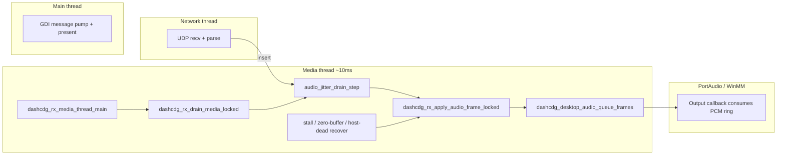

# RCA: P3 / Win32 GDI RX audio ring “stops filling” (~1–1.5 min), no auto-recover

## Document control

| Field        | Value                                                                                                                                                                             |
| ------------ | --------------------------------------------------------------------------------------------------------------------------------------------------------------------------------- |
| Symptom      | After roughly one to two minutes, **HUD `audio buf` stops increasing** (or sits at zero), **audio silent**, while **CD+G / HUD / network** still look healthy. Codec-independent. |
| Scope        | Desktop RX (`desktop-gdi-rx.exe`, `--win-gdi`), especially **slow Win32 + PortAudio** stacks; not tied to GDI blit code path (separate thread).                                   |
| Primary code | `platform/desktop/src/app_rx.c`, `core/src/audio_jitter.c`, `platform/desktop/src/desktop_audio.c`                                                                                |

## Architecture (who does what)

- **Media thread** owns `g_receiver.mutex`, drains **audio jitter** then **CDG jitter** each tick. CDG is explicitly allowed to progress when the PCM ring is full so “video ok, audio wedged” is a supported failure mode for diagnosis.
- **GDI loop** only publishes render snapshots / HUD; it does **not** feed audio.

## Failure mode A — Starvation gate vs. “healthy” host buffer

`dashcdg_audio_jitter_skip_starvation_gate_open()` (in `core/src/audio_jitter.c`) returns **true** only when `audio_buffered_ms <= max_safe_buffer_ms` (roughly `max(2 * frame_ms, preroll/4)`).

Loss / reorder can leave **no slot for `next_media_sequence`** while **later** packets are still in the jitter buffer. Recovery paths (`SKIP` / hole recovery / wall-clock stall branch at the bottom of `dashcdg_audio_jitter_drain_step`) **all** consult this gate.

If the **software PCM ring** still reports **high** `queued_frames` (callback stalled, driver backlog, or ring accounting mismatch) while **decode is not actually making progress**, the gate stays **closed** → `DRAIN_STOP` forever → **no new `queue_frames`** → HUD shows buffer not refilling. CDG continues because the drain loop still applies CDG when audio returns `STOP`.

**Mitigation:** After a **wall-clock stall** (`ms_since_prior_audio_apply` already tracked in `din`) exceeds a **second-tier threshold** (~900 ms), **open the starvation gate** even if `audio_buffered_ms` is high. Real cold-join tests keep `ms_since` at 500 ms and must remain conservative (`test_audio_jitter_skip_blocked_while_device_buffer_is_healthy`).

## Failure mode B — `buffered_silent` never fires (timestamp chatter)

`dashcdg_rx_should_auto_recover_buffered_silent_locked()` compares wall time to `last_audio_timestamp_advance_local_ms`, updated from `dashcdg_rx_note_audio_timestamp_progress_locked()` whenever **DAC `timestamp_ms` changes**.

PortAudio’s `outputBufferDacTime - currentTime` can **jitter by a few ms per block**. That flips the derived `audio_ts` by ±1 sample’s worth of ms and **resets the “advance” clock every callback**, so `since_last_ts_advance` never exceeds `DASHCDG_RX_BUFFERED_SILENT_STALL_RECOVER_MS` even if the user hears silence and the ring is wedged.

**Mitigation:** Only treat timestamp as “advanced” when the delta is **meaningful** (e.g. ≥ 2 ms), ignoring ±1 ms noise.

## Failure mode C — PortAudio stream inactive but `playback_running` still set

`dashcdg_desktop_audio_is_running()` reflects an internal `playback_running` flag. The callback can return `paAbort` or the host stream can go inactive without that flag being cleared immediately.

`dashcdg_rx_handle_dead_audio_backend_locked()` previously treated `is_running` **== 1** as “healthy” and returned without rebuild → **no dead-stream recovery**.

**Mitigation:** When `g_audio->stream != NULL`, if `Pa_IsStreamActive(stream) != 1`, **fall through** to the same rebuild path as a dead backend.

## Verification

- `tests/test_core.c`: existing jitter tests (especially `test_audio_jitter_skip_blocked_while_device_buffer_is_healthy` at **500 ms** stall) must still pass; add a test that **900+ ms** + high buffer + missing next frame yields `SKIP`.
- On hardware: GDI RX long soak with HUD showing `audio buf` / `gate=`; confirm recovery logs if stream is wedged.

## Additional long-standing issues (2026-04 tranche)

### Issue D - TX peer latency goes negative and can stay there

- Symptom: `[tx] v4-rx-peer ... lat=-...ms why=bad-lat/no-latency` can persist for a peer even after track/session changes.
- Root cause: TX compared receiver `presented_audio_timestamp_ms` to a sender-local playback estimate that can drift across epoch boundaries and producer catch-up bursts.
- Fix: latency now uses receiver-reported `sender_time_observed_ms` (same report epoch) projected by receipt age; sender-local estimate remains fallback only for implausible reports.

### Issue E - WinMM/GDI stall around ~190 s, no recovery until track change/restart

**Status: SOAK CANDIDATE (2026-04-26)** - targeted mitigations landed across RX recovery logic, XP-safe logging paths, and TX/RX observability. Closure requires soak evidence that same-track playback remains stable through prior failure windows.

- Symptom: on P3/GDI/WinMM path, audio can drop out after a long run (~190 s reported) and **not** recover on the **current** track.
- Contributing factors (historical; partially addressed):
  1. WinMM worker had early error returns (`waveOutPrepareHeader`/`waveOutWrite`) that skipped common teardown path.
  2. Restart path could create a new WinMM stream while stale `audio_io_ctx` still existed.
  3. WaveOut builds could take non-legacy recovery path that is optimized for PortAudio behavior.
- Mitigations shipped (frequency/recovery **unproven** on same track):
  1. WinMM thread now always exits through unified cleanup (`winmm_shutdown`).
  2. `dashcdg_desktop_audio_start_stream()` destroys stale WinMM stream before recreate.
  3. WaveOut builds force legacy-safe recovery fallback in RX (stop + flush + re-prime).
  4. Output readiness for WinMM now requires live `hwo` (not just non-null ctx pointer).
- Next investigation angles: long-run WinMM `waveOut*` state (device reset, buffer completion stalls), GDI/message-pump interaction starving the media thread, and whether stall correlates with **buffer index / queue depth** rather than wall time alone.

### Soak metrics fields required for closeout

Capture the following fields in every run so Issue E can be closed with evidence instead of symptom notes:

- TX summary line (`[tx] v4-rx:`):
  - `fec=Lx`, `p75=...`, `n=<controller-samples>`
  - `nack=<rx>/<resent>`
  - `unrec=<count>`
  - `eff=<repair-rate>`
- RX summary line (`[rx] v4-stats:`):
  - `nack_tx=<count>`
  - `unrec=<count>`
  - `eff=<repair-rate>`
  - `buf=`, `tgt=`, `stage=`, `pts=` around any recovery boundary
- Event lines:
  - TX: `[tx] nack-repair: group=... mask=... resent=...`
  - RX: `[rx] repair-nack: group=... size=... mask=...`
- Startup snapshots (self-describing run config):
  - TX: `[tx] config: ...`
  - RX: `[rx] config: ...`

### Final closure criteria

Issue E can be marked closed when all of the following are true in soak logs:

1. No persistent same-track audio death through and beyond the historical ~190 s window.
2. No repeating short-cadence re-prime churn after recovery.
3. `unrec` trend is bounded/declining at adaptive FEC levels with non-zero `eff`.
4. NACK path is active (`nack` and `nack_tx` increment under impairment) and correlates with fewer visible corruption bursts.

### Issue F - RX peer `age=` drifts upward instead of staying low

- Symptom: peer age trends up even while receivers are alive.
- Root causes:
  1. Stats path historically shared media port semantics and mixed unicast/multicast assumptions.
  2. Receivers were not uniformly listening on the stats bus, so updates could be intermittently missed.
- Fixes:
  1. Standardized stats transport on same multicast IP with dedicated default port (`24685`).
  2. TX listens on stats/PTP port (`--tx-rx-stats-port`, default 24685).
  3. Desktop RX and ESP32 both publish and listen on the same stats multicast port.

## Soak/test plan for these fixes

1. Run TX + three receivers (Win11 GL, P3 GDI/WinMM, ESP32) for >= 30 min.
2. Verify TX peer lines keep `age` near stats interval (usually <= 2-4 s, occasional spikes, then recover).
3. Confirm no persistent negative latency after at least 5 track changes and one pause/resume cycle.
4. On P3 WinMM path, **log** any stall around ~190 s (Issue E — same-track recovery not required to pass until fixed). Capture whether recovery logs appear and whether audio returns without track change.
5. Capture logs for any residual `bad-lat`, `slow-age`, or repeated recovery churn for threshold tuning.

## Related comments in tree

- `app_rx.c` — CDG drain when PCM ring full (WinMM / slow hosts).
- `audio_jitter.h` — hole recovery skew bounds (`SKIP_EMPTY_`*).

## Incident addendum (2026-04-25): RX break-up after long run + TX negative latency

### Mission statement

Prevent long-run audio degradation in desktop receivers and eliminate false/negative TX-reported peer latency while preserving cold-join and recovery behavior.

### Observed evidence (current logs)

- TX (`desktop-tx-20260425-031536-p20476.log`) repeatedly reports:
  - `state=degraded why=no-latency` with `lat=0ms` despite non-zero buffers.
  - `state=degraded why=bad-lat` with persistent negative values (`lat=-77ms`, `lat=-93ms`, etc.).
- RX (`desktop-rx-20260425-033836-p18968.log`) shows recurrent loop:
  - `audio_queue_overflow +47/+54/+55 ...`
  - `audio: re-priming after host underrun burst`
  - `host_underrun +48/+49 frames ...`
  - then repeats at short cadence.
- RX stats around failure windows show buffer collapse from healthy ~300+ ms down to tens of ms shortly after recovery/re-prime.

### Fault tree (NASA-style)

1. **Top event A: TX reports impossible/negative peer latency.**
   1.1 **Contributing cause:** latency formula mixes two different sender timeline estimators (`network_playback_ms` and wall-anchor playback) and chooses the minimum.  
   1.2 **Trigger condition:** brief sender catch-up/drift or timeline transitions make sender-side estimate lag receiver-reported presented timestamp domain.  
   1.3 **Effect:** computed latency crosses <=0 and is classified as `no-latency`/`bad-lat`, poisoning control eligibility.

2. **Top event B: RX audio enters self-sustaining underrun/re-prime churn.**
   2.1 **Contributing cause:** host-underrun auto-recovery threshold is aggressive (`MIN_STALE_MS=80`), so routine short stalls can trigger full re-prime.  
   2.2 **Contributing cause:** re-prime path resets stream/ring timing but does not reset audio jitter/decode priming, allowing continuity skip bursts immediately after recovery under reorder/backpressure.  
   2.3 **Trigger condition:** transient callback starvation or queue pressure event during steady state.  
   2.4 **Effect:** recovery action itself destabilizes playout (overflow -> underrun -> re-prime), producing audible break-up.

### Root causes (confirmed)

- **RC-1 (TX latency math):** `dashcdg_tx_compute_rx_latency_ms_locked` computes latency from sender-local playback estimators that can diverge from the receiver’s reported epoch under real scheduling drift.
- **RC-2 (RX recovery policy):** `dashcdg_rx_should_auto_recover_host_underrun_locked` is calibrated for very fast intervention, but in current desktop runs this creates false-positive recoveries.
- **RC-3 (RX recovery state hygiene):** `dashcdg_rx_reprime_audio_after_host_underrun_locked` does not fully reset jitter/decode priming state, enabling post-recovery continuity skips and re-entry churn.

### Corrective actions (implementation plan)

1. **CA-1 (TX latency domain unification):** compute latency primarily from receiver-reported `sender_time_observed_ms` projected by report age, and compare against projected `presented_audio_timestamp_ms`; keep sender-local fallback only for missing legacy fields.
2. **CA-2 (RX anti-chatter gate):** require sustained stale/no-progress window before host-underrun auto-recovery can fire (raise effective stale window; do not recover while queue/timestamp is still actively progressing).
3. **CA-3 (RX deterministic recovery reset):** on host-underrun re-prime, clear audio jitter queue and decode priming state so post-recovery playout restarts from coherent sequence boundary.

### Additional bugs/risk notes found during analysis

- **Risk-1:** `host_underrun` bursts can be logged with `ts=-1` during churn windows; this is valid signal for missing DAC timestamp but should not by itself force immediate hard recovery.
- **Risk-2:** TX peer health currently treats `lat<=0` as hard degraded even when packet age is near-zero and receiver buffer is healthy; this can hide true state during transient estimator mismatch.

### Verification criteria (must pass before closure)

1. No persistent negative latency in TX peer summaries during 30+ minute soak and across track switches.
2. RX logs do not show repeating `re-priming after host underrun burst` cycles at short cadence.
3. RX maintains stable `v4-stats ... buf` near target envelope with occasional recoverable dips, not repeated collapse.
4. No regressions in cold-join, pause/unpause, codec switch, and idle-RX-then-TX-start flows.

## Follow-up addendum (2026-04-25 night)

### New findings from current TX/RX logs

- Desktop RX can run stable for long windows (`buf ~350-370ms`) and then hit a brief arrival-gap burst (`~300ms`, then `~1.8s`) followed by recover/re-prime.
- TX "current stats" showed repeated `why=no-latency lat=0ms` for multiple peers including periods where `buf=140ms`.

### Additional root causes

1. **TX fallback guard bug:** latency computation still required `sender_time_observed_ms != 0` before entering the fallback path, so fallback was unreachable and peers stayed `no-latency`.
2. **Decode-path stall mode:** receiver can accumulate pending jitter frames while decode/apply progress stalls; manual `D` off/on effectively rebuilds stream+decoder state and temporarily restores audio.
3. **ESP32 stats semantics:** unsupported codec path advanced jitter but left `presented_audio_timestamp_ms` stale/zero, which amplified TX `no-latency` classifications.
4. **TX domain-cross contamination:** `sender_time_observed_ms` (sender wall-clock epoch) was subtracted from receiver `presented_audio_timestamp_ms` (playback timeline), yielding impossible `bad-lat` magnitudes (for example `1573790xxms`).

### Corrective actions added

1. Remove hard requirement on `sender_time_observed_ms` in TX latency computation; require only non-zero presented timestamp.
2. Add automatic decode-path rebuild recovery in desktop RX when jitter apply is stalled despite incoming datagrams and pending audio.
3. Update ESP32 unsupported-codec path to advance presented timestamp using frame playback timeline.
4. Make TX latency chooser prefer playback-domain candidate and reject implausible domain-mixed values instead of propagating giant bogus latencies.

## Follow-up addendum (2026-04-26 early): continuity-skip storm with `buf=140`, `pts=0`

### Symptom

- RX can enter a loop of `audio_continuity_skip +1` every ~20 ms with `pending=0 buf=140`.
- `v4-stats` in the same window reports `pts=0`, so audio never transitions to real applied playout.

### Root cause

- Audio jitter skip gate treated `audio_buffered_ms >= preroll/2` as sufficient to permit late-loss skip **before startup truly reached preroll/start conditions**.
- With `preroll=500`, this opened at ~125 ms; observed steady `buf=140` met the gate and allowed repeated empty-slot continuity skips instead of waiting for startup fill/start.

### Fix

- Tightened pre-start skip eligibility in `core/src/audio_jitter.c`:
  - replace `audio_buffered_ms >= announced_playout_delay_ms / 2` with `audio_buffered_ms >= announced_playout_delay_ms` (fallback to `frame_ms * 8` only when delay is zero).
- This prevents continuity-skip storms in half-filled pre-start state and lets RX continue toward stable claim/start behavior.

