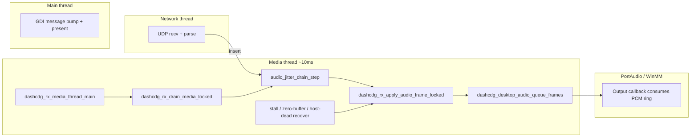

# RCA: P3 / Win32 GDI RX audio ring “stops filling” (~1–1.5 min), no auto-recover

## Document control

| Field        | Value                                                                                                                                                                             |
| ------------ | --------------------------------------------------------------------------------------------------------------------------------------------------------------------------------- |
| Symptom      | After roughly one to two minutes, **HUD `audio buf` stops increasing** (or sits at zero), **audio silent**, while **CD+G / HUD / network** still look healthy. Codec-independent. |
| Scope        | Desktop RX (`desktop-gdi-rx.exe`, `--win-gdi`), especially **slow Win32 + PortAudio** stacks; not tied to GDI blit code path (separate thread).                                   |
| Primary code | `platform/desktop/src/app_rx.c`, `core/src/audio_jitter.c`, `platform/desktop/src/desktop_audio.c`                                                                                |

## Architecture (who does what)

- **Media thread** owns `g_receiver.mutex`, drains **audio jitter** then **CDG jitter** each tick. CDG is explicitly allowed to progress when the PCM ring is full so “video ok, audio wedged” is a supported failure mode for diagnosis.
- **GDI loop** only publishes render snapshots / HUD; it does **not** feed audio.

## Failure mode A — Starvation gate vs. “healthy” host buffer

`dashcdg_audio_jitter_skip_starvation_gate_open()` (in `core/src/audio_jitter.c`) returns **true** only when `audio_buffered_ms <= max_safe_buffer_ms` (roughly `max(2 * frame_ms, preroll/4)`).

Loss / reorder can leave **no slot for `next_media_sequence`** while **later** packets are still in the jitter buffer. Recovery paths (`SKIP` / hole recovery / wall-clock stall branch at the bottom of `dashcdg_audio_jitter_drain_step`) **all** consult this gate.

If the **software PCM ring** still reports **high** `queued_frames` (callback stalled, driver backlog, or ring accounting mismatch) while **decode is not actually making progress**, the gate stays **closed** → `DRAIN_STOP` forever → **no new `queue_frames`** → HUD shows buffer not refilling. CDG continues because the drain loop still applies CDG when audio returns `STOP`.

**Mitigation:** After a **wall-clock stall** (`ms_since_prior_audio_apply` already tracked in `din`) exceeds a **second-tier threshold** (~900 ms), **open the starvation gate** even if `audio_buffered_ms` is high. Real cold-join tests keep `ms_since` at 500 ms and must remain conservative (`test_audio_jitter_skip_blocked_while_device_buffer_is_healthy`).

## Failure mode B — `buffered_silent` never fires (timestamp chatter)

`dashcdg_rx_should_auto_recover_buffered_silent_locked()` compares wall time to `last_audio_timestamp_advance_local_ms`, updated from `dashcdg_rx_note_audio_timestamp_progress_locked()` whenever **DAC `timestamp_ms` changes**.

PortAudio’s `outputBufferDacTime - currentTime` can **jitter by a few ms per block**. That flips the derived `audio_ts` by ±1 sample’s worth of ms and **resets the “advance” clock every callback**, so `since_last_ts_advance` never exceeds `DASHCDG_RX_BUFFERED_SILENT_STALL_RECOVER_MS` even if the user hears silence and the ring is wedged.

**Mitigation:** Only treat timestamp as “advanced” when the delta is **meaningful** (e.g. ≥ 2 ms), ignoring ±1 ms noise.

## Failure mode C — PortAudio stream inactive but `playback_running` still set

`dashcdg_desktop_audio_is_running()` reflects an internal `playback_running` flag. The callback can return `paAbort` or the host stream can go inactive without that flag being cleared immediately.

`dashcdg_rx_handle_dead_audio_backend_locked()` previously treated `is_running` **== 1** as “healthy”lllllllll nasrt5555555555555555555555555555 and returned without rebuild → **no dead-stream recovery**.

**Mitigation:** When `g_audio->stream != NULL`, if `Pa_IsStreamActive(stream) != 1`, **fall through** to the same rebuild path as a dead backend.

## Verification

- `tests/test_core.c`: existing jitter tests (especially `test_audio_jitter_skip_blocked_while_device_buffer_is_healthy` at **500 ms** stall) must still pass; add a test that **900+ ms** + high buffer + missing next frame yields `SKIP`.
- On hardware: GDI RX long soak with HUD showing `audio buf` / `gate=`; confirm recovery logs if stream is wedged.

## Additional long-standing issues (2026-04 tranche)

### Issue D - TX peer latency goes negative and can stay there

- Symptom: `[tx] v4-rx-peer ... lat=-...ms why=bad-lat/no-latency` can persist for a peer even after track/session changes.
- Root cause: TX compared receiver `presented_audio_timestamp_ms` to a sender-local playback estimate that can drift across epoch boundaries and producer catch-up bursts.
- Fix: latency now uses receiver-reported `sender_time_observed_ms` (same report epoch) projected by receipt age; sender-local estimate remains fallback only for implausible reports.

### Issue E - WinMM/GDI stall around ~190 s, no recovery until track change/restart

- Symptom: on P3/GDI/WinMM path, audio can drop out after long run and never recover on the current track.
- Root causes:
  1. WinMM worker had early error returns (`waveOutPrepareHeader`/`waveOutWrite`) that skipped common teardown path.
  2. Restart path could create a new WinMM stream while stale `audio_io_ctx` still existed.
  3. WaveOut builds could take non-legacy recovery path that is optimized for PortAudio behavior.
- Fixes:
  1. WinMM thread now always exits through unified cleanup (`winmm_shutdown`).
  2. `dashcdg_desktop_audio_start_stream()` destroys stale WinMM stream before recreate.
  3. WaveOut builds force legacy-safe recovery fallback in RX (stop + flush + re-prime).
  4. Output readiness for WinMM now requires live `hwo` (not just non-null ctx pointer).

### Issue F - RX peer `age=` drifts upward instead of staying low

- Symptom: peer age trends up even while receivers are alive.
- Root causes:
  1. Stats path historically shared media port semantics and mixed unicast/multicast assumptions.
  2. Receivers were not uniformly listening on the stats bus, so updates could be intermittently missed.
- Fixes:
  1. Standardized stats transport on same multicast IP with dedicated default port (`24685`).
  2. TX listens on stats/PTP port (`--tx-rx-stats-port`, default 24685).
  3. Desktop RX and ESP32 both publish and listen on the same stats multicast port.

## Soak/test plan for these fixes

1. Run TX + three receivers (Win11 GL, P3 GDI/WinMM, ESP32) for >= 30 min.
2. Verify TX peer lines keep `age` near stats interval (usually <= 2-4 s, occasional spikes, then recover).
3. Confirm no persistent negative latency after at least 5 track changes and one pause/resume cycle.
4. On P3 WinMM path, verify no unrecoverable silence around 190 s; if a stall occurs, recovery log appears and audio returns on same track.
5. Capture logs for any residual `bad-lat`, `slow-age`, or repeated recovery churn for threshold tuning.

## Related comments in tree

- `app_rx.c` — CDG drain when PCM ring full (WinMM / slow hosts).
- `audio_jitter.h` — hole recovery skew bounds (`SKIP_EMPTY_`*).

