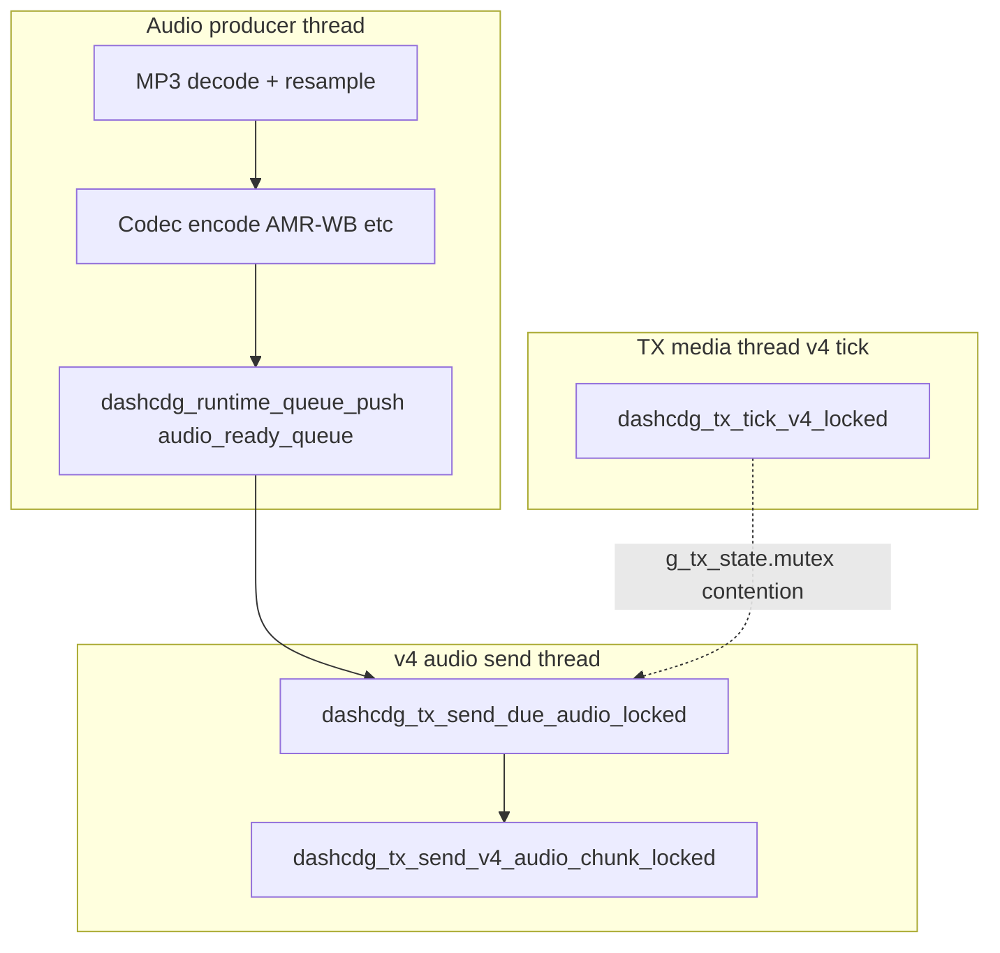

# RCA: v4 TX “global audio drop,” queue starve, and misleading `v4-rx-peer` health

## Document control

| Field | Value |
| --- | --- |
| Symptom | Occasional **silence everywhere** (all receivers); TX logs **`fault: audio_queue_starve`**, **`audio_silence_fill`**, **`audio_late_fill`**, **`audio_send_gap`** (gaps up to multi‑second); **`v4-rx-peer`** flips **healthy → degraded** with **`empty-buf`** then **`bad-lat`** (e.g. ~7–8 s while `buf` is hundreds of ms). |
| Scope | Desktop TX v4 (`desktop-tx.exe`), especially **AMR‑WB** + **multiple RX**; logs are from `[tx]` prefix. |
| Primary code | `platform/desktop/src/app_tx.c` (audio producer thread, v4 audio send thread, `dashcdg_tx_compute_rx_latency_ms_locked`, `dashcdg_tx_classify_rx_reporter_locked`) |

## Architecture (who does what)

- **Producer** fills `audio_ready_queue` up to `DASHCDG_TX_AUDIO_QUEUE_PREFILL_HIGH_WATER_FRAMES` (128−4); push uses **`wait_for_space=0`** — on overflow it counts **`audio_queue_overflows`** and backs off.
- **v4 audio send thread** holds **`g_tx_state.mutex`**, pops due frames (or emits **silence** / **late-fill** when the queue is empty but the send deadline has passed), sends v4 audio datagrams, then sleeps **`dashcdg_tx_compute_v4_sleep_ms_locked`** (1–4 ms when lead is healthy).
- **Media thread** runs **`dashcdg_tx_tick_v4_locked`** on the same mutex (session info, clock sync, loading screen, anchor chunks, CDG deltas).

## Failure mode A — `audio_ready_queue` runs dry under load

When **`dashcdg_runtime_queue_pop`** fails and the producer is not finished, **`dashcdg_tx_send_due_audio_locked`** increments **`audio_queue_starvations`** and may inject **silence** or **late-fill** frames so the wire timeline does not stall completely.

**Why the queue hits zero**

- **Producer vs consumer mismatch**: the send thread can drain up to **`DASHCDG_TX_AUDIO_SEND_MAX_CATCHUP_PACKETS`** (32) frames per wake; the producer may not refill 32 frames in one scheduler slice (MP3 read, resample, AMR‑WB encode).
- **CPU / scheduling**: several threads share **`g_tx_state.mutex`**; long critical sections or system-wide stalls can delay the send thread → **`audio_send_gap`** grows (threshold 80 ms; **max** reflects the longest interval between successful **`dashcdg_tx_note_audio_frame_sent_locked`** updates).
- **Downstream**: sustained starve and silence fill starve receivers → RX stats show **`empty-buf`** and startup stage drift → **`v4-rx`** shows all peers **degraded**.

**Mitigation ideas** (for future work, not all implemented here)

- Tune **catch-up batch size** vs **producer** cadence under narrowband codecs.
- Consider **wait-for-space** or larger **queue** if overflows correlate with the same incidents.
- Profile **mutex hold times** on the v4 tick path vs audio send path.

## Failure mode B — False **`bad-lat`** while buffers look fine

**`dashcdg_tx_compute_rx_latency_ms_locked`** uses:

- **Sender side**: **`dashcdg_tx_network_playback_ms_locked`** (encoder tail: last produced frame’s **`playback_ms`** end, aligned with v4 chunk tags on the wire).
- **Receiver side**: **`presented_audio_timestamp_ms + receipt_age_ms`** (RX DAC / presented time projected forward by the age of the stats datagram).

After a **long send gap**, the producer can **refill the queue in a tight loop** and advance **`audio_playback_end_ms`** much faster than **session wall** time advances in the same interval. The encoder tail is then **ahead of `dashcdg_tx_current_playback_ms_locked`** (wall-anchored session position). Comparing that **sprinted encoder head** to RX **presented + age** makes **`sender − projected`** explode into the **multi‑second** range and trips **`DASHCDG_TX_RX_REPORTER_MAX_REASONABLE_LATENCY_MS`** (4000) → **`bad-lat`**, even though **`audio_buffer_ms`** is still in a normal range (hundreds of ms).

**Mitigation (implemented):** For this **health metric only**, use **`min(network_playback_ms, wall_playback_ms)`** as the sender reference so a post-stall encoder sprint cannot outrun wall session position in the latency calculation. Encoder‑lag cases (**network < wall**) still use the encoder tail, matching v4 tag semantics.

## Verification

- Reproduce with v4 + AMR‑WB + multiple RX; confirm after an **`audio_send_gap`** burst, **`v4-rx-peer`** does not stick on **`bad-lat`** when buffers remain non‑empty and playout is recovering.
- Watch **`fault:`** lines and producer **`audq=`** / **`starve=`** in the periodic **`[tx] net:`** status line.

## Related comments in tree

- `app_tx.c` — **`dashcdg_tx_network_playback_ms_locked`** rationale (encoder vs wall for beacons / tags).
- `app_tx.c` — **`dashcdg_tx_compute_rx_latency_ms_locked`** (RX stats latency for **`v4-rx-peer`** health): sender reference uses **`min(network_playback_ms, wall_playback_ms)`** so a post-gap encoder tail cannot spuriously trip **`bad-lat`** against **`presented_audio_timestamp_ms + receipt_age_ms`**.
