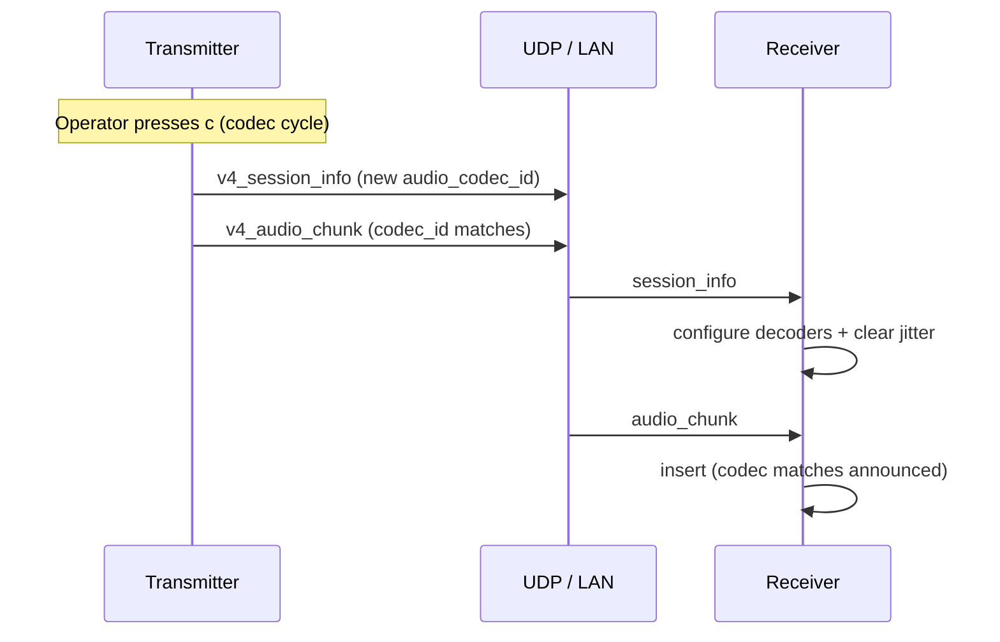
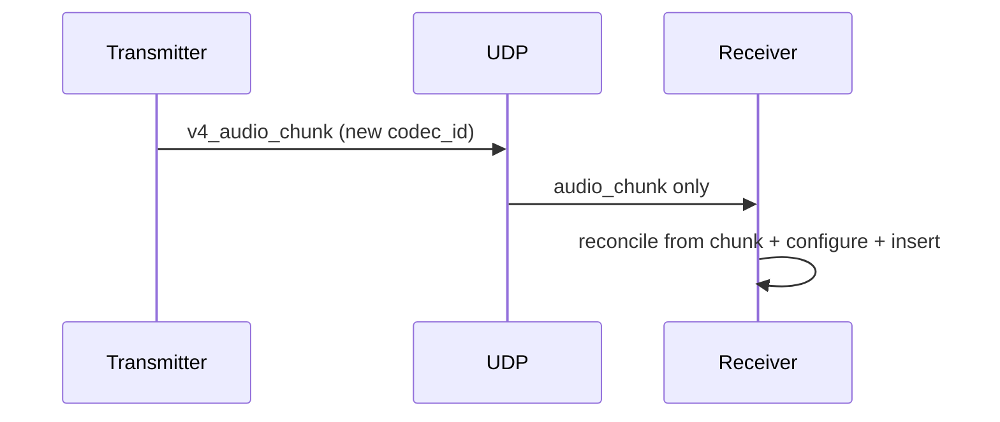

# V4 codec switching — wire contract and receiver behaviour

## Problem statement

Receivers configure Opus / AMR / EVRC / etc. decoders from **`v4_session_info`**. Audio frames carry **`codec_id` per `v4_audio_chunk`**. If **`session_info` is lost** or processed **after** the first frames of a new codec, the receiver can keep the **wrong decoder**, decode **zero frames**, and stay **silent** until the transmitter restarts.

A second failure mode is **stale jitter state**: frames tagged with the previous codec remain in the audio jitter buffer across a switch, wedging `next_media_sequence` / playback alignment.

## Contract (normative for implementations)

1. **Transmitter**
   - On any **codec change** (CLI, TTY `c`, or internal pipeline generation bump), the sender **must** emit an updated **`v4_session_info`** whose `audio_codec_id` matches the encoder **before** or **with** the first **`v4_audio_chunk`** using that codec on the wire.
   - The main v4 tick already sends **`session_info` before `audio_chunk`** in a single pass; the codec hotkey path **additionally** sends **`session_info` immediately** while holding the TX mutex so receivers do not depend on the next 15 ms poll loop alone.

2. **Receiver**
   - On every **`v4_session_info`**, apply `handle_v4_session_info` as today (including `receiver_state_reset` when session/asset/codec changes require it).
   - **Additionally**, before accepting a frame into the jitter buffer, if `v4_audio_chunk.codec_id != announced_audio_codec_id` while network audio is active, **reconcile**: treat the chunk as authoritative for codec/profile/frame timing, **clear the audio jitter buffer and audio FEC group trackers**, and **re-run** the same audio configure path used after session_info (reopen device + rebuild decoders). Session **sample rate / channels** stay those last announced for v4 desktop (NB codecs still play out at 48 kHz stereo per [`app_tx.c`](../../platform/desktop/src/app_tx.c) session_info rules).

3. **No protocol change** is required for this contract; it uses existing fields.

## Ordering diagram

If `session_info` is dropped:

## Related code

- TX: `dashcdg_tx_cycle_v4_audio_codec_locked`, `dashcdg_tx_tick_v4_locked`, `dashcdg_tx_send_v4_session_info_locked`, console `case 'c'`.
- RX: `handle_v4_session_info`, `dashcdg_rx_configure_audio_locked`, `dashcdg_rx_reconcile_v4_audio_codec_from_chunk_locked`, `dashcdg_rx_store_v4_audio_frame_locked`, `dashcdg_rx_insert_audio_pending_locked`.
